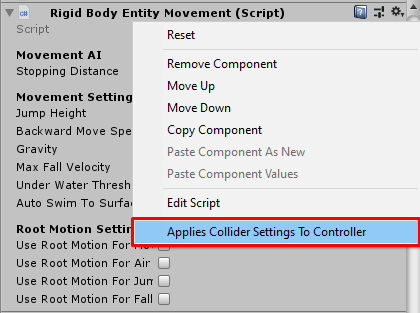
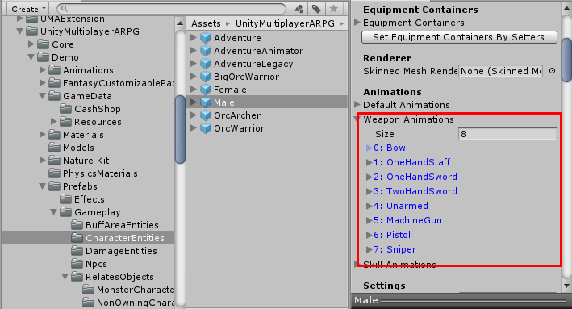
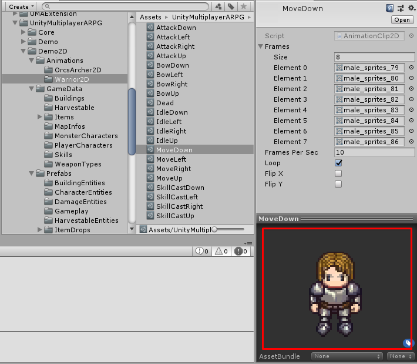
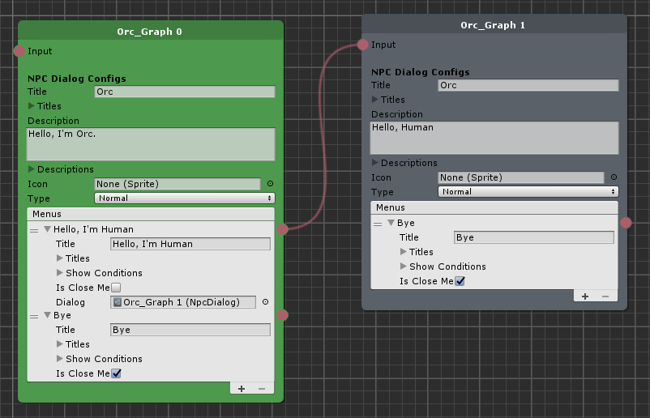

## 1.56b (2020-06-24)
- Fix `ItemDropEntity` dropping item not initialized.
- Fix `ItemDropSpawnArea` not spawn item drop entities.
- Fix wrong pick up animation key.
- Improve default animator controller.
- Remove Mixamo animation clips.

## 1.56 (2020-06-23)
- Fix character bouncing on water surface while `LegacyRigidBodyEntityMovement` → `autoSwimToSurface` set to `TRUE`.
- Fix character bouncing on water surface while `RigidBodyEntityMovement` → `autoSwimToSurface` set to `TRUE`.
- Fix building entities that were built inside safe-area won't receive damages.
- Move `gameplayCameraPrefab` and `minimapCameraPrefab` from `BasePlayerCharacterController` to implemented classes (`PlayerCharacterController`/`ShooterPlayerCharacterController`).
- Make only placeholder building owner character can build other building on the placeholder.
- Make `ItemDropEntity` can be placed in the scene and also able to respawn after picked up by characters.
- Add `useOverrideStartPosition` and `overrideStartPosition` to `PlayerCharacter`, uses them to change override start position when create new character.
- Add pickup animation settings to an character model classes.
- Add run animation settings to `CharacterModel2D` and `AnimatorCharacterModel2D`.
- Add item repair dialog (`UIRepairItem`).
- Remove `dataId` from building entity and save classes, will use identity's `hashAssetId` instead. For MMO developers who use MySQL, please import migration script: `mysql_update_1.55d-1.56.sql`.

## 1.55d (2020-05-30)
- Fix `UICharacterBuff` buff remains duration updates incorrectly.
- Fix `UICharacterSummon` summon remains duration updates incorrectly.
- Fix `UICharacterSkill` cooldown remains duration updates incorrectly.
- Fix `UIArmorAmounts` updates incorrectly when value equals to 0.
- Fix `UIAttributeAmounts` updates incorrectly when value equals to 0.
- Fix `UIDamageElementAmounts` updates incorrectly when min and max values equals to 0.
- Fix `UIDamageElementInflictions` updates incorrectly when value equals to 0.
- Fix `UIResistanceAmounts` updates incorrectly when value equals to 0.
- Fix `UISkillLevels` updates incorrectly when value equals to 0.
- Fix vehicle's passenger characters freeze when the driver exit the summoned vehicle.
- Fix non-host character can't move the vehicle while driving.
- Fix `RigidbodyEntityMovement` can move through walls while idle.
- Fix `ShooterPlayerCharacterController` wrong aim position while character casting skill.
- Change `BasePlayerCharacterEntity` → `storageItems` from sync list to sync field, to update just once when value changed to reduce callback hooks.
- Fix summoned monster which summon by monster not help summoner to attack enemies.
- Add `RandomAttackHitOccurs` abstract function to `BaseGameplayRule`, it will be used to random attack hit when character receive damage from another character.
- Add `pointClickInterruptCastingSkill` setting to `PlayerCharacterController`, if this is `TRUE` it will interrupt casting skill when click on ground to move.
- Add `INIT_POOL_TO_TRANSFORM` preprocessor directives to make the pooling system instantiates pooling objects as `_poolingTransform` children while playing in editor.
- Add walk animations to `AnimatorCharacterModel` and `AnimationCharacterModel` (And also add new states to `__AdvanceCharacter` and `__SimpleCharacter` animator controller), For now it will be used for monster wander movement animations.
- Fills empty movement animation clips when `AnimatorCharacterModel` or `AnimationCharacterModel` awakening.

## 1.55c (2020-05-22)
- Add `buildGridOffsets` to `PlayerCharacterController`, will be used while `buildGridSnap` is `TRUE` to set constructing building by grid offsets and grid size.
- Bring back old rigid body entity movement, it's `LegacyRigibodyEntityMovement` class. Can use `LegacyRigidBodyEntityMovementConversion` with its context menu `Convert From New Rigid Body Entity Movement` to convert new rigid body entity movement to old rigid body entity movement.
- Add bounds to every game entity, just use it to detect entity within range for now.
- Make `HarvestableEntity` overrideable.
- Fix virtual axes inputs not reset when disable the joystick.
- Move physics functions which has an similar functionality to physic function classes (PhysicFunctionsm PhysicFunctions2D).
- Make character model able to set equipment model by instantiated objects (children objects). Can see how it work [here](https://www.youtube.com/watch?v=K1x7ZhGFhqw).

## 1.55b3 (2020-05-15)
- Update LiteNetLib to version 0.9.2.2.
- Fix invalid character is ground state.

## 1.55b2 (2020-05-15)
- Fix character fall underground after teleported.

## 1.55b (2020-05-14)
- Update LiteNetLib to version 0.9.2.1.
- Don't notify reward gold and exp if the value <= 0.
- Fix 2D action animation stopping after played a few times.
- Fix passive skill's buffs not applies if the skill's start level is > 0.
- Fix wrong move speed rate while using skill, while activate animation type is attack animation.
- Fix monster attacking hidden characters.
- Fix skill casting not stop after interrupted.
- Fix cannot hold on building to see building options (`PlayerCharacterController`).
- Fix area skills won't cast to aim position while controller type is `WASD` (`PlayerCharacterController`).
- Improve chat box, don't highlight all text when press to enter messages.
- Implement [open character controller](https://github.com/Unity-Technologies/Standard-Assets-Characters) to `RigidbodyEntityMovement`, now slope limit is working, I also add context menu to set radius, height and center based on capsule collider settings.


## 1.55 (2020-05-05)
- Fix character not turn to target when use skill while controlling with `PlayerCharacterController` and `wasdLockAttackTarget` is `FALSE`.
- Make `BaseDamageEntity` and `MissileDamageEntity` variables, functions more accessible by extending classes.
- Add `recoverHpWhenLevelUp` to `DefaultGameplayRule`. If it's `TRUE` it will recover character's HP when level up.
- Add `recoverMpWhenLevelUp` to `DefaultGameplayRule`. If it's `TRUE` it will recover character's MP when level up.
- Add `recoverFoodWhenLevelUp` to `DefaultGameplayRule`. If it's `TRUE` it will recover character's Food when level up.
- Add `recoverWaterWhenLevelUp` to `DefaultGameplayRule`. If it's `TRUE` it will recover character's Water when level up.
- Add `recoverStaminaWhenLevelUp` to `DefaultGameplayRule`. If it's `TRUE` it will recover character's Stamina when level up.
- Fix `CharacterPitchIK` updating while character dead.
- Add notify rewarded EXP.
- Add notify rewarded Gold.
- Add notify rewarded Items.
- Hide `uiBuildingCampfireItems` when character move.
- Improve `ShooterPlayerCharacterController` to be able to activate NPC, Building Entity easier while `turnForwardWhileDoingAction` is `FALSE`.
- Implement impact effect to damage info.
- Don't prepare `GameEffect` and `ProjectileEffect` pooling objects, if the running application is not a client.

## 1.54f (2020-04-28)
- Improve mobile controllers.
- Make `GM Commands` class to be scriptable object to make it switchable, other developers may crate class which extends from `BaseGMCommands` class and implement an functions (Can see `DefaultGMCommands` as example). Then can set created data to `Game Instance` -> `Gm Commands`.
- Fix wrong ally/enemy detection logics, which make it find ally/enemy incorrectly.
- Implement system chat channel, GM players can enter chat by command: `/s {message}`. Other player will see message without sender name.
- Add "use button" events to `UICharacterItem` class.
- Improve `PlayerCharacterController`. Now, while `wasdLockAttackTarget` is `FALSE` it will turn to enemy when press attack or use skill. And it won't clear selected target when press movement keys (WASD), it will deselect target when distance to target more than `wasdClearTargetDistance` value.
- Move an events variables to (`BaseCharacterEntity_Events.cs`, `BasePlayerCharacterEntity_Events.cs`) to make it easier to find an events to implement with dev extensions or other classes.

## 1.54e (2020-04-16)
- Add `isAttackBuilding` option to `MonsterActivityComponent`, If this is `TRUE`, monster will attacks buildings.
- Add `isAggressiveWhileSummonerIdle` option to `MonsterActivityComponent`, If this is `TRUE`, monster will attacks targets while its summoner still idle.
- Add `turnForwardWhileDoingAction` option to `ShooterPlayerCharacterController`, If this is `TRUE`, it will control character to turn forward while doing an action (attack, use skills, activate and so on). And target also have to be on front of the character.

## 1.54d (2020-04-15)
- Fix invalid NPC Dialog UI while its type is `Shop`.
- Improve `PlayerCharacterController` to don't turn to move direction while playing action animation.

## 1.54c (2020-04-10)
- Add slot limit to `UICharacter`.
- Fix invalid party and guild ally or enemy checking logics.
- Change logging system, it will do `Debug.Log` in editor only. For the build, you have to use `LiteNetLibManager.Logging.onLog` to write log to screen or files.
- Add pooling system for game effects, damageable entities and buff entities.
- Add `canUseByEveryone` to `StorageEntity` and `CampFireEntity` to allow other players to use storage buildings.
- Fix weird summoned monster entity's behaviors.
- Make character entity turn to target while controlling with `ShooterPlayerCharacterController`.
- Add `moveSpeedRateWhileAttacking` to `MonsterCharacter` game data.
- Add configs to make cast skill animations and action animations can be played all layers.
- Add `BaseNpcDialog` class it is `NpcDialog`'s base class, you can create custom NPC dialog by inherit `BaseNpcDialog` class, then implements abstract functions (You may see `NpcDialog` as example). Then you may add codes to `UINpcDialog` by creates new partial class files which have an custom UI elements and implement `RenderUI` to render an custom UI elements.

## 1.54b (2020-03-21)
- Change aim controller while constructing the building, now the constructing buiding will place on ground follow mouse position while moving mouse cursor while playing on standalone platforms. If playing on mobile platforms, it will place by character position with mobile controller axes magnitude.
- Add constructing building rotation by keys, for the demo it uses keys `J` and `K`.
- Move `Build Distance` settings from `Game Instance` to `Building Entity` so each entities can have difference `Build Distance`.
- Fix invalid area skill position while controlling with Mobile controller (On screen controller).
- Fix invalid ally and enemy check logics.

## 1.54 (2020-03-12)
- Add and implement extra data to building save. For use case example, `CampFireEntity` will have an turn on state save as extra data.
- Add context menu "Convert To Newer Character Model" to convert `CharacterModel` to `AnimatorCharacterModel` or `AnimationCharacterModel`.
- Implement custom show condition to Npc's menu, developer can create custom show condition by scriptable object class with function which have a `IPlayerCharacterData` argument and return `bool` and can use it by create scriptable object instance and set to show condition.
- Implement custom damage info type, developer can create class which inherit `BaseCustomDamageInfo` class and implements function. Then use it by create its instance and set to damage info.
- Implement spawn entities progress events to `BaseGameNetworkManager`. So developer can set events callback to show spawn entities progress. And also change game save system function `OnServerOnlineSceneLoaded` to `PreSpawnEntities` to load and spawn building entities before spawn other entities.
- Implement custom map info, developer can create class which inherit `BaseMapInfo` to set character ally and enemy rules.
- Separate Google Play login codes from MMO repository, so developer must re-import `MMO_GooglePlayLogin` package.
- Separate Facebook login codes from MMO repository, so developer must re-import `MMO_FacebookLogin` package.
- Fix all language text not change immediately after chagne language.
- Fix fall damage applying at clients.
- Fix party/guild data losing when change scene (teleport to other maps) while playing Singleplayer/LAN mode.
- Fix calling invalid function in `BasePlayerCharacterController.cs` -> `ShowCurrentBuildingDialog`.
- Fix camera zooming while scrolling scrollview with middle mouse key while playing with `ShooterPlayerCharacterController`.
- Fix equipments and buffs re-apply when mount and unmount.

## 1.53d (2020-03-02)
- Add codes to avoid hotkeys spamming.
- Fix camera zooming while scrolling scrollview with middle mouse key.
- Fix invalid character createable state.
- Fix gold not multiplies with item's amount when dismantle item.
- Fix dismantle button not appearing while `canDismantleItemByPlayer` setting is turn-on.

## 1.53c (2020-02-28)
- Add `canRefineItemByPlayer` setting to `GameInstance`, developer can turn it on to allow player to refine item by does not have to talk to NPCs.
- Add `canDismantleItemByPlayer` setting to `GameInstance`, developer can turn it on to allow player to dismantle item by does not have to talk to NPCs.
- Add `pierceThroughEntities` setting to `DamageInfo`, set it more than 0 to allow raycast hit more than 1 character.
- Add `startItems` setting to `PlayerCharacter`, it's like `GameInstance` -> `startItems` but for specific character.
- Make `UISceneGameplay` extendable (Add new base class: `BaseUISceneGameplay`).
- Move UI events setup from `BasePlayerCharacterController` to `UISceneGameplay`.
- Implement `ArmorItem` class (Implement `IArmorItem` interface).
- Implement `ShieldItem` class (Implement `IShieldItem` interface).
- Implement `WeaponItem` class (Implement `IWeaponItem` interface).
- Implement `PotionItem` class (Implement `IPotionItem` interface).
- Implement `BuildingItem` class (Implement `IBuildingItem` interface).
- Implement `PetItem` class (Implement `IPetItem` interface).
- Implement `MountItem` class (Implement `IMountItem` interface).
- Implement `SkillItem` class (Implement `ISkillItem` interface).
- Implement `JunkItem` class (Implement `IJunkItem` interface).
- Implement `SocketEnhancerItem` class (Implement `ISocketEnhancerItem` interface).
- Add `GameEntityModel` -> `SetEffectContainersBySetters` dev extension invoker.
- Add `BaseCharacterModel` -> `SetEquipmentContainersBySetters` dev extension invoker.
- Add `CharacterModel` -> `SetAnimatorClipsForTest` dev extension invoker.
- Add `AnimatorCharacterModel` -> `SetAnimatorClipsForTest` dev extension invoker.
- Add `AnimatorCharacterModel2D` -> `SetAnimatorClipsForTest` dev extension invoker.
- Fix storage items not updates while playing 2D.
- Fix dismantle returning item amount not multiplies with dismantle item amount.


## 1.53b (2020-02-25)
- Add `dismantleFilter` setting to `GameInstance`.
- Add `maxCharacterSaves` setting to `GameInstance` but does not validating with server when creating character yet. Just count characters after loaded and trigger `UICharacterList`'s events.
- Add `eventOnAbleToCreateCharacter` event to `UICharacterList` which will be triggered when character count not reached `maxCharacterSaves` setting yet.
- Add `eventOnNotAbleToCreateCharacter` event to `UICharacterList` which will be triggered when character count reached `maxCharacterSaves` setting.
- Add `applyBuffToEveryone` config to `AreaBuffEntity`. If this is `TRUE`, buffs will apply to everyone including with an enemies.
- Fix skills can not be used while controlling character with `PlayerCharacterController`.
- Fix character move to center of enemy position while controlling character with `PlayerCharacterController`.
- Fix `fpsHiddingObjects` and `fpsHiddingRenderers` not activated when switch back from `FPS` to `TPS`.
- Fix movement problem while character's base move speed is 0.
- Fix empty item slots were removed when equip item, drop item from inventory, use the item until it empty, refine item until it destroyed, sell an item, dismantle item, use ammo until it empty and so on.
- WIP extendable item classes.
### Removed files
- GameEffectCollection.cs
- Item_Dismantle.cs (Rename to BaseItem_Dismantle.cs)
- Item_Refine.cs (Rename to BaseItem_Refine.cs)
- Item_Repair.cs (Rename to BaseItem_Repair.cs)
- Item_SocketEnhance.cs (Rename to BaseItem_SocketEnhance.cs)
- SkillUtils.cs

## 1.53
- Add item dismantle system, can dismantle an items to get items in sockets back and also can set `Item`'s dismantle config for returning items and gold when dismantle.
- Add campfire entity, it's extended from storage entity with convert items configs. And also set convert items as fuel, if there is any convert item is fuel, campfire entity must have convert item in storage to turn on.
- Fix character model changes equipment models too frequent.
- Fix language selection set to default language when open language setting dialog.
- Fix extra movement state not changes while game entity's movement secure is server authoritative.
- Fix stamia decreasing while idle.
- Fix character not harvesting an harvestable entities at first harvest animation.
- Fix item losts after move item from storage.
- Fix duplicating local-chat.

## 1.52c
- Add new input to `ShooterPlayerCharacterController` to make it able to hold `E` while pointing on building entity to show building menu.
- Rename `BaseVehicleEntity` class to `VehicleEntity` class, changed it from abstract class to non-abstract class and implements all functionality. Now developer can use `VehicleEntity` class instead of `MountEntity` class, `MountEntity` still derived from `VehicleEntity` class without non of any functionality changes for backward compatible.
- Fix default 2D movement will move to latest point click position after controlled by WASD keys.
- Implement multiple seats supports to vehicle entities.
- Vehicle/Mount entity which summon by skills or items will be saved and loaded when enter the game, enter the warp portals.

## 1.52b
- Rename `SimpleGameplayRule` class to `DefaultGameplayRule` but still keep `SimpleGameplayRule` class for backward compatible.
- Implement fall damage and also add config to `DefaultGameplayRule` there are `fallDamageMinDistance` and `fallDamageMaxDistance`. Character will receive damage 1% of Max Hp, when fall distance = min distance and receive damage 100% of Max Hp, when fall distance >= max distance.
- Implement `DoorEntity` and `StorageEntity` lock system, character who create it can set password to lock it and also can set it lock or unlock. For developer, there is new config: `lockable` tick it on to make it lockable. And also add following language keys: UI_ENTER_BUILDING_PASSWORD, UI_ENTER_BUILDING_PASSWORD_DESCRIPTION, UI_SET_BUILDING_PASSWORD, UI_SET_BUILDING_PASSWORD_DESCRIPTION.
- Improve In-App purchasing messages and also made it supports multiple language settings by add following keys: UI_ERROR_IAP_NOT_INITIALIZED, UI_ERROR_IAP_PURCHASING_UNAVAILABLE, UI_ERROR_IAP_EXISTING_PURCHASE_PENDING, UI_ERROR_IAP_PRODUCT_UNAVAILABLE, UI_ERROR_IAP_SIGNATURE_INVALID, UI_ERROR_IAP_USER_CANCELLED, UI_ERROR_IAP_PAYMENT_DECLINED, UI_ERROR_IAP_DUPLICATE_TRANSACTION, UI_ERROR_IAP_UNKNOW.
- Game save system (for singleplayer / LAN games) is now able to customize and switchable at `GameInstance` -> `saveSystem`. Developer can create customize save system by create class which derived from `BaseGameSaveSystem`, can see `DefaultGameSaveSystem` as example.
- Fix `AnimatorCharacterModel2D` playing wrong animations. And also add `OrcsWarrior2D` to 2d demo content to show how to setup character with `AnimatorCharacterModel2D`.
- Fix character's EXP still collecting after reached max level.
- Fix mobile hotkey joystick inputs, it used to have to double tap to use hotkey.

## 1.52
- Implement character crouch movement (Can test by press `Left Control`) to `Animator Character Model`, `Animation Character Model` and `Rigidbody Entity Movement`. You can set move speed rate while crouching at `Simple Gameplay Rule` -> `Move Speed Rate While Crouching`.
- Implement character crawl movement (Can test by press `Z`) to `Animator Character Model`, `Animation Character Model` and `Rigidbody Entity Movement`. You can set move speed rate while crouching at `Simple Gameplay Rule` -> `Move Speed Rate While Crawling`.
- Implement character swimming movement to `Animator Character Model`, `Animation Character Model` and `Rigidbody Entity Movement`. You can set move speed rate while crouching at `Simple Gameplay Rule` -> `Move Speed Rate While Crouching`. You can create water area by set layer to `Water` and set collider -> `isTrigger` to `true`.
- Add `Under Water Threshold` config to `Rigidbody Entity Movement`. Example of how it working: If character height is `1`, `Under Water Threshold` set to `0.5` and water height is `0.55`. Character will start swimming
- Move `Movement Secure` config from entity movement components to game entity components.
- Add `Auto Swim To Surface`, set this to `true` if you want character swim up to surface automatically, set this to `false` if you want character able to diving.
- Add `Fps Hidding Objects` and `Fps Hidding Renderers` to game entity model, set game objects and renderers which you want to hide while view mode is FPS here.
- Add clips configs to `Animator Character Model` and `Animation Character Model` for sprint, crouch, crawl and swimming state. So now you can set different clips for move and sprint state. And also add move animation speed rate configs for the cases that you still want to use same clips for move and sprint you can set `Sprint Anim Speed Rate` to make it play sprint animations more quickly.
- Add `Fps Model Prefab` config to `Character Model Manager` set Fps hands character model prefab which will instantiate as child of gameplay camera.
- Add `Fps Model Offsets` config to `Character Model Manager`. This is offsets between Fps hands character model and gameplay camera.
- Add `Fps Camera Target Transform` config to game entity set transform where camera will following while view mode is FPS.
- Add `Movement Collider Adjustment` component. Attach it to character entity to adjust capsule collider based on movement states.
- Add `Movement Transform Adjustment` component. Attach it to character entity to adjust transform position based on movement states. I use this component to adjust game entity's `Fps Camera Target Transform`.
- Add `Combat Text Distance` config to `Game Instance`, use it to limit distance to instantiates combat texts.
- Fix invalid character direction in 2D mode.
- Fix invalid missile trigger objects in 2D mode.
- Fix invalid buffs duration count at clients.

## 1.51
- Implement character entity's `Pitch`, it will be updated by controller while aiming up or down.
- Add `CharacterPitchIK` component, attach it to character entity to update character's aim pitch by any bones.
- Fix player's character stop attacking enemy when it moved.
- Fix invalid character summon serialize and deserialize.
- Fix invalid `UICharacterQuests` component -> `HideCompleteQuest ` conditions
- Fix when summoned monsters kills quest monsters, quest's task won't counting up.
- Fix when damge debuffs kills quest monsters, quest's task won't counting up.

## 1.50d
- Implement root motion support to `RigidBodyEntityMovement`, see `useRootMotionForMovement`, `useRootMotionForAirMovement`, `useRootMotionForJump` and `useRootMotionForFall`.
- Implement stamina to demo, press `Left Shift` to toggle sprint. For shooter controller hold `Left Shift` to sprint.
- Add `FactionIs` condition to check character faction to show NPC dialog menu.
- Fix reset skill item not consumed.
- Fix invalid warp position while `GameInstance` -> `currentPositionSaveMode` is `UseRespawnPosition`.
- Fix multi hit animation works incorrectly.

## 1.50c
- Add `BuffToTarget` to `Skill` -> `SkillBuffType`, if skill isn't attack skill, will buff to selected target
- Add `Toggle` to `Skill` -> `SkillBuffType`, skill's buff will be remove if already applied to skill user
- Add `isHide` status to `Buff`, developer can use with `Toggle Skill` to create hide skill
- Add `muteFootstepSound` status to `Buff`, developer can use with `Toggle Skill` to create hide+stalk skill
- Add multi hit **Trigger Duration Rate** to character model -> action animation
- Add `currentPositionSaveMode` config to `GameInstance`, developer can set it to `UseRespawnPosition` to make it save character current position as respawn position, not current position. So when enter game it will load respawn position, not last character position.
- Fix item skills not available to assign to hotkey
- Fix item skills not available to use
- Fix character level not increased after exp increased by harvestable entity

## 1.50b
- Improve game data list view, if entry is not empty it will show index with name and text color will be blue, if it is empty text color will be red.

- Improve `AnimationClip2D` inspector, now it will show animated sprites in preview section.

- Add npc graph.

- Add server scene loaded validatation, developer can add code to validate before allow server to instantiates objects and spawn players.
```
// Example codes
namespace MultiplayerARPG {
    public abstract partial class BaseGameNetworkManager {
        [DevExtMethods("UpdateReadyToInstantiateObjectsStates")]
        protected void ValidateSceneLoaded()
        {
            // Set custom states, it will check later, if all states are `TRUE`
            // It will be ready to instantiates objects and spawn players.
            readyToInstantiateObjectsStates["MapLoaded"] = mapManager.IsLoaded();
        }
    }
}
```
- Add game messages to inform players when they can't increase attribute amount.
- Add game messages to inform players when they can't increase skill level.
- Add game messages to inform players when they can't use skill.
- Improve bonus stats display, now it will show as "Hp: +1", "Mp: +1".
- Fix skill level bonus from equipment set bonus not applies to UIs.

## 1.50
- Add `Awake` and `OnDestroy` dev extension functions to `BasePlayerCharacterController`
- Implement In-App Purchasing for Singleplayer game
- Add `UICharacterItemDropHandler` class, developer can add it to character item icon as drop handler to handles inventory slots swap, storage slots swap, equip item functions
- Fix armor stats not work
- Fix invalid rarity title languae settings
- Fix item is able to unequip while inventory is full
- Fix quest rewards are able to receives while inventory is full
- Fix IAP items are able to receives while inventory is full
- Fix items are able to deals while inventory is full
- Fix items are able to crafts while inventory is full
- Fix invalid `IBuildingSaveData` -> `CloneTo` dev extension implementation
- Fix skills not update when equip items that increase skill levels

## 1.49d
- 2D games can build an buildings
- Add multilingual supports for NPC dialog menu
- Add skill attack type option to `Simple Area Attack Skill`
- Fix character stats not applies by weapons or shields
- Fix invalid character attack duration
- Fix invalid skill level calculation
- Fix invalid skill damage amounts calculation
- Fix shield unequip when equipping one-hand weapon
- Fix shooter controller cannot attack while playing on mobile platforms
- Fix passive skill not working

## 1.49c
- Add area attack skill, can create by right click in `Project` then choose `Create -> Create GameData -> Skill -> Simple Area Attack Skill`. You also have to prepare `Area Damage Entity`, which require collider and rigidbody to make physic trigger event works. (See it: https://www.youtube.com/watch?v=PErdX5rfvGk)
- Add area buff skill, can create by right click in `Project` then choose `Create -> Create GameData -> Skill -> Simple Area Buff Skill`. You also have to prepare `Area Buff Entity`, which require collider and rigidbody to make physic trigger event works. (See it: https://www.youtube.com/watch?v=PErdX5rfvGk)
- Add `minGuildNameLength` and `maxGuildNameLength` configs to `SocialSystemSetting` use it to limit guild name length
- Add `minGuildRoleNameLength` and `maxGuildRoleNameLength` configs to `SocialSystemSetting` use it to limit guild role name length
- Add `maxGuildMessageLength` configs to `SocialSystemSetting` use it to limit guild message length
- Fix guild with existed guild name can be created
- Fix invalid attribute amounts equals to 0 and not able to level up, after reset an attributes with item
- Fix invalid left-hand weapon aim position in shooter controller
- Fix quest missing data bugs when deserialize

## 1.49b
- Add utility script named `ImageBasedOnPlayingCharacterClass`, to set image based on playing character, developer may attach it to mobile attack button to change image based on playing character
- Add utility script named `ImageBasedOnEquippedWeaponType`, to set image based on equipped weapon type, developer may attach it to mobile attack button to change image based on equipped weapon type
- Add `Destroy Delay` field to `MissileDamageEntity`, developer may set some delay to play some special effect before destroy
- Fix item weight not multiplied with item amount
- Fix invalid unequip weapon set
- Fix character not rotate while aiming with sniper
- Fix wrong shooter camera controls on mobile platforms

## 1.49
- Add skill aim controls for mobile and also can cancel aimming skill, try drag assigned skill icon to use
- Fix quest `isComplete` state not saved issues
- Fix item list / skill list entries are destroyed after open `UICharacterHotkeyAssigner` first time
- Fix character move sound still playing after ride the mount entity while moving
- Fix `CharacterItem` -> `sockets` not saved issues
- Fix saved `CharacterHotkey` lose issues
- Fix can move character while casting skill which its `moveSpeedRateWhileUsingSkill` = 0
- Fix monster character entities not respawn by avoid empty `receivedDamageRecords`
- Fix invalid `criRate`, `criDmgRate`, `blockRate` and `blockDmgRate` calculation

## 1.48d
- Add equip weapon set switch by key, for the demo it is key **`** (the key below **Esc** and above **Tab**)
- Add character stats rate for item/skill buffs, it will be calculated by character's stats not including with stats from equipments and buffs. For example, if character have 100 Hp, and also equip armor which increase 20 Hp and 10% Hp rate, it will increase 30 Hp by the armor (20 + (100 * 10%)) so the character will have 130 Hp
- Add character attribute rate for item/skill buffs, it will be calculated by character's attributes not including with attributes from equipments and buffs. For example, if character have 50 Str, and also equip armor which increase 5 Str and 10% Str rate, it will increase 10 Hp by the armor (5 + (50 * 10%)) so the character will have 60 Str
- Armor stats (in `CharacterStats` struct) is deprecated, now there is new armor system, you can set armor to reduce damage for each damage elementals
- Fix character movement state not changes while controller mode is `Point Click`

## 1.48c
- Add equip weapon set system, player can switch equip weapon set. developer can set maximum amount of equip weapon set in `Game Instance` -> `Max Equip Weapon Set`. For UIs, if you want to add new equip weapon set #2, you have to set `Equip Weapon Slots`'s entry -> `Equip Weapon Set Index` to 1.
- Make defend equipments (an armors) can be equipped to many equipment slot, for example "Ring" can equip to "Ring-1" or "Ring-2" slot. developer can set maximum amount of slots than can be equipped in `Armor Type` -> `Equippable Slots`. For UIs, if you want to add "Ring-2" slot to `UI Equip Items`, you have to set `Other Equip Slots`'s entry -> `Equip Slot Index` to 1.
- Fix equipment models not instantiates correctly in character models

## 1.48b
- Add friend system (Press Z to toggle the dialog)
- Add new damage type, `Raycast` should use it with gun weapon, which its bullet is very fast. `Missile Damage Entity` won't hit target sometime when its move speed is very fast
- Add `ActivateButtonActivator` component, you can use it to activate UIs when your character nearby activatable entities
- Add `ExitVehicleActivator` component, you can use it to activate UIs when your character passenging vehicle
- Add `PickUpButtonActivator` component, you can use it to activate UIs when your character nearby item drop entities
- Add `ZoomButtonActivator` component, you can use it to activate UIs when equipped weapon can zoom
- Fix `UIAmmoAmounts` not updates when ammo reduce
- Changes damage entities to non-networking object, so networking packet to spawn it will be removed
- Reduce networking packet size by remove all play effect request network messages

## 1.48
- Change settings in `Map Info` -> `Can Pvp` to `Pvp Mode`
- Change settings in `Map Info` -> `Override Respawn Point` to `Override Respawn Point Mode`
- Change settings in `Map Info` -> `Override Respawn Point Map` and `Override Respawn Point Position` to `Override Respawn Points`
- Add simple faction system, now player can select faction in character creation scene
- Reduce settings in `Game Database`. Remove `Skills` because it can bring from character data, item data. Remove `Player Characters` because it can bring from `Player Character Entities` and Remove `Monster Characters` because it can bring from `Monster Character Entities`
- Add context menu to `Character Model`, `AnimationCharacterModel` and `AnimatorCharacterModel` to copy / patse `Weapon Animations` and `Skill Animations`
- Fix empty item slots not filled when `Game Instance` -> `Inventory System` is `Limit Slots`
- Fix chat input field focusing when spamming keys
- Fix cannot learn skill with item while skill point == 0
- Fix flying when spamming mount
- Fix character UIs still remains in list after deleted all characters
- Update demo to show how to setup factions, genders and character class selections

## 1.47d
- Fix invalid item remove index, that cause other bugs, such as represent invalid items when equip / unequip items
- Fix infinite loop when fill empty slots, while `Game Instance` -> `Inventory System` set to `Limit Slots`, this is cause of Unity freezing when equip / unequip items
- Fix receiving items filling after empty slots, while `Game Instance` -> `Inventory System` set to `Limit Slots

## 1.47c
- Monster can use skill
- Add workbench building in demo
- Fix monster drop always drop same items issues
- Fix workbench craft item not working issues
- Fix weapon / shield increase damages not working issues
- Fix equipment sockets not saves issues
- Fix invalid character item title with refine level format
- Fix invalid building entity location when building with shooter controller
- Fix bugs when set `Game Instance` -> `Inventory System` to `Limit Slots` that it fill empty slot incorrectly, also add `Game Instance` -> `Base Slot Limit` can use it as base slot limit for all character while set `Game Instance` -> `Inventory System` to `Limit Slots`
- Add not enough MP message
- Don't send request attack / use skill message to server if no enough ammo or MP

## 1.47b
- Fix invalid missile rotation in 2d mode
- Fix cannot attack issues
- Fix missile can hit other missile
- Fix missile can hit non-ally character (it will explode but not apply damage)
- Fix missile can hit dropped items

## 1.47
- Add attribute increase item, can use it to increase amount of attribute.
- Add attribute reset item, can use it to reset amount of attributes.
- Add skill use item, can use it to cast skill.
- Add skill learn item, can use it to increase level of skill.
- Add skill reset item, can use it to reset level of skills.
- Can set equipment to hotkey.
- Reduce packet size when update buff cooldown, now it will send only cooldown (float). Type (byte), Data Id (int), and Level (short) will not being sent.
- Reduce packet size when update skill cooldown, now it will send only cooldown (float). Type (byte), and Data Id (int) will not being sent.
- Reduce packet size when update summon cooldown, now it will send only cooldown (float). Type (byte), Data Id (int), and Object Id (uint) will not being sent.
- Reduce packet for non-owner character item, now it will send only Data Id (int), Level (short) to non-owner client because non-owner client requires only Data Id and Level to update character equipments. Owner client still receive full data (Id (string), Data Id (int), Level (short), Amount (short), Durability (float), Exp (int), Lock Remains Duration (float), Ammo (short), and Sockets (int[])).

## 1.46b

- Fix invalid index of data in `UI Non Equip Items`, this is cause of un-able to equip items or use items issues
- Add `Item Drop Table` game data, you can use it to create item drop table and set to `Monster Character` game data as more convenience way when you want to have same item drop table for difference monsters
- Add `Exp Per Damage` to `Harvestable` game data, you can make character receive exp while harvesting with this value, if this is 10 when damage to harvestable entity = 2, character will receives 20 exp
- Add network discovery component and also implemented it in Lan mode, see example in `01Home` scene -> `CanvasHome` -> `UILanConnection`

## 1.46

See it in [1.46 Updates](pages/055-1-46-updates.md)

## 1.45c

- Add `GetTotalWeight` function to `BaseGameplayRule`, developer may override it to increase weight by gold :P 
- Add `CurrenciesEnoughToBuyItem` to `BaseGameplayRule`, developer may override it to validate amount of custom currencies
- Add `DecreaseCurrenciesWhenBuyItem` to `BaseGameplayRule`, developer may override it to decrease amount of custom currencies 
- Add `IncreaseCurrenciesWhenSellItem` to `BaseGameplayRule`, developer may override it to increase amount of custom currencies 
- Add `CurrenciesEnoughToRefineItem` to `BaseGameplayRule`, developer may override it to validate amount of custom currencies 
- Add `DecreaseCurrenciesWhenRefineItem` to `BaseGameplayRule`, developer may override it to decrease amount of custom currencies 
- Add `CurrenciesEnoughToRepairItem` to `BaseGameplayRule`, developer may override it to validate amount of custom currencies 
- Add `DecreaseCurrenciesWhenRepairItem` to `BaseGameplayRule`, developer may override it to decrease amount of custom currencies 
- Add `CurrenciesEnoughToCraftItem` to `BaseGameplayRule`, developer may override it to validate amount of custom currencies 
- Add `DecreaseCurrenciesWhenCraftItem` to `BaseGameplayRule`, developer may override it to decrease amount of custom currencies 
- Add `CurrenciesEnoughToCreateGold` to `BaseGameplayRule`, developer may override it to validate amount of custom currencies 
- Add `DecreaseCurrenciesWhenCreateGold` to `BaseGameplayRule`, developer may override it to decrease amount of custom currencies 
- Add `MakeMonsterReward` to `BaseGameplayRule`, developer may override it to setup amount of custom rewarding currencies 
- Add `MakeQuestReward` to `BaseGameplayRule`, developer may override it to setup amount of custom rewarding currencies 
- Add `deadY` to `MapInfo`, when character fall to this position, character will dead 
- Add setting menu (press ESC in gameplay scene) with audio / language settings 


## 1.45b

- Fix armor can equip at weapon slot
- Rework on Localizations system, now all text formats are moved to `LanguageManager`
- Now 2d character model is support 8-directions sprites
- Add `AnimatorCharacterModel`, it's a new version of 3D mechanim character model which developer just have to set clips to make it work, not have to touch Animator Controller
- Add `AnimationCharacterModel`, it's a new version of 3D legacy animation character model
- Add `AnimatorCharacterModel2D`, it's 2D character model which based on animator
- Add `EquipmentModelContainerSetter` component, developers can add it to transform to use it as equipment containers instead of set `Equipment Containers` in `Character Model`, it will use game object name as `Equip Socket` and its transform as `Transform`
- Add `EffectModelContainerSetter` component, developers can add it to transform to use it as effect containers instead of set `Effect Containers` in `Character Model`, it will use game object name as `Effect Socket` and its transform as `Transform`
- Sort game data create menu


## 1.45

- Add gunfire system, can store ammo in magazine, can set dynamic crosshair, can set ability to zoom (more abilities can be added later)
- Add reload animation settings to `Character Model` component
- Add `Activate Animation Type` option to `Character Model` -> skill animations, developer can use this option to set which animation will play when activate the skill, if this value is `Use Attack Animation` it will play attack animation randomly
- Add `EquipmentEntity` component, developer can attach this component to weapon model to set particle/sound effects when firing (See the demo from Weapon059, Weapon065, Weapon067). May use this for refined equipments particle/mesh effects (refined equipments are an equipment with +1/+2/+3 and so on)
- Add cancel buttons to invitation dialogs
- Fix SQLite cannot save character data
- Fix MMO server crash when summon multiple characters
- Fix character not warp immediately when respawn
- Fix hotkey reset when warp


## 1.44c

- Fix cannot assign and use skills bugs
- Fix item dialog showing up when receiving damage while enhance socket item UI is visible


## 1.44b

- Fix cannot move item to storage bugs
- Fix lost socket enhancers when the equipment dropped
- Fix increase stats/attributes/resistances/skills not showing up in UI character item for socket enhancer item
- Fix cannot use GM commands in MMO mode


## 1.44

- Add equipment socket and socket enhancer item
- Equipment can increase skills levels
- Add `useNavMeshForKeyMovement` option to `PlayerCharacterEntity` set this to TRUE if you want to move by nav mesh paths while controlling with movement keys (WASD)
- Add `collectType` to `HarvestableEntity`, so you can make it drop materials to the ground while harvesting by this setting 
- Add guild name to `UIGuildInvitation`
- Add `opponentAimTransform` to `DamageableEntity` this will be used by player character controller or monster activity component to aim to target, so if 2 characters are stand at a different height, they can fire each other
- Optimize garbage collection for `CharacterAllianceIndicator`, `NpcQuestIndicator`
- Fix invalid layer masks
- Fix invalid stats value in item UI


## 1.43b

- Fix invalid character stats calculation in `UI Character`
- Fix cannot press F to pick up items
- Fix invalid character attack/use skill animations settings in `Character Model`
- Fix cannot access player storage bug
- Add camera collision
- Move character attack/skill/buff codes to new partial class files (BaseCharacterEntity_AttackFunctions, BaseCharacterEntity_BuffFunctions, BaseCharacterEntity_SkillFunctions)
- Reduce DevExtMethods calls in BaseGameEntity and classes that extended from this class, it will be called only in Awake and OnDestroy function. For other function, developer has to implement an event delegates (You can see DevExtDemo_PlayerCharacterEntity, DevExtDemo_MonsterCharacterEntity) for example
- Add `hideCompleteQuest` to `UICharacterQuests`, Developers can use it to filter quest list
- Add casting duration/animation/effect for skills, now you can set casting duration/animation/effect before activating the skill
- Add OnCastSkill(), OnApplySkill(), OnAttack() functions to `Skill` class. Developers can extend `Skill` class and change some skill functionality by those functions

** More Info: https://suriyun-production.github.io/mmorpg-kit-docs/#/pages/045-1-43b-updates) **


## 1.43

- Update LiteNetLib to version 0.8.3
- Change all SendOption to DeliveryMethod (Follow LiteNetLib updates)
- Can switch target entity (with TAB key)
- Add `DoorEntity`, can open/close it with activate key (Press E)
- Add `StorageEntity`, can open it with activate key (Press E)
- Add `WorkbenchEntity`, can use it to craft items with activate key (Press E)
- Add `startCentralServer` config for MMO server instance, developer can set this config to true in a config file to start central server when running the server
- Add `startMapSpawnServer` config for MMO server instance, developer can set this config to true in a config file to start map-spawn server when running the server
- Add `startMapServer` config for MMO server instance, developer can set this config to true in a config file to start map server when running the server
- Add `startChatServer` config for MMO server instance, developer can set this config to true in a config file to start chat server when running the server
- Fix player characters data not saved immediately before scene changes for Singleplayer/LAN modes
- Fix building entities saved to invalid scenes for Singleplayer/LAN modes


## 1.42b

- Fix gold not save in Singleplayer / LAN Modes
- Fix duplicating storage items in Singleplayer / LAN Modes
- Fix selected skill dialog hiding while skill's buff applied
- Fix cannot use skills while attacking
- Fix invalid melee hit overlap functions


## 1.42

- Add player storage system, players can deposit/withdraw an item from storage, other characters in the same account also able to access the storage
- Add guild storage system, players can deposit/withdraw an item from storage, other characters in the same guild also able to access the storage
- Add player bank system, players can deposit/withdraw gold from the bank, other characters in the same account also able to access the bank
- Add guild bank system, players can deposit/withdraw gold from the bank, other characters in the same guild also able to access the bank
- Add player storage dialog for NPC
- Add guild storage dialog for NPC
- Can run map-server in editor, add `Start Map On Awake`, `Starting Map` configs to `MMOServerInstance`
- Can switch database with config files/command line arguments, also add `Database Options`, `Database Option Index` to `MMOServerInstance`


## 1.41

- Add warp dialog for NPC
- Add private/instance map system for MMO mode, for the demo, you can try enter it by NPC. Instance maps will be spawned as new map server instance to serve players
- Players can enter instance map alone when no party
- Players will enter instance map follow party leader if player's character stands nearby party leader (`Game Instance` -> `Join Instance Map Distance`)
- Add `Enable Gm Commands` option to `Lan Rpg Network Manager`, developer can enable it to allow player to use GM Commands in Singleplayer/LAN mode
- Add warp portal type setting to `Warp Portal Entity`, `Warp Portal Database`. you can set type of portal for default warp or instance map
- `Warp Portal Entity` -> `Map Scene` is deprecated use `Map Info` instead
- `Warp Portal Database` -> `Map` is deprecated use `Map Info` instead
- `Npc Database` -> `Map` is deprecated use `Map Info` instead
- Add show guild name above character name
- Fix monster attack other monsters
- Save camera zoom and rotation when exit game


## 1.40b

- Fix missile damage entity still move after exploded
- Add `On Exploded` event to missile damage entity, you can use this to show explod effects
- Add drag and drop UIs, now you can drag and drop item / skill to assign hotkey. Drag item to sell / set refining item / equip / unequip. Classes relates to this are: `UICharacterItemDragHandler`, `UICharacterSkillDragHandler`, `UIDealingItemDropHandler`, `UIEquipItemSlotDropHandler`, `UIRefineItemDropHandler`, `UISellItemDropHandler`, `UICharacterHotkeyDropHandler`
- Add `Move Speed Rate While Attacking` to weapon item, this will multiply with character move speed while character attacking
- Add `Move Speed Rate While Using Skill` to skill, this will multiply with character move speed while character using skill
- Fix annoying camera's target null error when warp :P


## 1.40

- Shooter controller can pick an item (Press F)
- Shooter controller can construct the building
- Shooter controller can active building (Now it can just destroy, Press E)
- The building can be attacked and destroyed
- Add damage over time to buff
- Add disallow move to buff, if this is true character will not able to move while the buff applied
- Add disallow attack to buff, if this is true character will not able to attack while the buff applied
- Add disallow use skill to buff, if this is true character will not able to use skill while the buff applied
- Add disallow use item to buff, if this is true character will not able to use item while the buff applied
- Add `destroyDelay` to `MissileDamageEntity`, use this to add some delay to play effect before it destroyed
- Move `deadHideDelay` to `BaseMonsterCharacterEntity` -> `destroyDelay`, To developers, I've prepared migration codes so you don't worry about data changes
- Move `deadRespawnDelay` to `BaseMonsterCharacterEntity` -> `destroyRespawnDelay`, To developers, I've prepared migration codes so you don't worry about data changes
- Add `Movement State` to `Character Entity` which sync from server instead of calculate at client side with `CharacterAnimationComponent` component so `CharacterAnimationComponent` component is not being used anymore with v1.40 or above
- Remove `ySpeed` from `Character Model`, will use just `IsGrounded` in animtor controller to detect fall state
- Remove `magnitudeToPlayMoveClip`, `ySpeedToPlayJumpClip`, `ySpeedToPlayFallClip` from `Character Model` will use `Movement State` from `Character Entity` to change legacy animation movement


## 1.39b

- Fix invalid range skill aim position
- Fix SQLite start a transaction within a transaction
- Fix invalid ground detection on non-owning clients


## 1.39

- Fix wrong character move speed when controls with Joystick / WASD bug
- Fix Cannot equip armor with same armor type bug
- Not unequip equipped weapon on off-hand when equip another item on off-hand bug
- Add shooter controller (try 00Init_Shooter demo)
- Animator controller for characters now requires IsGrounded(bool), SideMoveSpeed(float) 
- Add more movement types for Animator / Legacy animation


## 1.38b

- Add more functionality for dev extensions
- Fix character model -> legacy animation bugs, it didn't playing well and dead animation play looply
- Reduce EditorUtility.SetDirty() function calls in OnValidate() function to avoid Unity 2018.3 bug (information about the bug: https://github.com/insthync/test-missing-prefabs)
- Make it able to select character class when create character (Try single player demo)


## 1.38

- Add `CharacterDeathSoundComponent` can attach it with Character Entity to play random sound when character dead 
- Move Dimension Type configs to Game Instance 
- Can use Item Refine to define item rarity 
- Can set animations based on weapon type at character model 
- Add equipment set, characters can gain more extra stats when equipped same set equipments 

More Info (https://medium.com/suriyun-production/1-38-updates-ef4586da2799) 


## 1.37b

- Refactor C# var to explicit type
- Make it able to use with older Unity (should be 2018.2 or above)
- Add WebSockets support for WebGL build
- Fix NPC icon showing multiple
- Fix footstep sound playing while jump


## 1.37

- Update Unity version to 2018.3.0f2, developers have to update to this version or above
- Add harvestable entity for 2d demo
- Make Singleplayer / LAN can change scene when entering warp portals
- Add configs to `MapInfo` to make it able to override saved respawn point so some map may force characters to respawn at the specific point
- Add footstep sound component
- Add UI to show attacking harvestable's health
- Add configs to `PlayerCharacterController` to make it not move to selected target immediately. To move to the selected target, player has to click on the selected target again
- Can show selected item information while dealing


## 1.36

- Add group buff / party buff skills
- Add summon skill
- Add pet system, it is items that when uses it will spawn pet, If pet dies it will unsummon as item and lock for sometime
- Add GM commands


## 1.35

- Clear listing when disconnected / stop server, to avoid null exception when accessing data from list
- Make networking system more easier to use
- Improve WASD movement now it will stop immediately when unpressed buttons
- Remove deprecated codes that relates to this (https://medium.com/suriyun-production/mmorpg-kit-1-32-character-database-entity-workflow-changes-ddeac9c4cc5d)
- Add 2D MMO Demo


## 1.34b

- Fix empty guild data for UI Guild
- Add Refine dialog for NPC, In case that someone wants to make it able to refine when talks to NPC only
- Add `hitOnlySelectedTarget` to `DamageInfo` class to make sword swing / arrow hitting only the selected target, instead of hitting any characters by hit FOV


## 1.34

- Add guild skills, Passive / Active, only guild leader can increase guild skill level, member can use active guild skills
- Add ENABLE_PURCHASING predefine, developer have to add it in "Scripting Define Symbols" when enable Unity Purchasing, I've added this to make it more friendly for beginners
- Add death EXP penalty, you can set the percentage at Game rule


## 1.33

- Fix leave party messages not sent to clients
- Fix leave guild messages not sent to clients
- Keep chat messages as static field, will be showed when warped to another map
- Showing game messages such as "Cannot carry anymore", "Not enough gold", "Not enough items"


## 1.32

- Remove all deprecated animation codes that moved to `Character Model`
- Fix monster character entity which placed in scene not respawn after dead
- Fix harvestable entity which placed in scene not respawn after dead
- Add Save respawn point dialog to NPC
- Change workflow `Character` -> `Entity Prefab` will be deprecated (Information about it: https://medium.com/suriyun-production/mmorpg-kit-1-32-character-database-entity-workflow-changes-ddeac9c4cc5d)


## 1.31

- Fix cannot create guild with SQLite database
- Fix connot read guild data with SQLite database
- Guild can level up, now it just collecting skill point but it will be used with guild skills later


## 1.30b

- Add default value to characters.partyId, characters.guildId, characters.guildRole, characters.sharedGuildExp for SQLite to fix it is not able to create new character
- Change how to get free ports to fix it is not able to create offline game on Mac OSX


## 1.30

- Make it able to customize network library, so it can change network library to another library instead of LiteNetLib
- Add OnGameDataLoaded callback to GameInstance and use it with MMOServerInstance to fix wrong script running order
- Can change party leader
- Make harvestable entity able to place in map scene (Does not have to use spawn area)
- Changes all database operations to be synchronized, and will be run on other threads to avoid main thread blocking, so gameplay will update smoothly while doing an database operations
- Add guild system (Can create / invite member / kick member / leave / terminate / change leader / set guild message / set role / change member role / change leader)


## 1.29

- Add party system (Can create / invite member / kick member / leave / terminate / set exp share / set item share)
- Change Connector/NET (MySql.Data) to MySqlConnector (https://github.com/mysql-net/MySqlConnector) to improve performance, for old version migration you have to remove MySql.Data.dll file


## 1.28

- Add choices for Player Character Movement to secure or not
- Reduce network transform packet size


## 1.27

- Add 2D games features
- Move weapon attack animations, skill cast animations to Character Model (Migration guide: https://medium.com/suriyun-production/mmorpg-kit-1-27-move-weapon-attack-animations-skill-cast-animations-to-character-model-f9016bd5a0ba)
- Make another entity (Harvestable / Building) able to play effects (Hit effects)
- Add destroyHideDelay to the harvestable entity, this is a delay before it's going to be hidden from clients after harvestable's hp reached zero (destroyed)
- Add onHarvestableDestroy event to the harvestable entity, developers may use this event to play destroy animations 
- Remove SecurePlayerCharacterEntity, make PlayerCharacterEntity secured


## 1.26

- Add cash shop demo
- Add IAP/IAB for iOS/Android
- Fix invalid equipment requirement calculation
- Add JSON config file reader for MMO server/MySQL/SQLite


## 1.25b

- Fix invalid map server scene loads


## 1.25

- Optimize garbage collections
- Cache all character data stats it will be updated when there are changes, so it will not re-calculate stats every frame
- Secure Player Character Entity can jump
- All Text / InputField changes to use TextWrapper / InputFieldWrapper, we can use wrappers to switch to TextMeshPro components easily, an old user should migrate to use the wrapper, see more details at https://medium.com/suriyun-production/mmorpg-kit-1-25-text-inputfield-migration-46d21a846262
- Add Game Database, you can use this Scriptable Object to add game data that you want to use instead of adding them to Resources folder


## 1.24

- Fix duplicating listing data bugs
- Fix invalid initialize data bugs
- Fix MMO can't choose character again when cannot connect to Map Server
- Improve jump animation to triggering when press jump, not play when high y speed


## 1.23

- Add Dev extension demo
- Fix Equip Weapons NULL exceptions
- Fix Building Object migrate codes obstruct game builds
- Add safe zone, Player cannot attack other players in safe zone, Monster cannot move into safe zone


## 1.22

- Hugh changes of workflows, Now character model will be instantiated as Character entity / Npc entity child, it will attached at same place of Character entity / Npc entity (Migration Guide: https://medium.com/suriyun-production/mmorpg-kit-1-22-changes-note-458cb291687)
- Build Object will be removed, Now its data moved to Build Entity
- Show player name / HP at its position
- Show monster name / HP at its position
- Show npc name / quest indecation at its position
- Make an network entity to be partial class and invoke some functions by function name suffix
- Make an UI to be partial class and invoke some functions by function name suffix
- Make an game data to be partial class
- Make game network manager to be partial class and invoke some functions by function name suffix


## 1.21

- Equipment Refining


## 1.20

- Fix WASD lock attack not working bugs
- Add missing skill available items description
- Add Require gold to craft system
- Add Craft Item Type for NPC Dialog, now you can create Craft Item Dialog by NPC
- Improve MMO enter map scene from character selection scene, it will disconnect from central server when able to connect to map server
- Add loading message when waiting for register/login/retrieve character list/create character/delete character


## 1.19

- Start scene / other scenes are deprecated, use Map Info instead
- Add PVP system
- Add new solution to add NPCs, by using Npc Database


## 1.18

- Facebook login integration (Require Facebook SDK: https://developers.facebook.com/docs/unity/)
- Google login integration (Require Google play games: https://github.com/playgameservices/play-games-plugin-for-unity)
- Fix cannot set custom missile damage entity to monster entity
- Fix invalid skill attack range
- Fix not lock enemy when using skill


## 1.17

- Separate (BaseCharacterEntity, PlayerCharacterEntity) to multiple files for more easier to read
- Add SecurePlayerCharacterEntity which is 100% server authoritative movement but not able to jump
- Add Player Dealing


## 1.16

- NPC can sell items
- Player can sell items to NPC
- Move and changes condition codes: Current <= 0 to IsDead()


## 1.15

-  Warp portal database system, developer can use this to add warp portals for more convenience than open scene to changes it
- Harvest system
- Fix bug, host cannot start game after loaded map scene sometime (Singleplayer/Multiplayer mode)
- Fix invalid network behaviour missing initialize data
- Remove predefined LiteNetLib.dll and add it source code directly, so develop will have to remove old plugins file from the project


## 1.14

- Building system
- World's building database
- Avoid class collision to other projects by add namespaces to some files
- Improve UI systems


## 1.12

- Fix mobile demo UI issues
- Add legacy animation supports
- Able to override action animation clips. So if you have difference animations for difference character model, you can override it.


## 1.11

- Reduce network message size
- Stop using tuples, change tuples to structs
- Stop using ECS, I will bring it back when it's stable
- Fix missing data when register
- Add equipment durability


## 1.10

- Add MMO Mode
- Account & Character Management for MMO Mode
- Multiple map server for MMO Mode
- Sqlite database for MMO Mode
- MySql database for MMO Mode
- Add new log file writer for more ease to read
- Changes some codes to ECS style


## 1.04

- Hungry, Thirsty, Food and Water system


## 1.03

- Add `Ammo` items
- Add crafting system
- Add passive skills
- Can set start skill level
- Prepare some stats for survival mode


## 1.02

- Add `controllerMode` to `PlayerCharacterController`, developer can set it to PointClick or WASD or Both
- Add `wasdLockAttackTarget` that if it TRUE, it will lock close character to attack
- Add `lockAttackTargetDistance` this value will be used to find close character to attack (it will sum with attack distance)
- Fix level up multiple times but does not increase statpoint / skillpoint multiple times
- Fix invalid exp calculation when level up multiple times
- Fix collect item quest tasks not consume items


## 1.01

- Add mobile controllers
- Prepare some stats for survival mode
- Change gameplay rule class to be ScriptableObject
- Change game instance extra to network settings so developers can changes network settings easily