## 1.77
### Activatable Entity interfaces and some structure changes
Now you can create component which implements activatable entity interfaces and add functionality to do something when player interact it (by activate key or pickup key or click on it), so you won't have to hard-code to add functionality to player character controller class, you can find information about it [here](../pages/152-how-to-create-interactable-objects.md)
So this affect to player character controller classes and entity classes (one change which afffects to many code files is change `CacheTransform` property name to `EntityMovement`)

### Bug Fixes
- Fix buff/item/skill cooldown visual bugs.
- Fix status effect cause game freezing when character dead.
- Fix wrong damage number visual bugs in `UICharacter`.
- Fix move speed not affects playable character model's animations.

### Improvements
- Add `leftHandWieldingWeaponAnimations` setting to `PlayableCharacterModel` use it to set animations while equip left-hand weapon.
- Add `leftHandShieldAnimations` setting to `PlayableCharacterModel` use it to set animations while equip shield.
- Add `walkFootstepSettings` setting to `CharacterFootstepSoundComponent` use it to set footstep sound while walking.
- Improve character entity's pitch update to be updated smoother.
- Add `isDamageOverTime` parameter to `DamageableEntity -> ReceivedDamage` function, it will be used for telling that the damage was received from damage over time debuff or not.
- Add `DualWieldRestriction` setting to `WeaponType`, use it to set weapon wielding restriction for `DualWieldable` weapons.
- 

* * *

## 1.76d2 (2022-07-13)
### Bug Fixes
- Avoid null `uiContainer` data error which breaks next proceeding.

* * *

## 1.76d (2022-07-12)
### Bug Fixes
- Fix character input state not being sent to server when it just change extra movement states (crouch/crawl and so on).
- Fix character keep reloading while there is no ammo in inventory.

**I am on vacation for 2 weeks, will be back at 26 Jul**

* * *

## 1.76c4 (2022-07-09)
### Bug Fixes
- Fix reload animation not playing locally.

* * *

## 1.76c (2022-07-08)
### Bug Fixes
- Fix `CharacterControllerEntityMovement` and `RigidBodyEntityMovement` wrong character turning simulation.
- Fix `UIList` wrong entries activation updating.

### Improvements
- Pass weapon, skill, and skill level to `CharacterEntity` -> `ReceivedDamage` when apply damage by buff/debuff.

* * *

## 1.76b (2022-07-07)
### Bug Fixes
- Fix `CharacterFootstepSoundComponent` sounds not being played while character is under water properly.

### Improvements
- Improve `PlayableCharacterModel` to don't transition to the same animation clip.
- Add `enableDropItemAction` option to `UICharacterItemDragHandler`, enable it to drop item when drop the dragged UI.
- Add `enableUnequipItemAction` option to `UICharacterItemDragHandler`, enable it to unequip item when drop the dragged UI.
- Add `enableMoveFromStorageAction` option to `UICharacterItemDragHandler`, enable it to move item from storage when drop the dragged UI.
- Add `enablePickupFromContainerAction` option to `UICharacterItemDragHandler`, enable it to pick up item from container when drop the dragged UI.
- Add `enableUnassignHotkeyAction` option to `UICharacterItemDragHandler`, enable it to unassign hotkey when drop the dragged UI.
- Add `enableUnassignHotkeyAction` option to `UICharacterSkillDragHandler`, enable it to unassign hotkey when drop the dragged UI.
- Add `maxDistanceFromSpawnPoint` option to  `MonsterActivityComponent`, set max distance to allow monster to move from spawn point, if it's <= 0, it will be determined that it is no limit.

* * *

## 1.76 (2022-07-06)
### Bug Fixes
- Fix wrong map's name when save buildings (MMO).
- Fix character entity's `IsCharging` state not being set to `FALSE` after charged.
- Fix monster's target never switch, and also add `switchTargetDelay` option to `MonsterActivityComponent`.
- Fix wrong `NpcDialogConditionType.QuestOngoing` condition.
- Fix `PlayableCharacterModel`'s charge played and transition to idle, it should be played and stop at last frame.
- Fix jitter entity movement, it's kind of clients simulating issues.
- Fix jump input not being applied at server sometime.

### Improvements
- Implement friend request/accept/decline and its notification.
- Change `BaseCharacterEntity` -> `Mount` function to be virtual.
- Improve attack layer setting by add `attackObstacleLayers` option to `GameInstance`, it will being used as a raycast's layer mask. 
- Change `CharacterFootstepSoundComponent`'s volume setting, now it will load setting from audio manager.
- Change `GameEffect`'s volume setting, now it will load setting from audio manager.
- Change functions in `UINetworkSceneLoading` to be virtual.
- Change functions in `UISceneLoading` to be virtual.
- Change `BasePlayerCharacterEntity` -> `ChangeQuestTracking`, `AcceptQuest`, `AbandonQuest` and `CompleteQuest` functions to be virtual.
- Change how `PlayableCharacterModel` working, now it won't create all states on initializing, it will create only states that being used (for playing and transitioning).
- Add `leftHandWieldingWeaponAnimations` to `PlayableCharacterModel`, plan to use it in case that player equip weapon at right-hand, then in left-hand it has a torch, then animation in left-hand will overrides other animation by keep playing torch hold aniamtion (I didn't test it yet).
- Add `customAnimations` to `PlayableCharacterModel`, plan to use it to play any custom animation such as dance, kneel, nod, use it for character emotes animation (it don't has a function which order it to play yet).
- Smooth character turning, if you want to change setting, you can do it in `PlayerCharacterController` -> `turnSmoothSpeed`. For other controller such as `ShooterPlayerCharacterController` don't have this option, because its movement controlling are differences.
- Improve `NavMeshEntityMovement`'s WASD controlling, now it is a lot smoother.

* * *

## 1.75f (2022-06-09)
### Bug Fixes
- Fix `requireCurrencies` (custom currencies) not being shown in item refine settings.
- Fix `requireCurrencies` (custom currencies) not being shown in item repair settings.
- Fix `requireCurrencies` (custom currencies) not being shown in item crafting settings.
- Fix `requireCurrencies` (custom currencies) not being shown in sockted item removal settings.
- Fix issues when equip item in extra slots decreasing the extra slots can duplicate itself.

### Improvements
- Change `CharacterDeathSoundComponent`'s volume setting, now it will load setting from audio manager.
- Set minimum reward amount to `Quest` game data, so for the case like when user set reward item amount to `0`, it will be set to `1` automatically.
- Set minimum reward amount to `CashShopItem` game data, so for the case like when user set receive item amount to `0`, it will be set to `1` automatically.
- Add `CurrentMoveSpeed` property to `IEntityMovement`, so we can get current move speed from entity, entity movement components.
- Implement functionality to allow user to add conditions to allow to build an building to building area, you can create class which extended from `BaseBuildConditionForBuildingArea` to and set it into `BuildingArea`'s `buildConditions` to add the conditions.

* * *

## 1.75e (2022-06-06)
### Bug Fixes
- Fix player's character not being destroyed in instance map when player exit from game and re-enter again.
- Fix ground damage apply at first frame when character's spawned.
- Fix monster's target never switch.
- Fix wrong attack direction while character model's hit trigger duration rate is 0.

### Improvements
- Move codes from `BaseCharacterEntity_NetworkSetup` to `BaseCharacterEntity_NetworkData`.
- Move codes from `BasePlayerCharacterEntity_NetworkSetup` to `BasePlayerCharacterEntity_NetworkData`.
- Add `MobileWithKeyInputs` option to `TestInEditorMode` in `GameInstance`, while `TestInEditorMode` is `MobileWithKeyInputs` you will be able to press keyboard's keys to controls character with mobile virtual joystick is enabled.

* * *

## 1.75d (2022-05-18)
### Bug Fixes
- Fix wrong skill level-up requirement UI's skill level calculation.
- Fix wrong skill point amount when reset skills.
- Fix wrong condition to invokes NPC UI extension's events.
- Fix missing refine item data when have not enough currency amount.
- Fix combat texts not being updated while input field is active.

* * *

## 1.75c (2022-05-06)
### Bug Fixes
- Fix `ProjectileDamageEntity` not hit entity properly.

### Improvements
- Implement `requireCurrencies` (custom currencies) and `requireItems` to item refine settings.
- Implement `requireCurrencies` (custom currencies) and `requireItems` to item repair settings.
- Implement `requireCurrencies` (custom currencies) and `requireItems` to item dismantle settings.
- Implement `requireCurrencies` (custom currencies) and `requireItems` to item crafting settings.
- Implement `requireCurrencies` (custom currencies) and `requireItems` to sockted item removal settings.
- Implement `requireCurrencies` (custom currencies) and `requireItems` to guild creating settings.

* * *

## 1.75b (2022-05-05)
### Bug Fixes
- Fix wrong skill level up requirement calculation in `UISkillRequirement`.

### Improvements
- Add `currencyAmounts` setting to skill's level up requirement setting, if character don't have enough currencies it won't be able to level up, and when level up, currencies will be decreased by the setting.
- Add `itemAmounts` setting to skill's level up requirement setting, if character don't have enough items it won't be able to level up, and when level up, items will be decreased by the setting.
- Add `disallow` setting to skill's level up requirement setting, set it to `TRUE` to disallow level up, you may use it in case you want character to learn skill from other ways such as use skill or talk to NPC.

* * *

## 1.75 (2022-05-03)
### Add chat bubble
Add `UIChatBubbleManager` component which you may attach it to the same game object with `UISceneGameplay` prefab. It will instantiates `UIChatMessage` by prefabs that being set in `UIChatBubbleManager` to `PlayerCharacterEntity` -> `chatBubbleTransform`.
So you will have to set `PlayerCharacterEntity` -> `chatBubbleTransform` too, create a child transform and may set it above of your character's head and set that transform to the reference field.

### Skill requirement structure changes
With the old skill requirement, we can't set vary `attributeAmounts` and `skillLevels` for each level, so I change structure to make it able to do it, by add `requirementEachLevels` to `BaseSkill` it is array of requirement each level.
But still keep old skill requirement as a tool for generate a new `requirementEachLevels` list.

### Bug Fixes
- Fix wrong character listing when create a new character (MMO).
- Fix null data while attacking with `Hit Only Selected Target` melee damage info.
- Fix dead party members still receives EXP.
- Fix `Game Spawn Area` not working properly (wrong random level, not vary random level).

* * *

## 1.74e (2022-04-26)
### Bug Fixes
- Fix position sync issues when driving vehicles.
- Fix action not being triggered while animation's trigger rate is 0.
- Fix player's character not being saved immediately when exit game (`LanRpgNetworkManager`).
- Fix share EXP and items by characters distant not working properly.

* * *

## 1.74d (2022-04-24)
### Bug Fixes
- Fix `RigidbodyEntityMovement` and `CharacterControllerEntityMovement` keep jumping when client start jumping.
- Add missing `Init` invoking to `MySQLDatabase`.

* * *

## 1.74c (2022-04-19)
### Bug Fixes
- Fix `MinimapCreator` create button not working properly.
- Fix wrong seed number when register hits.
- Fix wrong physics casting direction for `MissileDamageEntity`.

* * *

## 1.74b (2022-04-18)
### Bug Fixes
- Fix character's attributes cannot be increased (wrong condition in UI component).

* * *

## 1.74 (2022-04-18)
### Entity State Syncing Changes
In this version, entity state syncing was changed, now client will send movement input, and action input (such as attack/use skill/reload) at the same time then when the server receive input from client it will process it and sync updated state later.

### Hit Registration Changes
In this version client will tell server when sphere cast hit or raycast hit other damageable entity (when missile damage entity hit still same with the old version) then server will validate it by roll back hitboxes based on client RTT, I did it to improve players experience, if you want to change how it register hit and validate, you can create class which implements `IHitRegistrationManager` (you can look at `DefaultHitRegistrationManager` to see how I implement it) and attach to the same game object with map network manager (`LanRpgNetworkManager`/`MapNetworkManager`) to use it.

### Dev Extension Methods Changes
I've added `GameExtensionInstance` class, we will use it to extend some functionality without core's codes changes because it will contain static delegate functions which will be invoked by other parts, for now, it have `onAddCharacterStats`, `onMultiplyCharacterStatsWithNumber`, `onMultiplyCharacterStats` and `onRandomCharacterStats` delegates. I also remove `CharacterStats` dev extension methods invoking and using the mentioned delegates functions to improve performance, you can see how to extend it in `DevExtDemo_GameExtensionInstance` and `DevExtDemo_CharacterStats`.

### Missile Damage Entity Changes
Now missile damage entity will use physics casting functions instead of collider component with trigger events, you can set `hitDetectionMode` to `Raycast` or `SphereCast` or `BoxCast`, it will casting from current position to last frame position to find hitting objects. In this version also have `ProjectileDamageEntity` which made by `moepi2k` added.

### Minimap Improvement
In this version, you can make minimap texture by using a tool that will capture images from the opened scene, you can access the tool from menu `MMORPG KIT/Minimap Creator` or by a component named `MinimapCreator`. The captured minimap texture will be used by `MinimapRenderer` component which is a component that will create `SpriteRenderer` and set the minimap texture as its rendering sprite. So now it can render minimap without rendering all map objects by just rendering the minimap sprite but you still have to set the minimap camera's culling mask to show the minimap sprite renderer and other minimap objects (such as character markers). The `MinimapRenderer` will be attached to `MinimapCamera` in the demo.

### Auto Use Potion Item Setting
In this version, I've added `AutoUseKey` to `IPotionItem` so you can set key to potion items, the key will being used by `AutoUsePotion` component to use potion automatically by defined condition. For example, if you have `HpPotionItem`, its `AutoUseKey` is `HpPotion`. Then in `AutoUsePotion` component, its `conditionType` is `Hp`, its `useWhenRateLessThan` is `0.5`, its `key` is `HpPotionItem`. Then while playing, if your character's HP < 50% it will use `HpPotionItem`.

### Change XXXExtension class file name to XXXExtensions
Such as `CharacterDataExtension` to `CharacterDataExtensions`, `PlayerCharacterDataExtension` to `PlayerCharacterDataExtensions`.

### Client Authoritative Entity Movement will be validated at server

### Bug Fixes
- Fix wrong use skill requirement calculation. (In `BaseSkill` -> `CanUse` function).
- Fix FPS Model's jump and pickup animations not playing.
- Fix chat messages missing when enter new messages after changed scene.
- Fix unapplicable serializable callback by change `NpcDialogConditionData` to be `SerializableCallback<CharacterId (string), conditionPassResult (bool)>`.
- Fix missing guild title format in `UIPlayerCharacterEntityGuild`.

### Improvements
- Add more skill level up requirement, now you can set required skill point, and required gold.
- Add `onBeforeUseSkillHotkey` and `onBeforeUseItemHotkey` events to `PlayerCharacterController` and `ShooterPlayerCharacterController`.
- Add `onAfterUseSkillHotkey` and `onAfterUseItemHotkey` events to `PlayerCharacterController` and `ShooterPlayerCharacterController`.
- Add `buffToUserIfNoTarget` and `cannotBuffEnemy` to `Skill` setting, it will being used while `Skill`'s `skillBuffType` is `SkillBuffType.BuffToTarget`.
- Add `clearSkillCooldownOnDead` setting to `GameInstance`, if this is `TRUE` it will clear skill cooldown when character dead.
- Add timestamp to chat messages.
- Add `limitSurfaceHitNormalAngle`, `limitSurfaceHitNormalAngleMin` and `limitSurfaceHitNormalAngleMax` to `BuildingEntity` to limit surface angle while constructing the building to not allow to constructing on a slope by the settings.
- Add `startAttackDistance` setting to `DamageInfo`, it is a distance to start an attack, this does NOT distance to hit and apply damage, this value should be less than `hitDistance` or `missileDistance` to make sure it will hit the enemy properly. If this value <= 0 or > `hitDistance` or `missileDistance` it will re-calculate by `hitDistance` or `missileDistance`

* * *

## 1.73c (2022-02-09)
### Bug Fixes
- Fix reloading cause character freezing.
- Fix wrong skill requirement value.

### Improvements
- Add `UIBuff` reference to `UICharacterItem`, use it for potion buff data showing.

* * *

## 1.73b (2022-02-02)
### Removed components
- `LegacyRigidBodyEntityMovement`.
- `LegacyCharacterAttackComponent`.
- `LegacyCharacterUseSkillComponent`.
- `SetAssetBundleNameByAddressableGroups` because I think no one will use it, except me.

### Bug Fixes
- Fix missing text component reference in `UILanguageText` component setting.
- Fix item skills not being usable.
- Fix `UIItemCraftFormulas`, list entry UI not being filtered properly.
- Fix `UIBaseEquipmentBonus`, wrong stats rate value.
- Fix gold and custom currencies not being updated properly when player buy cash shop item.
- Fix wrong look direction while not aiming on enemy for 2D game mode.
- Fix instantiated equipment model activation not being updated while character riding vehicle.
- Fix wrong guild database loading logic (MMO).
- Fix wrong party database loading logic (MMO).
- Fix wrong storage items database loading logic (MMO).
- Fix wrong connection ID when send social group data to client (When the client is connecting to the server).

### Improvements
- Add `textScaleValue(TextWrapper)`, `minValue(float)`, `maxValue(float)` settings to `CameraRotationSpeedScaleSetting` component, it is a component that I use for camera rotation speed scale setting for each kind of zooming.
- Add `setEffectLayerFollowEntity(bool)` and `effectLayer` settings to `GameEntityModel`, if `setEffectLayerFollowEntity` is `TRUE` (it default value is `TRUE`), it will set effect layer follow entity's layer (An `PlayerCharacterEntity`/`MonsterCharacterEntity`/`VehicleEntity`/and so on).
- Add `setEquipmentLayerFollowEntity(bool)` and `equipmentLayer` settings to `BaseCharacterModel`, if `setEquipmentLayerFollowEntity` is `TRUE` (it default value is `TRUE`), it will set equipment layer follow entity's layer (An `PlayerCharacterEntity`/`MonsterCharacterEntity`/`VehicleEntity`/and so on).

### Note about next version
- I will really update Unity editor to 2020.3.26f1.
- I will focus on character movement and attacking player's experience improvement.

* * *

## 1.73 (2022-01-25)
### New Features
- Gacha, can create gacha game data by create menu -> `Create GameData` -> `Gacha`.
- Guild icon, can create gacha game data by create menu -> `Create GameData` -> `Guild Icon`.

### Structure changes
- Moves structs/classes codes out from `UITuples` and `UIEvents`. `UITuples` and `UIEvents` files will be removed in future version.
- Remove `TitleB` settings from game entity because it is not neccessary for guild title anymore, I've change how it sync guild info to client, now guild info will be requested from client and will be cached at client to not request it repeatedly. This change affect `UIBaseGameEntity` component, it won't has a text component reference for the `TitleB` anymore. To show guild title and guild icon, use `UIPlayerCharacterEntityGuild` component.
- Separate entity layers and tags, now it have `playerLayer`, `monsterLayer`, `npcLayer`, `vehicleLayer` and `vehicleTag` settings added to game instance. This can affect your project you will have to change physic layer ignoring in `CollisionIgnore` component which is usually attached to game instance component or change it in Unity's physics settings (from menu `Edit` -> `Project Settgins` -> `Physics` tab) (Or you may try to change `playerLayer`, `monsterLayer`, `npcLayer` and `vehicleLayer` to `Character`).

### Bug Fixes
- Fix networking messages between database server and app servers not being read properly.
- Fix LAN game character not being saved when exit the game or leave from host.
- Fix `AreaBuffEntity` and `AreaDamageEntity` not spawned on client when client just connect to server after that entities was spawn, by change them to networked object.
- Fix wrong animation playing when attack or use skills.
- Fix player hack attack speed while using `DefaultCharacterAttackComponent` or `DefaultCharacterUseSkillComponent` to attack.
- Fix empty item slots can be dragged and dropped to swap position with other slots.

### Improvements
- Reduce character item packet size when syncing empty slot.
- Reduce database query time by use synchronous query functions, because Unity's async is slow, it does not have to use async functions because database server is running separately from game server.
- Improve `UICharacterBuffs` list filtering codes by move it to `UICharacterBuffsUtils`, it will easier to read and fix issues.
- Improve `UICashPackages` list filtering codes by move it to `UICashPackagesUtils`, it will easier to read and fix issues.
- Improve `UICashShop` list filtering codes by move it to `UICashShopUtils`, it will easier to read and fix issues.
- Improve `UICharacterItems` list filtering codes by move it to `UICharacterItemsUtils`, it will easier to read and fix issues.
- Improve `UICraftingQueueItems` list filtering codes by move it to `UICraftingQueueItemsUtils`, it will easier to read and fix issues.
- Improve `UIItemCraftFormulas` list filtering codes by move it to `UIItemCraftFormulasUtils`, it will easier to read and fix issues.
- Improve `UICharacterQuests` list filtering codes by move it to `UICharacterQuestsUtils`, it will easier to read and fix issues.
- Improve `UICharacterSkills` list filtering codes by move it to `UICharacterSkillsUtils`, it will easier to read and fix issues.
- Add `questOnGoingStatusObjects` to `UICharacterQuest` it is list for game objects which will visible while quest status is on going.
- Add `questTasksCompleteStatusObjects` to `UICharacterQuest` it is list for game objects which will visible while quest status is tasks complete.
- Add `questCompleteStatusObjects` to `UICharacterQuest` it is list for game objects which will visible while quest status is complete.
- Add `questIsTrackingObjects` to `UICharacterQuest` it is list for game objects which will visible while quest is tracking.
- Add `questIsNotTrackingObjects` to `UICharacterQuest` it is list for game objects which will visible while quest is not tracking.
- Improve character stats text generating, now it has a `CharacterStatsTextGenerateData` partial class which you can add fields for your custom stats, then implement dev extension named `GetText` to fill text component with your custom stats data, and also add `SetStatsGenerateTextData` and `SetRateStatsGenerateTextData` dev extension methods invoking to `UIBaseEquipmentBonus` and `UICharacterStats`.
- Add `SummonedVisualRange` to `MonsterCharacter` game data, it will be used instead of `VisualRange` while monster character entity was summoned by another character.
- Add respawn invincible duration to character entities.
- Improve `RigidBodyEntityMovement2D`'s WASD movement.

### Note about next version
- I will update Unity editor to 2020.3.26f1.
- `LegacyRigidBodyEntityMovement` will be removed.
- `LegacyCharacterAttackComponent` will be removed.
- `LegacyCharacterUseSkillComponent` will be removed.

* * *

## 1.72c5 (2021-12-17)
### Bug Fixes
- Fix `UIItemAmounts` wrong item amount counting.
- Fix game instance's `canPickupItemsWhichDropsByPlayersImmediately` option not working properly.
- Fix move item (from inventory or storage) to empty slot with amount set not working properly.

### Improvements
- Change all character model classes to be partial class.

* * *

## 1.72c4 (2021-12-10)
### Bug Fixes
- Fix guild/party accept/decline messages not being sent to inviter clients.

### Improvements
- Make `BaseCharacterEntity` -> `CanAttack` function to be virtual function.
- Make `BaseCharacterEntity` -> `CanUseSkill` function to be virtual function.
- Make `BaseCharacterEntity` -> `CanUseItem` function to be virtual function.
- Add `noInventoryWeightLimit` to `GameInstance`, if this is `TRUE`, weight limit won't be applied. Hope it won't be cause of any new bugs.

* * *

## 1.72c3 (2021-12-10)
### Bug Fixes
- Fix wrong retrieving character item's `randomSeed` data type.

* * *

## 1.72c2 (2021-12-09)
### Bug Fixes
- Fix wrong game messages.
- Fix players can't get items from their corpses.
- Fix party's item sharing option not working properly.
- Fix monster always moving while it is in a safe area.
- Try fix item random stats not vary enough by increase range of random seed.

* * *

## 1.72c (2021-12-05)
### Bug Fixes
- Fix in-scene vehicle entity is being destroyed when player disconnect (it mustn't be able to be destroyed).
- Fix exit vehicle not being called when player disconnect which is cause of freezing passenger players when driver player disconnect.
- Fix `uiRewardCurrencies` in `UICharacterQuest` not being updated properly.
- Fix character not unsummon when summoner dead.
- Fix wrong equip position when order it to equip off-hand only weapon without specific position.
- Fix find ground position for building construction function not working properly (`PlayerCharacterController`).
- Fix doubling sync list data at clients.
- Fix `UICharacterCurrencies` can freeze the game when open it.
- Fix wrong mail data serializing.
- Fix player can craft item with `QueuedWorkbenchEntity` while they're not in range.

### Improvement
- Add `doNotDecreaseItemsOnQuestComplete` option to quest task, if this is `TRUE` it will not decrease task's items when quest is complete.
- Add quest task notification message (`UIQuestNotificationManager` component)

* * *

## 1.72b2 (2021-11-30)
### Bug Fixes
- Fix `MobileSwipeArea` not working properly.

* * *

## 1.72b (2021-11-30)
### Bug Fixes
- Fix WebSocket not working properly.
- Fix central-client not reconnecting after disconnected from map-server, which it won't move to character management scene.
- Fix map-users not being removed from cluster-server's collection after map-server disconnected.
- Fix player character entity not being destroyed after player re-login to the game, so you will see duplicating characters.
- Fix `AreaDamageEntity` -> `canApplyDamageToUser` not working.
- Fix summoning monster character entity not teleporting to summoner character entity properly.
- Fix pooling objects not being destroyed when object is out of pooling range.

* * *

## 1.72 (2021-11-29)
### Bug Fixes
- Fix LiteNetLibManager's batched sync list not working properly.
- Fix hotkey to equip items not working.

### Improvement
- Gradually change structure: Move player character entity's building functions to `PlayerCharacterBuildingComponent` component.
- Gradually change structure: Move player character entity's dealing functions to `PlayerCharacterDealingComponent` component.
- Gradually change structure: Move player character entity's NPC interaction functions to `PlayerCharacterNpcActionComponent` component.
- LiteNetLibManager improvement: Do not rewrite a new sync field packet for each connection, write once and use it to send to all connections.
- LiteNetLibManager improvement: Do not rewrite a new sync list packet for each connection, write once and use it to send to all connections.
- LiteNetLibManager improvement: Do not rewrite a new sync behaviour packet for each connection, write once and use it to send to all connections.
- LiteNetLibManager improvement: Do not rewrite a new net function (RPC) packet for each connection, write once and use it to send to all connections.
- Change websocket transport to https://github.com/chronoxor/NetCoreServer for better performance.
- Add warp points by condition setting to warp portal, now you can set different warp points for different factions, it may have other conditions later.
- Add start points by condition setting to player character data, now you can set different start maps for different factions, it may have other conditions later.
- Add `canApplyDamageToUser` setting to `AreaDamageEntity`, if this is `TRUE` area damage entity's damage will be able to applying to skill user.
- Don't show an indicator on NPC entity which its "talk to" task is done.
- Don't show crafting queue items dialog when players interact with the entity behind the wall.
- Add `visibleMaterials`, `invisibleMaterials` and `fpsMaterials` settings to `GameEntityModel`.

### MMO Structure Changes
- Add cluster-server which will be used for app-servers (map-server, map-spawn-server) connections handling and listing, broadcasting chat messages, player's character updating from any map-server to other map-servers.
- Move chat-server functionality to cluster-server, and also remove it, there is no chat-server anymore.
- Move central-server's app-server connections handling and listing to cluster-server.
- Now when it start central-server, cluster-server will be started automatically, it's part of central-server.
- Client can connect to central-server to manage authentication and character only.
- Only app-servers will connect to cluster-server.
- Force use server-to-server connections such as map-server to database-server, map-spawn-server to central-server (and so on) to use TCP transport.

* * *

## 1.71f (2021-11-24)
### Bug Fixes
- Fix `UIPartyInvitation` not being hidden after declined.
- Fix system chat not being received by other clients.

### Improvement
- Move `RETURN_MOVEMENT_SPEED_DELAY` from character entity to game instance `returnMoveSpeedDelayAfterAction` settings to allow developer to change delay before return move speed while attack or use skill to generic move speed.
- Move `MOUNT_DELAY` from character entity to game instance `mountDelay` settings to allow developer to change delay before mount again.
- Add `useItemDelay` to game instance, use it to change delay before use item again.
- Add `UseItemCooldown` to usable item, it's cooldown after use the item.
- Add `consumeHpRate`, `consumeMpRate` and `consumeStaminaRate` settings to skill, it will be used to calculate consuming Hp or Mp or Stamina amount by multiplies with character's max Hp or Mp or Stamina value, for example if `consumeHpRate` is `0.1` and character's max Hp is `100` consuming Hp will be `10`.
- Add `applyFootIk` and `applyPlayableIk` to animation state settings for playable character model.
- Add `changeCharacterQuest` setting to quest game data, set player character game data which you want your character to change when complete the quest.
- Add `abandonQuests` setting to quest game data, these quests will be abandoned when accept the quest.
- Change `WeaponItemEquipType` -> `OneHand` to `MainHandOnly`.
- Change `WeaponItemEquipType` -> `OneHandCanDual` to `DualWieldable`.
- Add `OffHandOnly` to `WeaponItemEquipType`.
- Remove equip position setting from weapon item game data, use equip position setting from weapon type game data instead, if weapon type's equip position is empty, it will use game data ID as a equip position.

* * *

## 1.71e (2021-11-18)
### Bug Fixes
- Fix wrong Z axis when instantiate new UI while canvas is screen space canvas by just set new UI's rotation to 0, 0, 0.
- Fix null object when updating grid manager.

### Improvement
- Add random item reward to quest (try "Test Talk To NPC" quest).
- Add selectable item reward to quest (try "Test Talk To NPC" quest).

* * *

## 1.71d (2021-11-16)
### Bug Fixes
- Fix `NearbyEntityDetector` don't detect inactive objects.
- Try to fix character keeps moving issues, when press move keys rapidly, by disable event system's `sendNavigationEvents` option.

### Improvement
- Change `BaseCharacterEntity` -> `RETURN_MOVEMENT_SPEED_DELAY` to `0.01f` following suggestion, if anyone having issues relates to this, you can tell me.

* * *

## 1.71c (2021-11-15)
### Bug Fixes
- Fix wrong dealing gold amount.

### Improvement
- If items container entity was spawned with dropper entity set, it will be determined that it is dropper entity's corpse, then it will set info to tell clients about corpse.
- When set items container as a selected target, it will show entity title UI.
- Add some delay before change movement speed while attacking or using skill to generic movement speed.

* * *

## 1.71b (2021-11-14)
### Bug Fixes
- Fix `AnimationPlayableBehaviour` still playing action states while character dead.
- Fix `AnimationPlayableBehaviour` wrong transition duration calculation.
- Fix `PlayableCharacterModel` wrong `isDoingAction` state setting.
- Fix wrong number format in `UIBaseEquipmentBonus` component.
- Fix `give_item` GM command not working properly.
- Fix `AnimatorCharacterModel` changing animator controller property while its `runtimeAnimatorController` is empty.
- Fix `WarpPortalEntity` can't find player character entity component while the entity riding vehicle.
- Fix wrong text formatting in `UIDamageElementInfliction` and `UIDamageElementInflictions` components.

### Improvement
- Add `beforeCrawlingPauseMovementDuration` and `afterCrawlingPauseMovementDuration` settings to `CharacterControllerEntityMovement` and `RigidBodyEntityMovement`.
- Delete `USE_TEXT_MESH_PRO` define directive, so you don't have to add `USE_TEXT_MESH_PRO` to scripting define symbols to use text wrapper with text mesh pro text component.
- Add `sliderGage` to `UIGageValue` class.
- Add `disableDefaultLogin` setting to `CentralNetworkManager` set it to `TRUE` if you want to make it don't allow to login with default username/password login system.
- Add `requireEmail` setting to `CentralNetworkManager` set it to `TRUE` if you want to make it asks for email when registering new account.
- Add `requireEmailVerification` setting to `CentralNetworkManager` set it to `TRUE` if you want to make it checks email verification state before allow to login.
- Change `CharacterPitchIK` to update bone transform in `LateUpdate` function, was try to use animation job system but it have bugs that I don't know how it is happening.
- Don't allow to switch weapon set while doing an action.
- Add rule to reduce move speed while character carry too many items, you can change move speed rate in gameplay rule.
- Add `playerDropItemMode` setting to `GameInstance`. If it is `Drop On Ground`, selected item will be dropped on ground. If it is `Destroy Item`, selected item will be destroyed.
- Add `playerCorpsePrefab` setting to `GameInstance`, it is prefab for player corpse which will be instantiate when player character dying (corpses will instantiating while `playerDeadDropItemMode` set to `Corpse Looting`).
- Add `playerDeadDropItemMode` setting to `GameInstance`. If it is `Drop On Ground`, it will drops items on ground. If it is `Corpse Looting`, it will instantiates corpse with dropping items inside.
- Add `monsterCorpsePrefab` setting to `GameInstance`, it is prefab for monster corpse which will be instantiate when monster character dying (corpses will instantiating while `monsterDeadDropItemMode` set to `Corpse Looting`).
- Add `monsterDeadDropItemMode` setting to `GameInstance`. If it is `Drop On Ground`, it will drops items on ground. If it is `Corpse Looting`, it will instantiates corpse with dropping items inside.
- Add `playerDeadDropsEquipWeapons` setting to map info, it this is `TRUE`, player who dies while staying on the map will drops equipped weapons.
- Add `playerDeadDropsEquipItems` setting to map info, it this is `TRUE`, player who dies while staying on the map will drops equipped items.
- Add `playerDeadDropsNonEquipItems` setting to map info, it this is `TRUE`, player who dies while staying on the map will drops non-equipped items.

* * *

## 1.71 (2021-11-01)
### Bug Fixes
- Add rigidbody automatically to building area to avoid untriggered issues, just know that it needs to have rigidbody if another collider has rigidbody, I just add rigidbody to hitboxes in previous version to fix raycast not hitting trigger colliders (but sometime it hit).
- Vehicle entity's shows damage combat text when receiving damage while it's not able to be attacked.

### Improvement
- Add unachieved level format for character level requirement UIs.
- Implement summon buffs saving.
- Implement building data's extra data saving for MMO games.
- Add "Walk" key for toggle movement to walk.

* * *

## 1.70g (2021-10-25)
### Bug Fixes
- Fix duplicating item drop table list when make changes to `Monster Character` game data.
- Fix character healing when damage < 0.
- Fix root motion movemnet not working properly while using `Playable Character Model`.

### Improvement
- Change item drop algorithm according to [this request](https://github.com/suriyun-production/mmorpg-kit-docs/issues/1213).

* * *

## 1.70f (2021-10-18)
### Bug Fixes
- Fix saved items not being loaded properly.
- Fix raycasting not hit hitboxes (fix by add rigidbody to hitboxes if not exists).
- Fix passive skills ailments not being applied.

### Improvement
- Implement Web Socket secure settings.
- Add `webSocketSecure` config, if this is `true` it will start Web Socket server secure mode.
- Add `webSocketCertPath` config, set path to `.pfx`.
- Add `webSocketCertPassword` config, set password for the `.pfx` file.

* * *

## 1.70e (2021-10-17)
### Bug Fixes
- Fix missing vehicle reference when spawn and ride it from item or skill.
- Fix queued crafting items updating at server.

### Improvement
- Add `Game Object/UI/Wrappers/Text Wrapper` menu, use it to create `Text` object with `Text Wrapper` attached.
- Add `Game Object/UI/Wrappers/Text Wrapper - TextMeshPro` menu, use it to create `TextMeshProUGUI` object with `Text Wrapper` attached.
- Add `Game Object/UI/Wrappers/Dropdown Wrapper` menu, use it to create `Dropdown` object with `Dropdown Wrapper` attached.
- Add `Game Object/UI/Wrappers/Dropdown Wrapper - TextMeshPro` menu, use it to create `TMP_Dropdown` object with `Dropdown Wrapper` attached.
- Add `Game Object/UI/Wrappers/InputField Wrapper` menu, use it to create `InputField` object with `InputField Wrapper` attached.
- Add `Game Object/UI/Wrappers/InputField Wrapper - TextMeshPro` menu, use it to create `TMP_InputField` object with `InputField Wrapper` attached.

* * *

## 1.70d (2021-10-15)
### Bug Fixes
- Fix GM comand: `/warp_to_character {name}` not working properly if other character's user level = 0.
- Fix `Character Pitch IK` consume a lot of memory.
- Fix random character stats is not serializable.

* * *

## 1.70c (2021-10-15)
### Bug Fixes
- Fix player banning, muting not working properly when using SQLite as database.

### Improvement
- GM comand: `/warp_to_character {name}`, Now it is working properly, players not have to be in the same map to warp.
- GM comand: `/summon {name}`, Now it is working properly, players not have to be in the same map to summon.
- Can use `_` as space (` `) for `Item ID`, `Map ID`, `Monster Character Entity Prefab Name` which will be entered in GM commands.

* * *

## 1.70b (2021-10-14)
### Bug Fixes
- Fix `/warp_character {name} {map_id} {x} {y} {z}` GM command, it uses wrong data for map ID.

### Improvement
- Add randoming character stats and character stats rate settings to equipment's random bonus setting.
- Add `Max Random Stats Amount` setting to equipment's random bonus setting, use it to set limit amount of randoming stats. If this <= `0` amount of randoming stats is unlimit.

* * *

## 1.70 (2021-10-14)
### Bug Fixes
- Fix vehicle entity not playing dead animation.
- Fix wrong `Nav Mesh Entity Movement`'s movement state updating.
- Fix `UI Item Craft Formulas` to show list of items properly.
- Fix jump force not apply if `Apply Jump Force Mode` is `Apply After Fixed Duration`.
- Fix cash shop item generator not working properly.

### Improvement
- Add warp rotation settings to NPC dialog.
- Add min/max item amount settings to item drop data.
- Add GM comand: `/warp {map_id}` = Warp to specific map.
- Add GM comand: `/warp_character {name} {map_id} {x} {y} {z}` = Warp to specific character to specific map and position.
- Add GM comand: `/warp_to_character {name}` = Warp to character which its name is `{name}`. (Not working properly yet, players have to be in the same map to warp).
- Add GM comand: `/summon {name}` = Summon character which its name is `{name}`. (Not working properly yet, players have to be in the same map to summon).
- Add GM comand: `/monster {monster_id} {level} {amount}` = Summon monster which its ID is `{monster_id}`, lv. `{level}`, amount `{amount}`.
- Add GM comand: `/kill {name}` = Kill character which its name is `{name}`.
- Add GM comand: `/suicide` = Kill yourself.
- Add GM comand: `/mute {name} {duration}` = Mute character which its name is `{name}` for `{duration}` minutes.
- Add GM comand: `/unmute {name}` = Unmute character which its name is `{name}`.
- Add GM comand: `/ban {name} {duration}` = Ban character's account which its name is `{name}` for `{duration}` days.
- Add GM comand: `/unban {name}` = Unban character's account which its name is `{name}`.
- Add GM comand: `/kick {name}` = Kick character which its name is `{name}`.
- Add mouse sensitivity settings to the Demo.
- Add graphics settings to the Demo.
- Add `Freeze Animation` ailment setting to buff data.
- Add `Ailment Presets` and `Ailment` setting to buff data, `disallowMove`, `disallowAttack`, `disallowUseSkill`, `disallowUseItem` and `freezeAnimation` settings will be used if this is `None`. Otherwise, it will set those ailments at runtime. For example if this is `Stun` then `disallowMove`, `disallowAttack`, `disallowUseSkill` and `disallowUseItem` ailments will be `TRUE`.
- Add `stunEffects`, `muteEffects` and `freezeEffects` settings to `Game Instance` it will be instantiated when buff with `Stun` or `Mute` or `Freeze` ailment were applied to characters, so you won't have to set game effects to every buffs data which has any of that ailment.
- Add `RandomBonus` settings to equipment item data, use it to set randomizing equipment stats, but it will save only random seed number so if you change item's ranndom stats later, items stats that were added to players inventory would being changed.
- Vehicle entity can plays an action animtions such as play attack, use skill.
- Change camera control code structure, now it have `IGameplayCameraController` and `IMinimapCameraController` interfaces which I use them to implement my camera controller.

* * *

## 1.69d (2021-09-27)
### Bug Fixes
- Fix `Character Pitch IK` not updating character's transforms while character's model component is `Playable Character Model`.
- Fix monster character entity moving with default move speed, not wander move speed while wandering.
- Fix `Playable Character Model`'s landed animation not playing.

### Improvement
- Add `Monster Character Activity` when create monster character entity by character entity creator tool, so user won't have to add `Monster Character Activity` by themself.
- Add `Capsule Collider` as trigger collder when create character entity with nav mesh entity movement by character entity creator tool, so user won't have to add trigger collider by themself.
- Add `onPlayLaunch` event to `Equipment Entity` component, can use it to play gun firing animation.
- Add `onPlayReload` event to `Equipment Entity` component, can use it to play gun reloading animation.
- Add `onPlayCharge` event to `Equipment Entity` component, can use it to play bow's string holding animation.
- Add `Platform Layer Mask` setting to `Rigidbody Entity Movement` and `Character Controller Entity Movement`, set layers of objects that you want it to be platform here.

* * *

## 1.69c (2021-09-19)
### Bug Fixes
- Fix `UI Chat Handler` cannot send chat messages after change map.
- Fix `UI Chat Handler` cannot send whisper messages without prefix command (`/w`).
- Fix `My SQL Database` cannot create new guild.

### Improvement
- Allow player to move item from storage slot to equipment slot directly.
- Allow player to move item from equipment slot to storage slot directly.
- Don't allow to use hotkey to use skills while it is cooling down.
- Add `Player Character Despawn Milliseconds Delay` to `Map Network Manager`. If players quit the game, their characters won't be destroyed immediately, it will have some delay before it was destroyed.

* * *

## 1.69b (2021-09-09)
### Bug Fixes
- Fix extra movement state will be disabled while idle, so you won't see your character crouch or crawl while idle.
- Fix `/add_item` GM command keep adding items while character's inventory going to be overwhelmed. 
- Fix `/give_item` GM command keep adding items while character's inventory going to be overwhelmed. 

### Improvement
- Add `Do Not Fill Empty Slots` setting to `Game Instance`, if this is `TRUE` it won't fill empty slots to character's inventory or storage while slots are limiting.
- Add `/help` GM command, use it to see list of all commands.

* * *

## 1.69 (2021-09-07)
### Bug Fixes
- Fix `Playable Character Model` plays relax animation when changes movement state quickly.
- Fix `Playable Character Model`'s swim animation not playing properly.
- Fix building entity's extra data not being saved/loaded properly.
- Fix resistances are shown more than max value.
- Fix skill being casted repeatedly when spamming use skill buttons.
- Fix wrong buff stacking amount calculation.
- Fix character not stop moving when disallow move debuff applied.

### Improvement
- Add `Building Password Content Type` and `Building Password Length` settings to `Base Player Character Controller`.
- Add `Start Rotation` setting to map info game data.
- Add `Use Override Start Rotation` and `Override Start Rotation` to player character game data, use them to override map info's `Start Rotation`.
- Add quest tracking.
- Add `Is Additive` setting to playable character model's `Anim State` and `Action State` structs.
- Change how to sync movement state and extra movement state, now they will be synced along with movement messages.
- Include [SimpleAssetBundleClient](https://github.com/insthync/SimpleAssetBundleClient) to the project.
- Update `UnityWebRequest` error handling APIs for Unity 2020_2 or above.

*I will delete deprecated component: `Character Model` from the project in the next version*

* * *

## 1.68 (2021-08-21)

### Playable Character Model
`Playable Character Model` is a character model which uses [playable graph](https://docs.unity3d.com/Manual/Playables-Graph.html) to play character animations, its performance is better than `Animator Character Model` and its settings is similar to `Animator Character Model` too. 

With this character model you can set avatar mask to each action animation. 

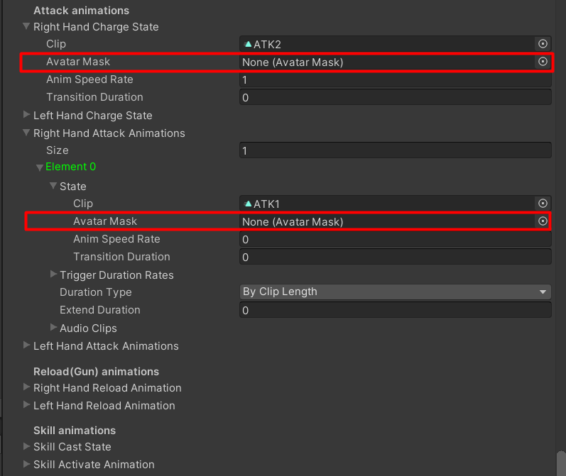

You can convert `Animator Character Model` to `Playable Character Model` by context menu:

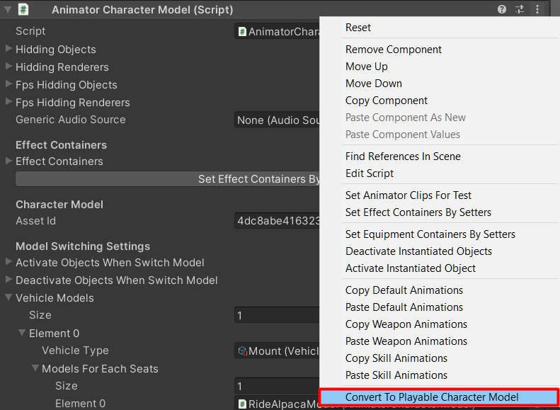

### Bug Fixes
- Fix status effects from item's passive skills not being applied.
- Fix wrong send friend request inform message.
- Fix `Activate Button Activator` component is activating `Activate Objects` (Virtual Mobile Buttons) while point on building which is not activatable building.
- Fix `UI Cash Shop Item` wrong calculation price when enter amount over `99`.

### Improvement
- Add `Warp To Map Item` which can be created from create menu -> `Create GameData/Item/Warp To Map Item`, use this item to warp character to the map which defined in item settings.
- Add `Warp To Respawn Point Item` which can be created from create menu -> `Create GameData/Item/Warp To Respawn Point Item`, use this item to warp character to respawn point.
- Add `Simple Warp To Target Skill` which can be created from create menu -> `Create GameData/Skill/Simple Warp To Target Skill` use this skill to warp character to aim position.
- Add `Is Warp To Aim Position` setting to `Simple Area Attack Skill`, if this is turn on, it will warp character to aim position.
- Add `Is Warp To Aim Position` setting to `Simple Area Buff Skill`, if this is turn on, it will warp character to aim position.
- Add VSync settings for each platforms to `Game Instance`.
- Add `Can Pickup Items Which Drops By Players Immediately` to `Game Instance`, if this is turn on, it will character will be able to pickup items which drop by other players immediately.
- Delete `Text Title` and `Text Title B` from `Base Game Entity`.

* * *

## 1.67c (2021-08-05)

### Bug Fixes
- Fix wrong SQLite -> Mail columns reading.
- Fix missing fields in character model component inspector.
- Fix animator character models play the same action animation like the one which played action animation lastly. 

### About Animator Character Model
I've fixed its issues by bringing back old animator character model codes which won't cache animator controller by character prefab, so it will slow because it has to create a new animator controller for all characters, the cached version has an action animation problem because the cached animator controller will be shared for all character. I can keep using the cached version but I have to create new states in animator controllers, but I'm not sure about the number of states which included attacking, reloading, skill casting, charging animations yet. So I decide to use the old version, if Unity allows me to add new animator states dynamically at runtime or has a function which just play any animation it will be easier to solve these issues.

Unity just has a [playable graph](https://docs.unity3d.com/Manual/Playables-Graph.html) in 2018.4, which I am going to use to create a new kind of character model component, maybe named "PlayableGraphCharacterModel", can handles all animation by codes, so you won't have a graph editor like animator controller editor if you want to change transitions you may have to changes codes.

I've tried to mix animator and playable graph by uses a playable graph for action animation playing but the result was not looking good. It won't play masked avatar parts as intended.

* * *

## 1.67b (2021-07-31)

### Character Model Manager / Character Model based components
- Store `assetId` to `BaseCharacterModel` prefab.
- Move `vehicleModels` from `CharacterModelManager` to `BaseCharacterModel`, now it can set model for each vehicle types to FPS model.

### Other Structure Changes
- Change `BaseSkill` -> `GetSkillCastEffect()` function to `SkillCastEffect` getter property.
- Change `BaseSkill` -> `GetDamageHitEffects()` function to `DamageHitEffects` getter property.
- Change `DamageElement` -> `GetDamageHitEffects()` function to `DamageHitEffects` getter property.

### Improvement
- Improve game data, game entity inspector GUI by put properties into foldout group.

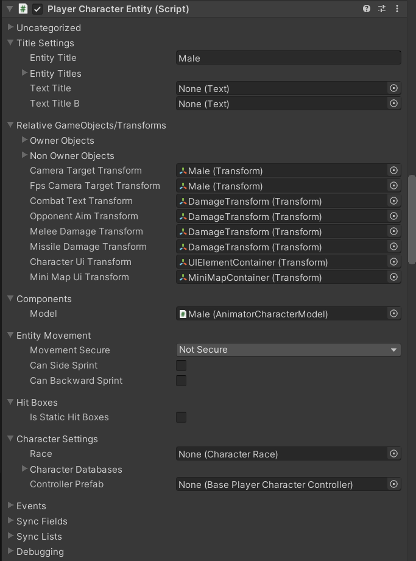

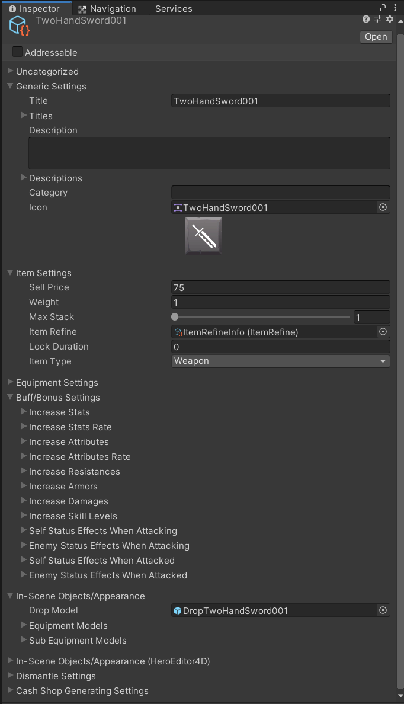

- Add cash shop item generating to item game data, it will generate cash shop item data when initialize item game data and add it to the game instance's list.
- Add `cash` field to `mail` data.
- Remove guild's `OptionId1`, `OptionId2`, `OptionId3`, `OptionId4`, and `OptionId5`. Add `Options` which its type is `String` so it can set any guild options as JSON (or other format).
- Add `onIsTypeWriter` and `onNotTypeWriter` to `UIChatMessage`. Usage example: I've use it to change layout alignment for messages which I typed to the right-side, other's messages to the left.
- Add `SetLayoutChildElement` component, use it to change layout group's child alignment.
- Add `UILatestChatMessage` component, use it to show just one latest chat message.
- Reduce warning messages by set default value to private serialized properties.
- Add `doNotIncludeItems` to `UICharacterHotkeys`, turn it on to don't include an items in `UICharacterHotkeyAssigner`.
- Add `doNotIncludeSkills` to `UICharacterHotkeys`, turn it on to don't include an skills in `UICharacterHotkeyAssigner`.
- Add `RandomAttackDamage` to `BaseGameplayRule`, you can implement your own functionality to change how to calculating each damage element (by extends `BaseGameplayRule` or `DefaultGameplayRule` class).
- Add `GetTotalDamage` to `BaseGameplayRule`, you can implement your own functionality to change how to calculating total damage (by extends `BaseGameplayRule` or `DefaultGameplayRule` class).

### Bug Fixes
- Fix status effects from socket enhancer not applies.
- Fix wrong attack and use skill distance calculation at client-side. It was not find distance between attack origin and hit box, it was find distance between attack origin and character's collider which will be used for mouse picking. It is cause of problem which character's attacking won't hit enemy.
- Fix no combat text when damage over time applies to characters.
- Fix missile/raycast(hitscan) can hit item drop entities.
- Fix duplicating character entity when switch to FPS mode.

* * *

## 1.67 (2021-07-21)
### Improvement
- Status effects from passive skills can be applied to target.
- Add mail notification.
- Add claim all mails items function.
- Add delete all mails function.

### Bug Fixes
- Fix pet item cooldown bug.
- Fix monster which killed by buffs won't reward player's EXP.
- Fix other entities invisible when the playing character is hiding.
- Fix wrong missle entity position when spawn.
- Fix duplicating storage item issues (MMO).
- Fix monster's items were checking when use skills, now it won't do it.

* * *

## 1.66d (2021-06-22)
### Improvement
- Add status effects section to game database dialog.

### Bug Fixes
- Fix status effects for attacked character not working properly.

* * *

## 1.66c (2021-06-21)
### Improvement
- Change listing UI components (such as `UICharacterBuffs`, `UICharacterCurrencies` and so on) to have the same variable/function names (with other classes), intend to make it easier to find things and also changes some functions to be overridable.
  - Dialog reference (Example: `uiCurrencyDialog`) variable name will be changed to `uiDialog`.
  - Prefab reference (Example: `uiCharacterCurrencyPrefab`) variable name will be changed to `uiPrefab`.
  - Container reference (Example: `uiCharacterCurrencyContainer`) variable name will be changed to `uiContainer`.
  - On dialog hide function (Example: `OnItemDialogHide`) name will be changed to `OnDialogHide` and also overrideable.
  - On entry select function (Example: `OnSelectCharacterItem`) name will be changed to `OnSelect` and also overrideable.
  - On entry deselect function (Example: `OnDeselectCharacterItem`) name will be changed to `OnDeselect` and also overrideable.
  - `UpdateData` function will be overridable.
- Change skill functions
- Add `isExtendDuration` to `Buff` struct. If it is `TRUE` buff duration can be extended, when extending it will change buff level to the latest applying level.
- Add `maxStack` to `Buff` struct. It will be used while `isExtendDuration` is `FALSE` to make buff stackable.
- Add `doNotRemoveOnDead`. If it is `TRUE` buff won't be removed from the character when the character dead.
- Socket enhancer items can apply status effects.
- Buffs can apply status effects.
- Add `goldRate` to `CharacterStats` struct.
- Add `expRate` to `CharacterStats` struct.
- Add `/gold_rate (float)` to default GM commands, use it to set gold rate.
- Add `/exp_rate (float)` to default GM commands, use it to set exp rate.
- Add `onEquipmentModelsInstantiated (equipPosition)` action to `BaseCharacterModel`, it will be called when instantiating equipment model when equipping equipment.
- Add `onEquipmentModelsDestroyed (equipPosition)` action to `BaseCharacterModel`, it will be called when destroying equipment model when unequipping equipment.
- Change `BaseEquipmentEntity` to be partial class.
- Change `EquipmentEntity` to be partial class.
- Don't show consuming HP text component if consume amount = 0.
- Don't show consuming MP text component if consume amount = 0.
- Don't show consuming Stamina text component if consume amount = 0.
- Change how to create animator override controllers for `AnimatorCharacterModel` by creating just once for each kind of entity, the older version was creating new animator override controllers for all entities so it was slow when spawning entities.

### Bug Fixes
- Regenerate `DefaultInterestManager` meta file to avoid weird Unity's importing bug.
- Fix username and password not stored properly while auto login is turn on.
- Fix home scene will being loaded while starting map server.
- Fix attacking not simulating correctly, which is the cause of user can see character attacks but damage won't be applied.

* * *

## 1.66b (2021-06-10)
### Logging System
Logging system changed, now it uses [ZLogger](https://github.com/Cysharp/ZLogger) for the logging system. There are some plugins folder strucure changes when adding plugins, so you should delete `Assets/UnityMultiplayerARPG/Core/LiteNetLibManager` and `Assets/UnityMultiplayerARPG/MMO/Plugins` folder before import the new version.

### Status Effect
Add `StatusEffect` game data which can create from menu `Create -> Create GameData -> StatusEffect`, can set it to equipment item 
- `selfStatusEffectsWhenAttacking` to apply status effects to the item-equipped character when attacking.
- `enemyStatusEffectsWhenAttacking` to apply status effects to the enemy when the item-equipped character attacking.
- `selfStatusEffectsWhenAttacked` to apply status effects to the item-equipped character when attacked.
- `enemyStatusEffectsWhenAttacked` to apply status effects to the enemy when the item-equipped character attacked.

### Bug Fixes
- Fix server auth entity movement can jump repeatedly on the air.
- Fix wrong swimming animation state when jump to the water.
- Fix non-stop swimming up to the surface while `autoSwimToSurface` option is turned on.
- Fix character casting skill while it has not enough items (but casted skill won't apply).

* * *

## 1.66 (2021-06-05)
### Bug Fixes
- Fix missing parameters in `UICharacterStats` -> `CharacterStats.GetText` which is cause of wrong stats listing.
- Fix empty text when text wrapper/input field wrapper awake.
- Fix wrong item index in `UINpcDialog` -> `uiSellItemDialog`.
- Fix wrong aim direction when select itselft and attack.
- Validate hit index when simulate attack to avoid hacking.

### Improvement
- Summoned monsters can buffs summoner, there is new `summonerBuff` settings in `MonsterCharacter` game data.
- Add `IsImmune` state to `DamageableEntity`, while this is `TRUE` it won't receives damage.
- Change entity title setting, all kinds of entity will have `entityTitle` and `entityTitles` settings, if value in `syncTitle` is null or empty it will use those settings.
- Add `availableClasses` setting to `EquipmentRequirement`, now developer can set more than one kind of character class which will able to equip item.
- Add `isOverrideCharacteristic` and `overrideCharacteristic` to `BaseMonsterCharacterEntity` use them to override `MonsterCharacter`'s `Characteristic` setting.
- Change how LAN player's storage items saving, it will be saved locally, not on host.
- Delete `GetDamageEffectTransform` function from `IDamageInfo`, it's not necessary because all character animations will be played both on server and client. The older version won't play any animation but it has to change because character's hitbox has to update as same as clients.

* * *

## 1.65f (2021-05-31)
### Skill structure changes
Now it will pass target entity object ID to use skill function, `targetObjectId` parameter was added to `BaseSkill` -> `ApplySkillImplement`, `CanUse` functions.

### Bug Fixes
- Avoid null data in `BuildingMaterial`'s trigger events.
- Fix null instigator data when apply or receive damage.
- Fix `Killed` function being called double when character dead by debuffs.
- Fix default move state for `NPC Entity` is falling.

### Improvement
- Add `hpRecovery` to `CharacterStats`, see how it was implemented and calculated to recover character's HP in `DefaultGameplayRule` -> `GetRecoveryHpPerSeconds` function.
- Add `mpRecovery` to `CharacterStats`, see how it was implemented and calculated to recover character's MP in `DefaultGameplayRule` -> `GetRecoveryMpPerSeconds` function.
- Add `staminaRecovery` to `CharacterStats`, see how it was implemented and calculated to recover character's stamina in `DefaultGameplayRule` -> `GetRecoveryStaminaPerSeconds` function.
- Add `hpLeechRate` to `CharacterStats`, see how it was implemented in `DefaultGameplayRule` -> `OnCharacterReceivedDamage` function.
- Add `mpLeechRate` to `CharacterStats`, see how it was implemented in `DefaultGameplayRule` -> `OnCharacterReceivedDamage` function.
- Add `staminaLeechRate` to `CharacterStats`, see how it was implemented in `DefaultGameplayRule` -> `OnCharacterReceivedDamage` function.
- Add overlapping checking to `HarvestableSpawnArea` for 2D games.

* * *

## 1.65e (2021-05-21)
### Chat structure changes
Chat codes were moved from game network manager to following implemented interfaces:
- `IClientChatHandlers` contains functions to request server to send chat messages. Implemented to `ClientChatHandlers`.
- `IServerChatHandlers` contains functions to handle request from clients to send chat messages. Implemented to `DefaultServerChatHandlers`.

### BaseSkill structure changes
- Abstract `ApplySkill` function was changed to `ApplySkillImplement` and also change its accessibility level to `protected`.

### Bug Fixes
- Fix missing place building entity on ground codes for 2D games in `PlayerCharacterController`.
- Fix skill level up button disabled while equip item which increase skill level to max level. It should be enabled while learnt level is < max level.
- Avoid null data error in `DismantleItemUIActivator` update function when change scene or stop game.
- Avoid null data error in `EnhanceSocketItemUIActivator` update function when change scene or stop game.
- Avoid null data error in `RefineItemUIActivator` update function when change scene or stop game.
- Avoid null data error in `RepairItemUIActivator` update function when change scene or stop game.
- Avoid null data error in `ShopUIActivator` update function when change scene or stop game.
- Avoid null data error in `StorageUIActivator` update function when change scene or stop game.
- Fix offline game save race condition when change scene which is cause of storage's items losing.
- Fix wrong move direction while FPS is very low.

### Improvement
- Make `CharacterRace` to be partial class.
- Make rewarding EXP in `MonsterCharacter` data can be increased by monster level. By add `randomExp` variable, the old `randomExpMin` and `randomExpMax` variables will be set to `randomExp` -> `baseAmount` if any of them != 0 and values in `randomExp` are 0.
- Make rewarding gold in `MonsterCharacter` data can be increased by monster level. By add `randomGold` variable, the old `randomGoldMin` and `randomGoldMax` variables will be set to `randomGold` -> `baseAmount` if any of them != 0 and values in `randomGold` are 0.
- Add `requireItems` settings to skill classes. If this list is empty it won't decrease items from inventory. It will decrease one kind of item in this list when using skill, not all items in this list.
- Add `requireAmmoType` settings to skill classes. If `Require Ammo Type` is `Based On Weapon` it will decrease ammo based on ammo type which set to the weapon, amount to decrease ammo can be set to `Require Ammo Amount`. If weapon has no require ammo, it will not able to use skill. If `Require Ammo Type` is `Based On Skill`, it will decrease ammo based on `Require Ammos` setting.
- Add `requireAmmoAmount` settings to skill classes. It will be used while `Require Ammo Type` is `Based On Weapon` to decrease ammo.
- Add `requireAmmos` settings to skill classes. If this list is empty it won't decrease ammo items from inventory. It will decrease one kind of item in this list when using skill, not all items in this list.
- Add `craftingDistance` to `QueuedWorkbenchEntity`, if this is > 0 it will limit distance to craft an items with this workbench entity by its value.
- Add `boundsSizeRateWhilePlacing` to `BuildingMaterial`, it will be used to reduce collider's bounds when find other intersecting building materials.

* * *

## 1.65d (2021-05-13)
### Bug Fixes
- Fix `increaseStatPointsUntilReachedLevel` and `increaseSkillPointsUntilReachedLevel` setting not working as intended.
- Fix wrong attribute amounts and skill levels in item equipment requirement and skill level up requirement UIs.

### Improvement
- Add `QueuedWorkbenchEntity` it is workbench with queueable crafting system.
- Change stat point and skill point to be fractional.

* * *

## 1.65c (2021-05-12)
### Bug Fixes
- Fix `NoConstructionArea` not working.
- Fix to not applies move speed while use root motion for movement.

### Improvement
- Add `increaseStatPointsUntilReachedLevel` to `DefaultGameplayRule`, If this > `0`, it will increase stat point until character reached max level. If it's `20`, it will increase stat point until character reached level `20`.
- Add `increaseSkillPointsUntilReachedLevel` to `DefaultGameplayRule`, If this > `0`, it will increase skill point until character reached max level. If it's `20`, it will increase skill point until character reached level `20`.
- Add `activateObjectsWhenSwitchModel` to `BaseCharacterModel`, these game objects will be activated when switch from other model (switching when riding vehicles).
- Add `deactivateObjectsWhenSwitchModel` to `BaseCharacterModel`, these game objects will be deactivated when switch from other model (switching when riding vehicles).

* * *

## 1.65b (2021-05-11)
### Bug Fixes
- Fix moving animations not play at server, It's a cause of root motion entity not moving issues.
- Fix wrong weapon animations while riding vehicle.
- Fix `RigidBodyEntityMovement` component not being added when create character entity with `Character Entity Creator (3D)` dialog.

### Improvement
- Add `harvestType` and `harvestDamageAmount` settings to skill. If `harvestType` is `BasedOnWeapon`, harvest damage amount will be calculated by weapon type's `harvestDamageAmount` settings. If `harvestType` is `BasedOnSkill`, harvest damage amount will be calculated by skill's `harvestDamageAmount` settings.
- Add `skillHarvestEffectivenesses` to `Harvestable`, it will be used when skill's `harvestType` is `BasedOnSkill` to random dropping items when harvestable entity attacked.

* * *

## 1.65 (2021-05-01)
### Character actions structure changes
Now actions codes were moved to separated classes which implement following interfaces `ICharacterAttackComponent`, `ICharacterUseSkillComponent`, `ICharacterReloadComponent`, `ICharacterChargeComponent`. To make it able to change functionality by change attached component.
- If there is no class which implements `ICharacterAttackComponent` attached to the same game object with character entity, it will attach `DefaultCharacterAttackComponent` on awake.
- If there is no class which implements `ICharacterUseSkillComponent` attached to the same game object with character entity, it will attach `DefaultCharacterUseSkillComponent` on awake.
- If there is no class which implements `ICharacterReloadComponent` attached to the same game object with character entity, it will attach `DefaultCharacterReloadComponent` on awake.
- If there is no class which implements `ICharacterChargeComponent` attached to the same game object with character entity, it will attach `DefaultCharacterChargeComponent` on awake.
Change how to send attack packet, now owner client won't send aim position to server, it will send launch position, direction and time to server, only when attack action triggered.
Change how to send skill packet, now it will send it will send launch position, direction and time to server.

### New Features
- Hit box lag compensation. If you want to changes settings, you have to attach `DefaultLagCompensationManager` to the same game object with `LanRpgNetworkManager` to `MapNetworkManager`.

### Bug Fixes
- Fix stuttering `RigidBodyEntityMovement2D`.
- Fix slow `AudioSourceSetter`, now it will store settings in variables, it was get settings directly from `PlayerPrefs`.

### Improvement
- Add `countDownObjects` to `UICharacterSkill` component, game objects which set into this field will be activated when the skill is cooling down.
- Add `noCountDownObjects` to `UICharacterSkill` component, game objects which set into this field will be activated when the skill is not cooling down.
- Add `countDownObjects` to `UIGuildSkill` component, game objects which set into this field will be activated when the skill is cooling down.
- Add `noCountDownObjects` to `UIGuildSkill` component, game objects which set into this field will be activated when the skill is not cooling down.
- Add `canBuildOnAnySurface` field to `BuildingEntity`. If this is `TRUE` this building entity will be able to build on any surface. But when constructing, if player aimming on building area it will place on building area.
- Add `allowRotateInSocket` field to `BuildingArea`. If this is `TRUE`, players will able to rotate constructing building entity while placing on the building area.
- Add `NoConstructionArea` component, add this component and adjust trigger collider where you want to prevent players to construct buildings.

* * *

## 1.64 (2021-04-12)
### Database server changes
- Now it won't uses GRPC anymore, it use `LiteNetLibManager` for inter-server communication. Project size will be smaller. Hope this change make it able build as IL2CPP for standalone platforms.

### Bug Fixes
- Fix entity movements not moves character follow transform which synced from server.
- Fix items that drops from harvestable entities not able to pickup immediately (it had to wait sometime to pickup).
- Fix found ground position not applied when spawn entities.
- Fix `landedPauseMovementDuration` setting in `CharacterControllerEntityMovement` and `RigidbodyEntityMovement` not work as intended.
- Fix `EquipmentEntity` not update material/activating objects follow `effects` settings.

### Improvement
- Improve gun fire recoiling, now it is smoother and also makes separated recoil by axes (`CrosshairSetting` -> `recoilX`, `recoilY`).
- In `UICashShopItem` it will hide sell price if sell price <= `0`.
- `BuildingMaterial` changes `meshRenderer`, `spriteRenderer` and `tilemap` to be public fields.
- Improve `NavMeshEntityMovement` to turn character smoothly.

### New Components
- Add `NonEquipDropHandler` this is drop area for inventory, when drop item which dragged from equipment slot it will un-equip, when drop item which dragged from storage it will move item from storage.
- Add `ClientCashShopActions`, for cash shop services response setting at client.
- Add `ClientMailActions`, for mail services response setting at client.

### New Tools
- Add `Game Database` editor which you can open from menu `MMORPG KIT` -> `Game Database`, hope it helps customer to manage game data easier.

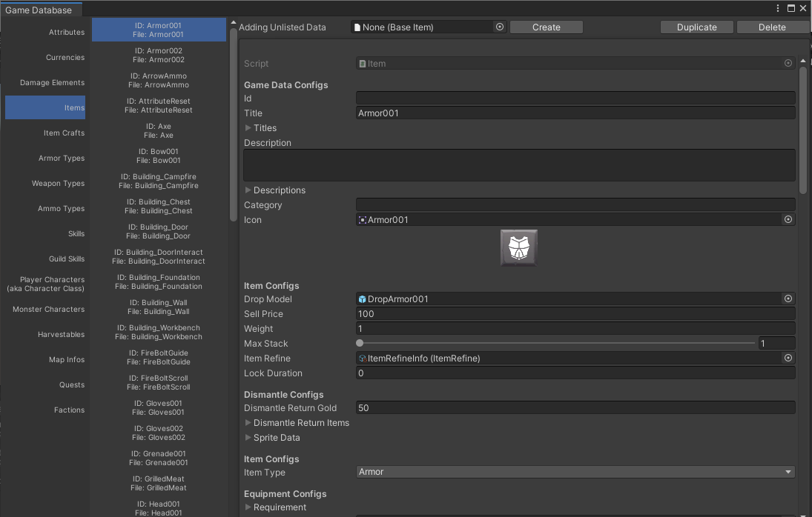

- Add `Character Entity Creator (3D)` which you can open from menu `MMORPG KIT` -> `Character Entity Creator (3D)`, which helps customer to create new character entity easier.

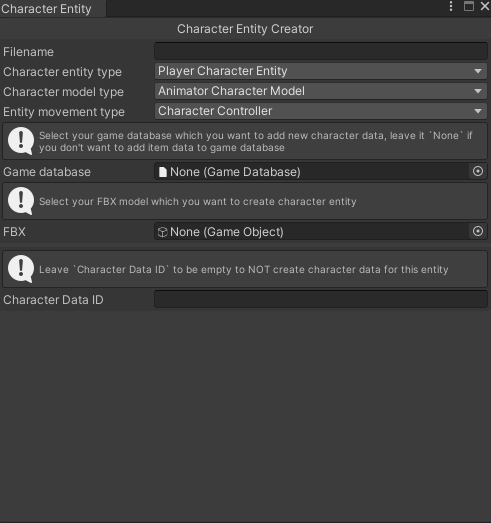

- Add `Character Model Cloner (3D)` which you can open from menu `MMORPG KIT` -> `Character Model Cloner (3D)`, which helps customer to clone settings to another character model.


* * *

## 1.63h (2021-03-24)
### Bug Fixes
- Fix character won't attack after weapon chanrged.
- Fix monster move stuttering when follow enemy.

### Improvement
- Improve character model's effect containers and equipment containers gizmos to make it easier to see in editor.
- Add equipment entity's missile damage transform and pivot gizmos to make it easier to see in editor.
- Add hit box's pivot gizmos to make it easier to see in editor.
- Add `onStart` which will be called in `Start` function, `onBeginDrag` which being called in `OnBeginDrag` and `onEndDrag` which being called in `OnEndDrag` events to `UIDragHandler`.
- Add `uiTextRightHandSumAmmo` which will shows sum of current ammo and reserve ammo to `UIAmmoAmount`.
- Add `rightHandNoRequireAmmoSymbol` which will be shown while sum ammo amount is `0` to `UIAmmoAmount`.
- Add `uiTextLeftHandSumAmmo` which will shows sum of current ammo and reserve ammo to `UIAmmoAmount`.
- Add `leftHandNoRequireAmmoSymbol` which will be shown while sum ammo amount is `0` to `UIAmmoAmount`.
- Add UI component fields which relates to weapon's ammo to `UICharacterItem` (like as `UIAmmoAmount`).
- Add `doNotShowEmptySlots` to `UICharacterItems` to filter and hide empty slots when showing items.
- Add landed state which will plays when just landed after falling to `AnimatorCharacterModel` and `AnimationCharacterModel`.
- Add `doNotChangeVelocityWhileAirborne` which while it's turned on it will uses move velocity before air borne to move entity not movement inputs to `CharacterControllerEntityMovement` and `RigidBodyEntityMovement`.
- Add `landedPauseMovementDuration` to pause movement when just landed after falling to `CharacterControllerEntityMovement` and `RigidBodyEntityMovement`.

* * *

## 1.63g (2021-03-21)
### Bug Fixes
- Fix wrong weapon charge animation clip.
- Fix `Missile Damage Entity` -> `previousPosition` not reset, which is cause of disappears issues.

### Improvement
- Reduce client inputs packet size by not send object ID, connection ID was bound to character entity so it not have to send object ID.
- Add `Move Speed Rate While Reloading` and `Move Speed Rate While Charging` to weapon items. And also implemented to character entity to change move speed while reloading or charging.
- Change how to calculate `multiHitTriggerDurationRates`. The old was like this example: if `multiHitTriggerDurationRates` set to `[0.2, 0.4, 0.8]` calculated trigger durations will be `[0.2, 0.4, 0.8]`. The new one is like this: if `multiHitTriggerDurationRates` set to `[0.2, 0.4, 0.8]` calculated trigger durations will be `[0.2, 0.2, 0.4]`.
- Add guild rewarding. There are new settings in `GuildWarMapInfo`: `participantMailTitle` - Title for mail which send to participants (not winner), `participantMailContent` - Content for mail which send to participants (not winner), `participantRewardGold` - Gold which will be send with the mail which send to participants (not winner), `participantRewardCurrencies` - Currencies which will be send with the mail which send to participants (not winner), `participantRewardItems` - Items which will be send with the mail which send to participants (not winner), `winMailTitle`- Title for mail which send to winner participants, `winMailContent` - Content for mail which send to winner participants, `winRewardGold` - Gold which will be send with the mail which send to winner participants, `winRewardCurrencies` - Currencies which will be send with the mail which send to winner participants, `winRewardItems` - Items which will be send with the mail which send to winner participants.

* * *

## 1.63f (2021-03-19)
### Bug Fixes
- Fix camp fire entity still turned on and not converting materials while materials amount less than the one which set in conversion settings.
- Avoid null data when finding overriding attack function from skills.
- Always send aim position to server to make projectile direction same as the owner-client.

### Improvement
- Add `Id` field to game data, you can set fixed ID to each game data, or leave it empty to use filename as ID.
- Add options to set update Pitch IK by movement state to `CharacterPitchIK` component.
- All UI components -> icon's `preserveAspect` setting will be turned on.

* * *

## 1.63e (2021-03-18)
### Bug Fixes
- Fix non-owner character not turn smoothly on clients.

### Improvement
- Send only changes inputs to server.
- Set time zone to local time when send mail while using SQLite as database.
- Move aim position sync field to send it at same time with attack/use skill RPC.

* * *

## 1.63d (2021-03-17)
### Bug Fixes
- Fix client not send rotation while not moving.
- Fix monster character entity's on respawn not being called.

### Improvement
- Rotate character smoothly after received inputs from other clients or when received sync transform from server.

* * *

## 1.63c (2021-03-16)
### Bug Fixes
- Fix wrong server authoritative move destination. I've changed how it works, now it will send position, rotation, movement state when there are changes that occur only. It won't send point-click position or move input state separately, it will calculate movement destination at client send the destination to server then server move character.
- Fix storage empty slots not filled before move item to the storage.

### Improvement
- Change respawn APIs to make it able to change how to respawn character.
- Add `receiveCurrencies` to `CashShopItem` game data.
- Add `textRecieveGold` to `UICashShopItem`, set text which you want to show receiving gold when buy cash shop item here.
- Add `uiReceiveCurrencies` to `UICashShopItem` set UI which you want to show receiving custom currencies buy cash shop item here.
- Add `uiReceiveItems` to `UICashShopItem` set UI which you want to show receiving items buy cash shop item here.
- Add `UIUserCurrencies` component, use it to show user's currencies (gold in bank, user's cash).
- Change building entity materials setter to use shared materials.
- Improve `AudioSourceSetter` to set audio source's volume only when value changed.

* * *

## 1.63b (2021-03-09)
### Bug Fixes
- Fix error which occurring after monster killed.
- Fix wrong cash package validation response function's return type.
- Fix crafting queue item UI not updated correctly.

### Improvement
- Add `listEmptyObject` to `UICashPackages`, `UICashShop`, `UICharacterItems`, `UICharacterQuests`, `UICharacterSkills`, `UIFindCharacters`, `UIFriend`, `UIItemCraftFormulas`, `UIItemCrafts`, `UIItemsContainer`, `UILanConnection`, `UIMailList`, `UIMailListEntry` and `UIStorageItems`, set game object which will show while there is no entry in the list to that `listEmptyObject`.
- Add `filterCategories` to `UICashShop`.

* * *

## 1.63 (2021-03-06)
### New Systems
- Add new damage type: `Throwable` with new damage entity: `ThrowableDamageEntity`. Can use it to make grenade weapons. *`ThrowableDamageEntity` physics simulating won't synced from server yet, so players can see difference entity's position but damage still applies at server.*
- Add new fire type: `FireOnRelease` to weapon item data which will be used by `ShooterPlayerCharacterController`, it will start firing when release *attack* button.
- Add weapon charge animation which will plays while holding *attack* button (while weapon's fire type is `FireOnRelease`). *To whom who made custom animator controller, you have to add new state which its clip name must be `__WeaponCharge` and must have `IsWeaponCharge` boolean parameter and use it and transition to weapon charge state*. *In the future I might make damage varying by charge duration :P*.
- Add queueable crafting system, when you want new item craft formula you can create new `ItemCraftFormula` scriptable objects and put it to your game database.

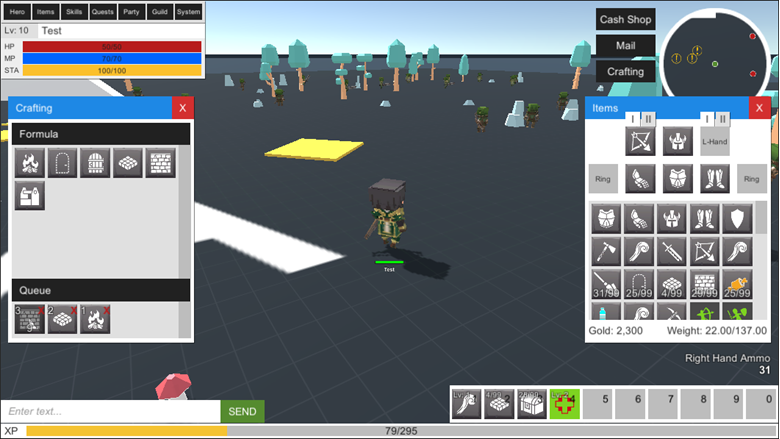

### Improvement
- Add `UIGageDurability` and `UIGageExp` (for pet item) to `UICharacterItem`.
- Add `DestroyImmediatelyAfterFired` to weapon item data, can use it with grenade items to destroy it after throw.
- Add `RandomCurrencies` to `MonsterCharacter` game data and `ItemDropTable` game data for rewarding players with currencies when kills monsters.
- When character hiding, other clients will unsubscribe that character.

### Entity Movement Changes
- If `MovementSecure` is `ServerAuthoritative` it will simulate movement immediately at owner-client. Owner-client will send inputs to server (not position/rotation) then the server will simulate movement and sync transform to all clients, including owner-client in-case owner-client is lag it can cause rubber banding effect to make its transform not too difference with the server. It will set owner-client's character's transform to the one which received from server when distance is > `SnapThreshold`.
- If `MovementSecure` is `NotSecure` it will send transform to server then server pass transform to all clients like mentioned above. It can reduce work at server. But it is able to hack, I will implement speed hack detection at server later.
- It uses character's movespeed for interpolation, not estimating speed.
- It won't uses `LiteNetLibTransform` anymore, you can remove that component from your character entity. *`LiteNetLibTransform` will be disabled on awake if it can find that it has that component attached*.

* * *

## 1.62g (2021-02-18)
- Fix wrong constructing building rotation while controlling with `ShooterPlayerCharacterController`.
- Improve entity movement -> find grounded position function to find nearest position to `fromPosition` (finding ground origin).

*Yes, it's like it has no new update, I actually made this just because I want to update Facebook and Google login packages because I was forgot it in previous update*

* * *

## 1.62f (2021-02-18)
### Improvement
- Allow to set `impactEffects` while `damageType` is `Melee`.
- Add `buildRotateSpeed` to `PlayerCharacterController` and `ShooterPlayerCharacterController`. It will be used while `buildRotationSnap` is `FALSE` to rotate building while player pressed rotate keys.
- Change `LiteNetLibManager`'s response handler delegate to be non-async function because it's not neccessary.
- Set `generateGridMode` to `Collider3D` when `GridManager` was added at run-time and `CurrentGameInstance.DimensionType` is `Dimension3D` (Older version will be `Renderer`).
- Set `generateGridMode` to `Collider2D` when `GridManager` was added at run-time and `CurrentGameInstance.DimensionType` is `Dimension2D` (Older version will be `Renderer`).
- Add `maxPathsForKeyMovement` to `NavMeshEntityMovement`. Use this in-case you don't want character to keep moving to position behind the wall. If calculated paths +1 higher than this value, it will stop moving. If this is 0 it will not applies.
- Add `requireShield` to `BaseSkill`. If this is `TRUE`, character have to equip shield to use skill.
- Rename `UICraftItem` to `UIItemCraft` to makes its name same with game data.
- Rename `UICraftItems` to `UIItemCrafts` to makes its name same with game data.
- Rename `UICraftItemSelectionManager` to `UIItemCraftItemSelectionManager` to makes its name same with game data.

### Bug Fixes
- Fix duplicating craft items at clients.
- Fix issue when summoned monster kills monster but it's not increase summonter character quest progress.
- Fix issue when summoned monster kills monster and drop items but it's not allow summoner character to pick up.
- Fix building freeze after destroyed by characters.
- Fix HP/MP/Stamina and so on debuff not being drained.
- Fix storage closed not being notified at clients.
- Fix building not rotating while `PlayerCharacterController`/`ShooterPlayerCharacterController` -> `buildRotationSnap` is `TRUE`.

* * *

## 1.62e (2021-02-05)
### Improvement
- Don't use `FindObjectsOfType` to find `UIBlockController`.
- Add `movementTheshold` to `GridVisibleChecker` to reduce position in grid update rate, it will update when distance of current position and previous updated position is more than this value.
- Changes how to interpolate `LiteNetLibTransform`, now it will interpolate by calculated move speed between 2 received positions. And also add extrapolate option which will extrapolate by alculated move speed between 2 received positions too.
- Improve `ShooterPlayerCharacterController` to turn forward while doing action by turn speed correctly.
- Add `stoppedPlayingAttackOrUseSkillAnimationDelay` to `ShooterPlayerCharacterController`, it is delay before turning character to move direction after played attack or using skill animation.
- Make `BuffToTarget` skills, applying to skill user if no selected character.
- Add indexes to tables to improve database query performance.

* * *

## 1.62d (2021-01-31)
### Bug Fixes
- Fix null data when applies fall damage.
- Fix weapon set not reset to first set when press switch key.

### Improvement
- Add follow smoothness options to `FollowCamera` component.
- Add platform motion supports to `RigidBodyEntityMovement`.
- Add `CharacterControllerEntityMovement` it is like `RigidBodyEntityMovement` but uses `CharacterController` component, if you want to changes from `RigidBodyEntityMovement` to this, Save collider info from `CapsuleCollider` (May capture screen shot of copy to text file :P) then remove `OpenCharacterController`, `CapsuleCollider`, `Rigidbody` and `RigidBodyEntityMovement` before add `CharacterControllerEntityMovement` component. after that, copy saved collider info to `CharacterController`.

* * *

## 1.62c (2021-01-29)
### Bug Fixes
- Scene networked object not unsubscribed after destroyed.
- Networked object not subscribed immediately when spawn.
- Fix transform not updated correct when teleport, exit vehicle.

### Improvement
- Change how to find focusing `InputField` when press hotkey.
- Add `SetVisible(bool isVisible)` funciton to `UIBase`, useful for `Toggle` events.

* * *

## 1.62b (2021-01-27)
### Message Key changes
- Change `UI_SUCCESS_CASH_SHOP_BUY` to `UI_CASH_SHOP_ITEM_BOUGHT`.
- Change `UI_MAIL_SEND_SUCCESS` to `UI_MAIL_SENT`.
- Change `UI_MAIL_CLAIM_SUCCESS` to `UI_MAIL_CLAIMED`.
- Change `UI_MAIL_DELETE_SUCCESS` to `UI_MAIL_DELETED`.
- Add `UI_FRIEND_ADDED`.
- Add `UI_FRIEND_REMOVED`.
*Can use migration tool in `LanguageManager` component to update keys*

### Bugs Fixes
- Fix character finding not working.
- Fix invalid friend list caching.

### Improvement
- Add `errorMessageColor` setting to `UIGameMessageHandler`, now can change text color for mesages which its key start with `UI_ERROR`.

* * *

## 1.62 (2021-01-27)
### Code structure changes
This version continues changes code structure which mentioned in 1.61c, there are following changes:
- Change `UIInventoryResponses` class name to `ClientInventoryActions` and move it to `Assets/UnityMultiplayerARPG/Core/Scripts/Networking/Actions` folder.
- Add `RequestOpenStorage` and `RequestCloseStorage` functions to `IClientStorageHandlers` and also implements them.
- Add `HandleRequestOpenStorage` and `HandleRequestCloseStorage` functions to `IServerStorageMessageHandlers` and also implements them.
- Remove open storage and close storage RPC functions from `BasePlayerCharacterEntity` class. Uses open storage and close storage functions from classes that implements `IClientStorageHandlers`.
- Add `RequestSwitchEquipWeaponSet`, `RequestDismantleItem`, `RequestDismantleItems`, `RequestEnhanceSocketItem`, `RequestRefineItem`, `RequestRemoveEnhancerFromItem`, `RequestRepairItem`, `RequestRepairEquipItems`, `RequestSellItem` and `RequestSellItems` functions to `IClientInventoryHandlers` and also implements it.
- Add `HandleRequestSwitchEquipWeaponSet`, `HandleRequestDismantleItem`, `HandleRequestDismantleItems`, `HandleRequestEnhanceSocketItem`, `HandleRequestRefineItem`, `HandleRequestRemoveEnhancerFromItem`, `HandleRequestRepairItem`, `HandleRequestRepairEquipItems`, `HandleRequestSellItem` and `HandleRequestSellItems` functions to `IServerInventoryMessageHandlers` and also implements it.
- Remove some inventory management RPC functions which mentioned above from `BaseCharacterEntity` and `BasePlayerCharacterEntity` classes. Uses those functions from classes that implements `IClientInventoryHandlers`.
- Add `IClientCharacterHandlers` class, contains functions to request server to increase character's attribute and skill. Implemented to `DefaultClientCharacterHandlers`.
- Add `IServerCharacterMessageHandlers` class, contains functions to handle request from clients to increase character's attribute and skill. Implemented to `DefaultServerCharacterMessageHandlers`.
- Move `IClientPartyHandlers` -> `ClientParty`'s to `GameInstance` -> `JoinedParty`.
- Move `IClientGuildHandlers` -> `ClientGuild`'s to `GameInstance` -> `JoinedGuild`.
- Delete `IClientUserHandlers` and moves properties to `GameInstance`, so in `GameInstance` will contains `UserId` (*string*), `UserToken` (*string*), `SelectedCharacterId` (*string*), `PlayingCharacter` (*IPlayerCharcterData*), `PlayingCharacterEntity` (*PlayerCharacterEntity*), `OpenedStorageType` (*StorageType*) and `OpenedStorageOwnerId` (*string*).

### Game error message code structure changes
- Move `GameMessage` -> `Type` enum item to `UITextKeys`, remove `Type` from `GameMessage`.
- Remove `Error` enums from all response messages, changes mentioned error variable to message (`UITextKeys`). So it will be able to send any messages instead of and errors.
- Add button in `LanguageManager` to changes old `GameMessage` -> `Type` keys to new `UITextKeys` keys

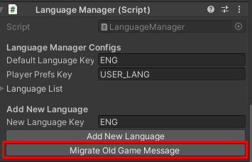

### LiteNetLibManager code structure changes
- Combine `RegisterClientMessages` and `RegisterServerMessages` to `RegisterMessages`, so developer can add new networking messages handlers in the `RegisterMessages` functions.
- Deletes `EnableClientRequestResponse` and `EnableServerRequestResponse`. Can use `EnableRequestResponse` functions to enable request/response feature, when use it, it will enable request/response for both client and server handlers.
- Deletes `DisableClientRequestResponse` and `DisableServerRequestResponse`. Can use `DisableRequestResponse` functions to disable request/response feature, when use it, it will disable request/response for both client and server handlers.
- Deletes `RegisterClientRequest` and `RegisterServerResponse` functions. Can use `RegisterRequestToServer` to register server's request handler and client's response handler.
- Deletes `RegisterServerRequest` and `RegisterClientResponse` functions. Can use `RegisterRequestToClient` to register client's request handler and server's response handler.
- Deletes `UnregisterClientRequest` and `UnregisterServerResponse` functions. Can use `UnregisterRequestToServer` to unregister server's request handler and client's response handler.
- Deletes `UnregisterServerRequest` and `UnregisterClientResponse` functions. Can use `UnregisterRequestToClient` to unregister client's request handler and server's response handler.
- Changes how visible checker component works, only player's networked objects will find nearby objects to subscribes. An older version, other objects will decides which player's networked objects to subscribes.

### Bugs Fixes
- Fix requests will be timed out while time out setting set to `0`, if it is <= `0` it should not be timed out. (LiteNetLibManager)
- Fix it's not switch to offline transport when start server / client in offline mode.
- Fix missing info for area damage entity when skill caster leaves the game.
- Fix wrong available NPC quest lists. Which is cause of wrong indicator activation.

* * *

## 1.61d (2021-01-14)
### LiteNetLibManager Updates
- Update `LiteNetLib` to version `0.9.4`.
- Change some transport codes structure. To whom update from older version, you have to delete `MixTransportEventListener` and `LiteNetLibTransportEventListener`.

### Bugs Fixes
- Fix unimplemented `IClientUserHandlers`. Which break client UIs controls.
- Fix wrong available NPC quest lists. Which is cause of wrong indicator activation.

### Improvement
- Add `haveTasksDoneQuestsIndicator` to `NpcQuestIndicator`, it will be activated while playing character has a quest which done all tasks. Indicator activation prority: `haveTasksDoneQuests` > `haveInProgressQuests` > `haveNewQuests`.

* * *

## 1.61c (2021-01-08)
### Code structure changes
This version gradually changes some codes structure, some RPC functions were moved to lower level request-response network function, and also divided into interfaces to implement different functions and each interface is switchable, there are following interfaces:
- `IClientBankHandlers` contains functions to request server to withdraw and deposit user gold, withdraw and deposit guild gold. Implemented to `DefaultClientBankHandlers`.
- `IClientCashShopHandlers` contains functions to request server to get shop/package info, buy IAP products. Implemented to `DefaultClientCashShopHandlers`.
- `IClientFriendHandlers` contains functions to request server to find characters by name, get friends, add friends ad remove friends. Implemented to `DefaultClientFriendHandlers`.
- `IClientGameMessageHandlers` contains functions to handle game messages, updating social members and social data, notify rewards, notify storage's state and social group invitation from server. Implemented to `DefaultClientGameMessageHandlers`.
- `IClientGuildHandlers` contains functions to request server to manage guild and a `ClientGuild` property which is playing character's guild. Implemented to `DefaultClientGuildHandlers`.
- `IClientInventoryHandlers` contains functions to request server to manage inventory: swap or merge item, equip and unequip equipments. Implemented to `DefaultClientInventoryHandlers`.
- `IClientMailHandlers` contains functions to request server to get mail list, read mail, claim mail items, delete mail and send mail. Implemented to `DefaultClientMailHandlers`.
- `IClientOnlineCharacterHandlers` contains functions to request server to get online characters, handle notify online character from server. Implemented to `DefaultClientOnlineCharacterHandlers`.
- `IClientPartyHandlers` contains functions to request server to manage party and a `ClientParty` property which is playing character's party. Implemented to `DefaultClientPartyHandlers`.
- `IClientStorageHandlers` contains functions to request server to move item from storage, move item to storage, swap or merge storage item. Implemented to `DefaultClientStorageHandlers`.
- `IServerBankMessageHandlers` contains functions to handle request from clients to withdraw and deposit user gold, withdraw and deposit guild gold. Implemented to `LanRpgServerBankMessageHandlers` and `MMOServerBankMessageHandlers`.
- `IServerBuildingHandlers` contains functions to store buildings at server for saving to save file or database. Implemented to `DefaultServerBuildingHandlers`.
- `IServerCashShopMessageHandlers` contains functions to handle request from clients to get shop/package info, buy IAP products. Implemented to `LanRpgServerCashShopMessageHandlers` and `MMOServerCashShopMessageHandlers`.
- `IServerFriendMessageHandlers` contains functions to handle request from clients to find characters by name, get friends, add friends ad remove friends. Implemented to `MMOServerFriendMessageHandlers` (not available for singleplayer/LAN games).
- `IServerGameMessageHandlers` contains functions to send game messages, updating social members and social data, notify rewards, notify storage's state and social group invitation to clients. Implemented to `DefaultServerGameMessageHandlers`.
- `IServerGuildHandlers` contains functions to contains functions store and manage guild at server. Implemented to `DefaultServerGuildHandlers`.
- `IServerGuildMessageHandlers` contains functions to handle request from clients to manage guild. Implemented to `LanRpgServerGuildMessageHandlers` and `MMOServerGuildMessageHandlers`.
- `IServerInventoryMessageHandlers` contains functions to handle request from server to manage inventory: swap or merge item, equip and unequip equipments. Implemented to `DefaultClientInventoryHandlers`.
- `IServerMailMessageHandlers` contains functions to handle request from clients to get mail list, read mail, claim mail items, delete mail and send mail. Implemented to `MMOServerMailMessageHandlers` (not available for singleplayer/LAN games).
- `IServerOnlineCharacterHandlers` contains functions to store online characters and handle request online characters from clients. Implemented to `DefaultServerOnlineCharacterHandlers`.
- `IServerPartyHandlers` contains functions to contains functions store and manage party at server. Implemented to `DefaultServerPartyHandlers`.
- `IServerPartyMessageHandlers` contains functions to handle request from clients to manage party. Implemented to `LanRpgServerPartyMessageHandlers` and `MMOServerPartyMessageHandlers`.
- `IServerStorageHandlers` contains functions to store storage and storage items at server. Implemented to `LanRpgServerStorageHandlers` and `MMOServerStorageHandlers`.
- `IServerStorageMessageHandlers` contains functions to handle request from clients to move item from storage, move item to storage, swap or merge storage item. Implemented to `LanRpgServerStorageMessageHandlers` and `MMOServerStorageMessageHandlers`.
- `IServerUserHandlers` contains functions to manage users and user's characters at server. Implemented to `DefaultServerUserHandlers`.

*I've changes the structure because my game has a separated lobby scene that can manage character, guild, party, and so on. So made an interface to make it can be re-used by other classes that extending the `LiteNetLibManager` class.*

### Bugs Fixes
- Skill's cast effects not playing if calculated `castDuration` is `0`.
- Fix gold not decreased when remove gem (enhancer item) from item's socket.

### Improvement
- Add `availableArmors` setting to `BaseSkill`, it's working like `availableWeapons` but it's condition for equipped armor, so you can made skill can be used by condition like: "character have to equip shield to use skill".
- Add `availableVehicles` setting to `BaseSkill`, it's working like `availableWeapons` but it's condition for riding/driving vehicle, so you can made skill can be used by condition like: "character have to ride a horse to use skill".
- Rename `GameSpawnArea` -> `level` to `minLevel` and add `maxLevel` to `GameSpawnArea`, to make it able set randoming level by `minLevel` and `maxLevel` in spawn area.
- Add `Unknow` to `InventoryType` will be used in an UIs for unknow source item such as gem in item's socket to don't show buttons.
- Add `CanInteractEntity` function to `BaseGameplayRule`, this function will be used to check if character can interact selected entity or not. And also implemented in `DefaultGameplayRule` to don't allow to interact selected entity behind the walls.
- Moved `GetSummonPosition` function from `BaseCharacterEntity` which is function to get summoning character position to `BaseGameplayRule` to makes it able to modify.
- Moved `GetSummonRotation` function from `BaseCharacterEntity` which is function to get summoning character rotation to `BaseGameplayRule` to makes it able to modify.

* * *

## 1.61b (2020-12-07)
### New Systems
- Add mail system, player can use it to send mail to other players, it can be used at server-side to send rewards to players too (but didn't implement as a sample yet).
- Moved character race from extension project to core project, so the extension doesn't required in case you want to set character race to characters anymore.

### Bugs Fixes
- Fix: shooter player character controller error when reload.

### Improvement
- Add `ConsumeHp` and `ConsumeStamina` to `BaseSkill` it is required Hp and Stamina to use skill.
- Add `EnhancerRemoval` setting to `GameInstance`, if `returnEnhancerItem` is `TRUE` it will return enhancer item from equipment (not destroy socketed gem in equipment), `requireGold` is gold amount which required to remove enhancer item.
- Can assign more than one kind of entity to one spawn area.

* * *

## 1.61 (2020-12-04)
### New Systems
- Add custom currency system, which can be received by quest completion and can be used to by items from NPC.

### Bugs Fixes
- Fix: cannot request to bulk dismantle items from client.
- Fix: cannot request to bulk sell items from client.
- Fix: guild skill level not updated to clients after incresed.
- Fix: guild skill bonus not calculated.
- Fix: players can attack each other while map PVP mode is none.
- Fix: cannot consturct building by playing 2D game.

### Improvement
- Add options `recoverMonstersWhenRoundEnd` to `BaseGameNetworkManager`, if this is `TRUE` monsters will be recovered
- Add `localPosition`, `localEulerAngles` and `localScale` settings to `EquipmentModel`, so developer can model transform when equip equipment item.
- Add `completeAfterTalked` to `QuestTask` it will being used if `taskType` is `TalkToNpc`, if this is `TRUE` it will complete quest immediately when talk to Npc (and all tasks have to be done).
- Add `MultiplayerARPG` namespace to character save and relates data classes, also added type binder class (`PlayerCharacterDataTypeBinder`) to make it able to deserialize old saves correctly.
- Add `imageRarity` to `UICharacterItem`, use it to set `Image` component which you want to show rarity icon (`Icon` in `ItemRefine` game data).
- Make an UI drag and drop handler classes to be partial and overrideable.

* * *

## 1.60c (2020-11-12)
- Add socketed item removal.
- Add `Player Character Is` to `Npc Dialog Condition Type` can use it with defined character class (`Player Character` game data) as condition to show Npc dialog menu.
- Add `Talk To Npc` quest task type.
- Add quest requirement (required level, character class (`Player Character`) and completed quests).
- Fix duplicating items when pick it up.
- Fix errors while using this asset with Odin inspector.

* * *

## 1.60b (2020-11-08)
- Update LiteNetLib version to 0.9.3.2.
- Fix wrong connection state detection.
- Fix LiteNetLibTransform calling teleport RPC while it was not already setup.
- Fix 8-Direction 2D not working.

* * *

## 1.60 (2020-11-05)
### New Systems
- Add day-night time system, developer can create class which inherit from `BaseDayNightTimeUpdater` to implement how to update time of day (can see `DefaultDayNightTimeUpdater` class as example). To apply updated time of day in a scene (to update light color, light direction and so on), developer have to create new component to do it, can see `SampleDayNightTimeApplyer` class as example.
- Add guild war system, its rules is if any guild can occupy guild castle by destroy guild castle's heart other guilds characters will be expelled to respawn point then occupier guild have to defend the castle if occupier can defend the castle witnin a battle time (can changes in `GuildWarMapInfo`) they will win. Winner guilds (guild which can occupy or guild which can defend) will receives rewards, but it does not implements guild war rewards yet (Please wait next version).

### Bugs Fixes
- Fix wrong item was dismantled by bulk dismantle.

### Improvement
- Change `BaseCharacterEntity`'s `onDead` to be `UnityEvent`.
- Change `BaseCharacterEntity`'s `onRespawn` to be `UnityEvent`.
- Change `BaseCharacterEntity`'s `onLevelUp` to be `UnityEvent`.
- Add `DamageableEntity`'s `onNormalDamageHit` event.
- Add `DamageableEntity`'s `onCriticalDamageHit` event.
- Add `DamageableEntity`'s `onBlockedDamageHit` event.
- Add `DamageableEntity`'s `onDamageMissed` event.
- `VehicleEntity` can receives damage, have to set `canBeAttacked` to `TRUE` then set its stats.
- Add `BaseGameEntity`'s `UpdateEntityComponents(bool)` property which can be overrided to change condition to update entity components. And also use overrided it in `BaseMonsterCharacterEntity` to update entity components while it has subscribers only (try to improve performance).
- Allow to use same keys for entity activating, item picking up and vehicle exiting.
- Add `MapNetworkManager`'s `mapSpawnDuration` it's map spawn request timeout duration, set it to 0 to unlimit. This is for requset from map server to central server.
- Add `CentralNetworkManager`'s `mapSpawnDuration` it's map spawn request timeout duration, set it to 0 to unlimit. This is for requset from central server to map-spawn server.
**Map-spawm workflow: Client talks to NPC -> Map-Server send map-spawn request to Central-Server -> Central-Server send map-spawn request to Map-spawn Server -> Map-spawn server start new map instance -> Map-spawn response to Central-server -> Central-server response to Map-server -> Character warp to the map.**

### Deleted
- Delete deprecated codes: `CharacterStats` -> `armor` and relates codes in other classes.

### LiteNetLibManager API Changes
- Move `GameMsgTypes` class out from class `LiteNetLibGameManager`, so codes like `LiteNetLibGameManager.GameMsgTypes.Ping` will be changed to `GameMsgTypes.Ping`.
- Move `DestroyObjectReasons` class out from class `LiteNetLibGameManager`, so codes like `LiteNetLibGameManager.DestroyObjectReasons.RequestedToDestroy` will be changed to `DestroyObjectReasons.RequestedToDestroy`.
- Change request/response API, now it's required to enable request/response by `EnableServerRequestResponse`, `EnableClientRequestResponse` functions. And also have to register request/response by `RegisterServerRequest`, `RegisterServerResponse`, `RegisterClientRequest`, `RegisterClientResponse` functions. If developers going to create request from client to server and do response at client, they have to register server request to read client's request then write response to send to client, and register client response to read server's response.
- Change `LiteNetLibMessageHandler` class name to `MessageHandlerData`. 

* * *

## 1.59d (2020-10-21)
- Generate attack stagger random seed at server then use it at client to make stagger random result at client same as server.
- Improve recoil by apply recoil force when playing attack animation enter apply damage part.
- Set character animations by left-hand (off-hand) weapon when right-hand weapon is not equipped.
- Fix MMO database management server not saving buildings.
- Fix MMO database management server not saving storage items sometime.

* * *

## 1.59c (2020-10-12)
- Changes how `DamageableEntity` works, it will required `DamageableHitBox`, if there is no `DamageableHitBox` attached (on the same game object and childrend game objects), it will automatically attach `DamageableHitBox` on the same game object on awake.
- Changes how `BuildingArea` works, it will not implements `IGameEntity` and `IUnHittable` anymore, but it still will attach `UnHittable` component on start if building area is part of `BuildingEntity` to avoid aimming and hitting by damage entities.
- Fix `ServerPickupNearbyItems` not working and also add button to demo.
- Add `ServerRepairEquipItems` function to `BasePlayerCharacterEntity` and also add button to demo.
- Add shooting recoil, its settings is in item data's `CrosshairSetting` struct (Thanks moepi2k).
- MMO server codes will not be included in non-standalone builds (iOS, Android and so on), for standalone (PC/Mac/Linux) which you want to not includes server codes by add `CLIENT_BUILD` to `Project Settings` -> `Scripting Define Symbols`.
- Fix error when saving character data with MySQL while equipping two-hand equipments.

* * *

## 1.59b (2020-09-29)
### Bugs Fixes
- Fix `MissileDamageEntity` and raycast damage not hitting `DamageableHitBox` (Then character won't receives damage).
- Fix wrong condition when using skills which required target.

* * *

## 1.59 (2020-09-28)
### Change how to setup and use an RPC
- Change how to register RPC functions to use attributes ([ServerRpc], [AllRpc], [TargetRpc]). So register with function codes (`RegisterNetFunction()`) will be removed. This was applied to an entities classes.
- Change how to call RPC functions to use `RPC()` function (Changes `CallNetFunction()` to use `RPC()` function).

**I hope these changes, will makes it easier to understand codes for former UNET users.**

### Bugs Fixes
- Fix `ShooterPlayerCharacterController` to avoid aimming to corpse to attack.
- Fix `PlayerCharacterController` and `ShooterPlayerCharacterController` to be able to select corpse to use resurrect skill.
- Fix `ShooterPlayerCharacterController` not update FOV when switch weapon while zooming.
- Fix wrong distance detection while entity attaches `DamageableHitBox` by attach `UnHittable` component to entity to make attack functions not include entity's colliders as hit target, will use hit boxes as hit target instead.
- Fix wrong distance between entities detection when use skills by uses physics overlapping.
- Fix wrong distance between entities detection when pickup items by uses physics overlapping.
- Fix wrong skill type filter condition when assign hotkey.
- Fix wrong functions name that were set in `[InspectorButton]` attributes.
- Fix ground detection not detect nearest ground position by change how to find ground position by set ray origin to above finding position, it was find ground position by set ray origin to finding position which sometime it won't work if ground is above finding position.

### Improvement
- Rename `CharacterModelManager` -> `fpsModelOffsets` to `fpsModelPositionOffsets`, use it to set FPS hand model position offsets to camera's transform.
- Add `fpsModelRotationOffsets` to `CharacterModelManager` component, use it to set FPS hand model rotation offsets to camera's transform.
- Add function to pickup nearby items. Now there is a function: `OnClickPickupNearbyItems()` in `UIPickupItemList` component which showing how to use it.
- Improve dismantle item function to be able to set amount of item.
- Add function to bulk dismantle items to `BasePlayerCharacterEntity`, add `UIBulkDismantleItems` for UI part. I also update demo UIs.

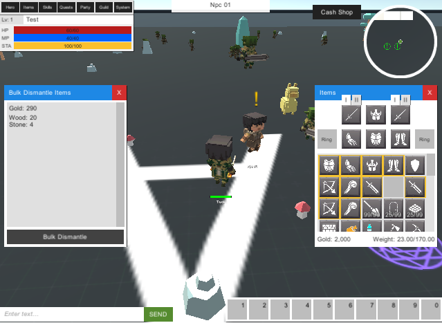

- Add function to bulk sell items to `BasePlayerCharacterEntity`, add `UIBulkSellItems` for UI part. I also update demo UIs.


- Add `uiComparingEquipments` to `UICharacterItem`, they will be shown when set UI's data while item data is equipment item.

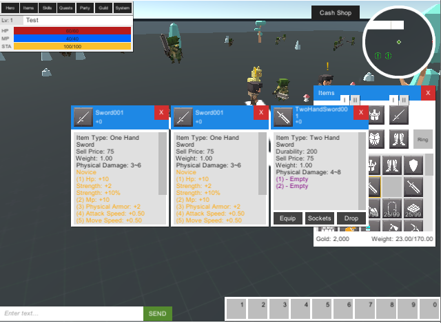

- Add `buttonName` setting to `UIToggler` component to make it able to use button keys which set to `Project Settings` -> `Input` or `InputSettingManager` component to toggle UI.
- Can add `CLIENT_BUILD` to `Project Settings` -> `Scripting Define Symbols` to strips server codes when compile.

* * *

## 1.58d (2020-09-15)
- Fix `ShooterPlayerCharacterController` placing constructing building incorrectly.
- Fix `AnimatorCharacterModel` not stop playing cast skill animation.
- Add mobile item drop list demo.

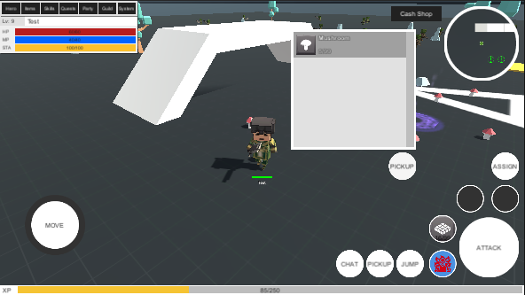

- Add mobile controller config demo.

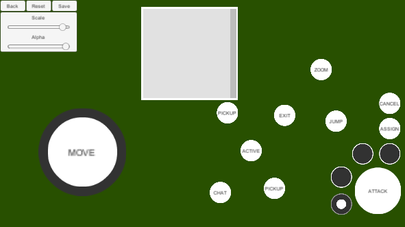

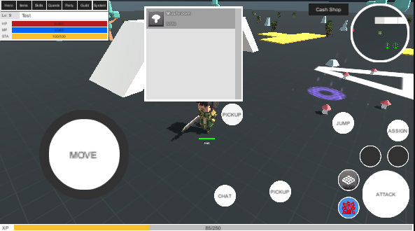

- Fix: Can not set `Damage Type` to `Custom` (By change `Custom` value to `254`).
- Fix: Can not set `Npc Dialog Condition Type` to `Custom` (By change `Custom` value to `254`).
- Fix: `Game Instance Tools` incorrect exp tree calculation.
- Improve `Grid Visible Checker` performance by update in-grid position for identities which has controlling player only.
- Stop updating `Base Monster Character Entity` while there is no subscriber.

* * *

## 1.58c (2020-09-10)
### Bugs Fixes
- Fix `ShooterPlayerCharacterController` cannot construct building entity.
- Fix `AnimatorCharacterModel` not play action animation when attacks or uses skill repeatedly.

* * *

## 1.58b (2020-09-08)
- Fix database's caching data race condition issues.
- Fix MMO's map spawn server not spawns map server while `notSpawnInBatchMode` setting is `false`.
- Fix hosting player character entity's `IsInSafeArea` always `true` while controlling with `ShooterPlayerCharacterController`.
- Fix wrong weapon's fire stagger direction calculation.

* * *

## 1.58 (2020-09-04)

### Removed components
- Move events registration codes from `UIOwningCharacter` to `UICharacter` class, remove `UIOwningCharacter` component and also add `notForOwningCharacter` setting which if it is `TRUE` it won't update data when controlling character's data changes.
- Move events registration codes from `UIOwningEquipItems` to `UIEquipItems` class, remove `UIOwningEquipItems` component and also add `notForOwningCharacter` setting which if it is `TRUE` it won't update data when controlling character's data changes.
- Move events registration codes from `UIOwningNonEquipItems` to `UINonEquipItems` class, and also remove `UIOwningNonEquipItems` component.
- Move events registration codes from `UIOwningSkills` to `UICharacterSkills` class, remove `UIOwningSkills` component and also add `notForOwningCharacter` setting which if it is `TRUE` it won't update data when controlling character's data changes.
- Move events registration codes from `UIOwningAmmoAmount` to `UIAmmoAmount` class, and also remove `UIOwningAmmoAmount` component.
- Move events registration codes from `UIOwningHotkeys` to `UICharacterHotkeys` class, and also remove `UIOwningHotkeys` component.
- Move events registration codes from `UIOwningQuests` to `UICharacterQuests` class, and also remove `UIOwningQuests` component.
- Move events registration codes from `UIOwningSummons` to `UICharacterSummons` class, and also remove `UIOwningSummons` component.

### New Systems
- Add aim assist to `FollowCameraControls` with settings which will be handled by `ShooterPlayerCharacterController` component.
- Add aim assist system settings to `ShooterPlayerCharacterController` (See `Aim Assist Settings` section).

### Bugs Fixes
- Fix missing update events for controlling character and its relates data UIs.
- Fix action animation -> anim speed rate not being calcualted when attack or reload or use skill.
- Fix cannot press activate key to enter warp portal. 

### Improvement
- [MMO] Change architecture, add database manager server, central server and map server will connect to this server to manage data. So database operation will not block gameplay.


- Add `toggleRememberUsername` to `UIMmoLogin`, use it to remember username to login later.
- Add `toggleAutoLogin` to `UIMmoLogin`, use it to remember username and password to login automatically later.
- Add [`UniTask`](https://github.com/Cysharp/UniTask) and implement it to async functions.
- Update [`NevMeshComponents`](https://github.com/Unity-Technologies/NavMeshComponents) for Unity 2019.4.
- Add visible checker which implemented by [`SuperGrid2D`](https://github.com/bartofzo/SuperGrid2D) developer can use it instead of `LiteNetLibVisibleChecker` to improve performance.
- Add `squareGizmosHeight` to `GameArea` (Base class for spawn area classes) to allow developer to change gizmos height while game area's type is `Square`.
- Improve spawn area, pending spawning entity will be spawned later by `respawnPendingEntitiesDelay` settings.
- Improve `IDamageableEntity` -> `ReceiveDamage` function. Add `fromPosition(Vector3)` parameter it is attacker's position developer may use it to make hit indicator. And swap weapon and damage amounts parameters, damage amounts will come before weapon then skill and skill level.
- Improve `ShooterPlayerCharacterController`: zoom in / zoom out smoothness.
- Improve `ShooterPlayerCharacterController`: show crosshair while construct building.
- Improve `ShooterPlayerCharacterController`: add smooth turn settings `turnSpeed`, `turnSpeedWhileSprinting`, `turnSpeedWhileCrouching`, `turnSpeedWileCrawling`, `turnSpeedWileSwimming` and `turnSpeedWileDoingAction`.
- Remove `MemberReflectionUtils` class and use [`nameof()`](https://docs.microsoft.com/en-us/dotnet/csharp/language-reference/operators/nameof) to get variable name.
- Add `GetItemMaxSocket` function to `BaseGameplayRule` developer can override it to change item's max socket while playing game.
- Add `OnCharacterRespawn` function to `BaseGameplayRule` developer can override it to change rule when respawn character.
- Change `CharacterHitBox` compoennt to inherit from `DamageableHitBox<BaseCharacterEntity>`.
- Add `rotationSpeedScaleWhileZooming` to `ZoomWeaponAbility` it will multiplies with camera's rotation speed while zooming.
- Add `CurrentRotation` to `IPlayerCharacterData` interface and implement it to `PlayerCharacterData` and `BasePlayerCharacterEntity` to save rotation when exit game.
- Add `GameEffectPoolContainer` and use it in `BaseEquipmentEntity` -> `PlayWeaponLaunchEffect` function to play pooling game effects when attack (Can use it as muzzle effect).
- Add cancellation token source for attack and reload async function and use it to cancel actions when character dying.
- Make `MovementColliderAdjustment` adjust `OpenCharacterController`'s capsule but it can't change direction.
- Add rotation options to `WarpPortalEntity` (and in warp portal database too) to force set rotation after character warped.
- Make `ArrayElementTitle` attribute support Unity editor's professional mode (dark mode).

### Note
- Because of architecture changes, you will have to update facebook login and google play login if you use it.
- I may change how to connect between servers (such as `map server to central server`, `chat server to central server`) to use Grpc to make connections. It's currently use `LiteNetLib`.
- I will remove security options for all entity movement and make all of them to be server authoritative.

* * *

## 1.57b (2020-07-28)
### New UI Components
- Add `UIPickupItemList` and `UIPickupItemManager` to show dropped items nearby character and show as list and allow player to select item to pick it up.

### Bugs Fixes
- Fix duplicating item when enhance socket items.
- Fix `UIStorageItems`'s generated item UIs not deselected when `uiItemDialog` hidden.
- Fix `CharacterAlignOnGround` not working correctly.
- Fix invalid `AmmoItem` create menu and its item type.
- Fix `UIOwningAmmoAmount` not register events correctly.

### Improvement
- Update `MySqlConnector` to version `1.0`, it have an breaking changes and have to changes namespace to `MySqlConnector`. So developer have to update `FacebookAuth` or `GooglePlayAuth` packages.
- Make it don't change item's title text color if `ItemRefine` -> `titleColor` 's alpha is 0.
- Use `GetOrAddComponent` (from `GenericUtils` class) to codes like:
```
var comp = GetComponent<Comp>();
if (!comp)
    comp = gameObject.AddComponent<Comp>();
```
- Improve find ground function for drop item and spawn entities.
- Remove events registration from `UISceneGameplay`, it will add an `UIOwning...` to UI component to register events.
- Move events registration codes from `UIOwningStorageItems` to `UIStorageItems` class and also remove `UIOwningStorageItems`.
- Move dealing events registration codes from `UISceneGameplay` to `UIDealing` class.
- Move item update events registration codes from `UISceneGameplay` to `UIDismantleItem`, `UIEnhanceSocketItem`, `UIRefineItem` and `UIRepairItem` class.
- Move events registration codes from `UISceneGameplay` to `UIDealing` class.
- Move events registration codes from `UISceneGameplay` to `UIDealing` class.
- Add `LifeTime` settings to `BuildingEntity`, building will be destroyed automatically by its life time. If it's <= 0, it's no limit life time.

### Note
- Next version I will use Unity version 2019.4.5f1. I want to use its new prefab features to remake demo UIs. And also want to remake input system by using new Unity's input system.

* * *

## 1.57 (2020-07-22)
### New UI Components
- Add `UIOwningAmmoAmount` component, which will set an event to update `UIAmmoAmount` when owning character's data which relates to weapon ammo amount changes. So we could attach this component to the same game object with `UIAmmoAmount` which intended to show ammo amount of character which player controls, and we also won't have to set the `UIAmmoAmount` to `UISceneGameplay` -> `uiAmmoAmount` field to set an event.
- Add `UIOwningCharacter` component, which will set an event to update `UICharacter` when owning character's data which relates to character changes. So we could attach this component to the same game object with `UICharacter` which intended to show information of character which player controls, and we also won't have to set the `UIOwningCharacter` to `UISceneGameplay` -> `uiCharacters` field to set an event.
- Add `UIOwningEquipItems` component, which will set an event to update `UIEquipItems` when owning character's data which relates to character's equip items changes. So we could attach this component to the same game object with `UIEquipItems` which intended to show equip items of character which player controls, and we also won't have to set the `UIOwningEquipItems` to `UISceneGameplay` -> `uiCharacterEquipItems` field to set an event.
- Add `UIOwningHotkeys` component, which will set an event to update `UICharacterHotkeys` when owning character's data which relates to character's hotkeys changes. So we could attach this component to the same game object with `UICharacterHotkeys` which intended to show hotkeys of character which player controls, and we also won't have to set the `UIOwningHotkeys` to `UISceneGameplay` -> `uiCharacterHotkeys` field to set an event.
- Add `UIOwningNonEquipItems` component, which will set an event to update `UINonEquipItems` when owning character's data which relates to character's non-equip items changes. So we could attach this component to the same game object with `UINonEquipItems` which intended to show non-equip items (inventory items) of character which player controls, and we also won't have to set the `UIOwningNonEquipItems` to `UISceneGameplay` -> `uiCharacterNonEquipItems` field to set an event.
- Add `UIOwningQuests` component, which will set an event to update `UICharacterQuests` when owning character's data which relates to character's quests changes. So we could attach this component to the same game object with `UICharacterQuests` which intended to show quests of character which player controls, and we also won't have to set the `UIOwningQuests` to `UISceneGameplay` -> `uiCharacterQuests` field to set an event.
- Add `UIOwningSkills` component, which will set an event to update `UICharacterSkills` when owning character's data which relates to character's skills changes. So we could attach this component to the same game object with `UICharacterSkills` which intended to show skills of character which player controls, and we also won't have to set the `UIOwningSkills` to `UISceneGameplay` -> `uiCharacterSkills` field to set an event.
- Add `UIOwningStorageItems` component, which will set an event to update `UICharacterStorageItems` when owning character's data which relates to character's storage items changes. So we could attach this component to the same game object with `UICharacterStorageItems` which intended to show storage items of character which player controls, and we also won't have to set the `UIOwningStorageItems` to `UISceneGameplay` -> `uiCharacterStorageItems` field to set an event.
- Add `UIOwningSummons` component, which will set an event to update `UICharacterSummons` when owning character's data which relates to character's summons changes. So we could attach this component to the same game object with `UICharacterSummons` which intended to show summoned monsters of character which player controls, and we also won't have to set the `UIOwningSummons` to `UISceneGameplay` -> `uiCharacterSummons` field to set an event.
- Add `UIToggler` component, can attach to any game object which always active to toggle the UI by defined key. It's alternative of `UISceneGameplay` -> `toggleUis`.
- Add `UIBlockController` component, can attach to UIs which will block controls while one of them is showing. So while one of block controller UI is showing, player won't be able to control character (made to work with `ShooterPlayerCharacterController` only for now). It's alternative of `UISceneGameplay` -> `blockControllerUis`.
- Add `ReloadButtonActivator` component, set reload virtual joystick to `activateObjects` to make it activate while character equip weapon which can reload and dectivate while character equip weapon which cannot reload.

### New Components
- Add `CharacterAlignOnGround` component which will align character animation on ground slope, attach it to your horse entity then set skinned mesh's root bone's transform to `rootBoneTransform` field.

### Bugs Fixes
- Fix missing `using TMPro;` in `GenericUtils`.
- Fix `NpcDialogConditionData` not being saved.
- Fix `WeaponItem` -> `EquipType` its value is invalid.
- Fix `UIArmorAmounts` not update correctly when un-equip an items.
- Fix `UIAttributeAmounts` not update correctly when un-equip an items.
- Fix `UIDamageElementAmounts` not update correctly when un-equip an items.
- Fix `UIResistanceAmounts` not update correctly when un-equip an items.
- Fix `ShooterPlayerCharacterController` find entities in front of owning character incorrectly.
- Fix `HarvestableEntity` multiple respawning when it destroy.
- Fix `HarvestableEntity` multiple trigger `OnHarvestableDestroy` event when it destroy.
- Fix `BuildingEntity` multiple trigger `OnBuildingDestroy` event when it destroy.
- Fix `PlayerCharacterController` do action on target (activate building, NPC and so on) repeatly.
- Fix `AnimatorCharacterModel` playing action/cast skill incorrectly by add `actionStateNames` and `castSkillStateNames` settings to force it play action animation and cast skill animation by state name. For developer who made custom animator controller for `AnimatorCharacterModel`, please read **Note** section.

### Improvement
- Add `onActivateBuilding` event to `BasePlayerCharacterController`, developer may add event to the action with dev extension to do something when activate custom buildings.
- Add `onBuildingConstruct` event to `BuildingEntity`, which will trigger when building just constructed.
- Add `applyJumpForceMode` and `applyJumpForceFixedDuration` settings to `LegacyRigidBodyEntityMovement` and `RigidBodyEntityMovement`. `applyJumpForceFixedDuration` will be used while `applyJumpForceMode` is `ApplyAfterFixedDuration` to apply jump force after define duration. While `applyJumpForceMode` is `ApplyAfterJumpDuration` it will apply jump force after played jump animation.
- Add play clip speed rate settings to `AnimatorCharacterModel` and `AnimationCharacterModel`. For developer who made custom animator controller for `AnimatorCharacterModel`, please read **Note** section.
- Add amount to `CraftItem`, min value is 1, so when it was <= 0 it will set to 1.
- Add function to get value of cached attribute, skill, resistance, armor, increase damage and equipment set easier to `CharacterDataCache`.
- Draw entity bounds when select the entity only.
- Move avatar mask named `TopMask` from Demo folder to CORE's resource.
- Improve find ground function for drop item and spawn entities.

### Note
- For developer who made custom animator controller for `AnimatorCharacterModel`, you have to add `HurtSpeedMultiplier`(float, default = 1.0) and set it to hurt state -> speed multiplier. Add `DeadSpeedMultiplier`(float, default = 1.0) and set it to dead state -> speed multiplier. Add `JumpSpeedMultiplier`(float, default = 1.0) and set it to jump state -> speed multiplier. Add `FallSpeedMultiplier`(float, default = 1.0) and set it to fall state -> speed multiplier. Add `PickupSpeedMultiplier`(float, default = 1.0) and set it to pickup state -> speed multiplier. Other than this, you have to set action and cast skill state names for each layers to `actionStateNames` and `castSkillStateNames` settings.

* * *

## 1.56b (2020-06-24)
- Fix `ItemDropEntity` dropping item not initialized.
- Fix `ItemDropSpawnArea` not spawn item drop entities.
- Fix wrong pick up animation key.
- Improve default animator controller.
- Remove Mixamo animation clips.

* * *

## 1.56 (2020-06-23)
- Fix character bouncing on water surface while `LegacyRigidBodyEntityMovement` → `autoSwimToSurface` set to `TRUE`.
- Fix character bouncing on water surface while `RigidBodyEntityMovement` → `autoSwimToSurface` set to `TRUE`.
- Fix building entities that were built inside safe-area won't receive damages.
- Move `gameplayCameraPrefab` and `minimapCameraPrefab` from `BasePlayerCharacterController` to implemented classes (`PlayerCharacterController`/`ShooterPlayerCharacterController`).
- Make only placeholder building owner character can build other building on the placeholder.
- Make `ItemDropEntity` can be placed in the scene and also able to respawn after picked up by characters.
- Add `useOverrideStartPosition` and `overrideStartPosition` to `PlayerCharacter`, uses them to change override start position when create new character.
- Add pickup animation settings to an character model classes.
- Add run animation settings to `CharacterModel2D` and `AnimatorCharacterModel2D`.
- Add item repair dialog (`UIRepairItem`).
- Remove `dataId` from building entity and save classes, will use identity's `hashAssetId` instead. For MMO developers who use MySQL, please import migration script: `mysql_update_1.55d-1.56.sql`.

* * *

## 1.55d (2020-05-30)
- Fix `UICharacterBuff` buff remains duration updates incorrectly.
- Fix `UICharacterSummon` summon remains duration updates incorrectly.
- Fix `UICharacterSkill` cooldown remains duration updates incorrectly.
- Fix `UIArmorAmounts` updates incorrectly when value equals to 0.
- Fix `UIAttributeAmounts` updates incorrectly when value equals to 0.
- Fix `UIDamageElementAmounts` updates incorrectly when min and max values equals to 0.
- Fix `UIDamageElementInflictions` updates incorrectly when value equals to 0.
- Fix `UIResistanceAmounts` updates incorrectly when value equals to 0.
- Fix `UISkillLevels` updates incorrectly when value equals to 0.
- Fix vehicle's passenger characters freeze when the driver exit the summoned vehicle.
- Fix non-host character can't move the vehicle while driving.
- Fix `RigidbodyEntityMovement` can move through walls while idle.
- Fix `ShooterPlayerCharacterController` wrong aim position while character casting skill.
- Change `BasePlayerCharacterEntity` → `storageItems` from sync list to sync field, to update just once when value changed to reduce callback hooks.
- Fix summoned monster which summon by monster not help summoner to attack enemies.
- Add `RandomAttackHitOccurs` abstract function to `BaseGameplayRule`, it will be used to random attack hit when character receive damage from another character.
- Add `pointClickInterruptCastingSkill` setting to `PlayerCharacterController`, if this is `TRUE` it will interrupt casting skill when click on ground to move.
- Add `INIT_POOL_TO_TRANSFORM` preprocessor directives to make the pooling system instantiates pooling objects as `_poolingTransform` children while playing in editor.
- Add walk animations to `AnimatorCharacterModel` and `AnimationCharacterModel` (And also add new states to `__AdvanceCharacter` and `__SimpleCharacter` animator controller), For now it will be used for monster wander movement animations.
- Fills empty movement animation clips when `AnimatorCharacterModel` or `AnimationCharacterModel` awakening.

* * *

## 1.55c (2020-05-22)
- Add `buildGridOffsets` to `PlayerCharacterController`, will be used while `buildGridSnap` is `TRUE` to set constructing building by grid offsets and grid size.
- Bring back old rigid body entity movement, it's `LegacyRigibodyEntityMovement` class. Can use `LegacyRigidBodyEntityMovementConversion` with its context menu `Convert From New Rigid Body Entity Movement` to convert new rigid body entity movement to old rigid body entity movement.
- Add bounds to every game entity, just use it to detect entity within range for now.
- Make `HarvestableEntity` overrideable.
- Fix virtual axes inputs not reset when disable the joystick.
- Move physics functions which has an similar functionality to physic function classes (PhysicFunctionsm PhysicFunctions2D).
- Make character model able to set equipment model by instantiated objects (children objects). Can see how it work [here](https://www.youtube.com/watch?v=K1x7ZhGFhqw).

* * *

## 1.55b3 (2020-05-15)
- Update LiteNetLib to version 0.9.2.2.
- Fix invalid character is ground state.

* * *

## 1.55b2 (2020-05-15)
- Fix character fall underground after teleported.

* * *

## 1.55b (2020-05-14)
- Update LiteNetLib to version 0.9.2.1.
- Don't notify reward gold and exp if the value <= 0.
- Fix 2D action animation stopping after played a few times.
- Fix passive skill's buffs not applies if the skill's start level is > 0.
- Fix wrong move speed rate while using skill, while activate animation type is attack animation.
- Fix monster attacking hidden characters.
- Fix skill casting not stop after interrupted.
- Fix cannot hold on building to see building options (`PlayerCharacterController`).
- Fix area skills won't cast to aim position while controller type is `WASD` (`PlayerCharacterController`).
- Improve chat box, don't highlight all text when press to enter messages.
- Implement [open character controller](https://github.com/Unity-Technologies/Standard-Assets-Characters) to `RigidbodyEntityMovement`, now slope limit is working, I also add context menu to set radius, height and center based on capsule collider settings.


* * *

## 1.55 (2020-05-05)
- Fix character not turn to target when use skill while controlling with `PlayerCharacterController` and `wasdLockAttackTarget` is `FALSE`.
- Make `BaseDamageEntity` and `MissileDamageEntity` variables, functions more accessible by extending classes.
- Add `recoverHpWhenLevelUp` to `DefaultGameplayRule`. If it's `TRUE` it will recover character's HP when level up.
- Add `recoverMpWhenLevelUp` to `DefaultGameplayRule`. If it's `TRUE` it will recover character's MP when level up.
- Add `recoverFoodWhenLevelUp` to `DefaultGameplayRule`. If it's `TRUE` it will recover character's Food when level up.
- Add `recoverWaterWhenLevelUp` to `DefaultGameplayRule`. If it's `TRUE` it will recover character's Water when level up.
- Add `recoverStaminaWhenLevelUp` to `DefaultGameplayRule`. If it's `TRUE` it will recover character's Stamina when level up.
- Fix `CharacterPitchIK` updating while character dead.
- Add notify rewarded EXP.
- Add notify rewarded Gold.
- Add notify rewarded Items.
- Hide `uiBuildingCampfireItems` when character move.
- Improve `ShooterPlayerCharacterController` to be able to activate NPC, Building Entity easier while `turnForwardWhileDoingAction` is `FALSE`.
- Implement impact effect to damage info.
- Don't prepare `GameEffect` and `ProjectileEffect` pooling objects, if the running application is not a client.

* * *

## 1.54f (2020-04-28)
- Improve mobile controllers.
- Make `GM Commands` class to be scriptable object to make it switchable, other developers may crate class which extends from `BaseGMCommands` class and implement an functions (Can see `DefaultGMCommands` as example). Then can set created data to `Game Instance` -> `Gm Commands`.
- Fix wrong ally/enemy detection logics, which make it find ally/enemy incorrectly.
- Implement system chat channel, GM players can enter chat by command: `/s {message}`. Other player will see message without sender name.
- Add "use button" events to `UICharacterItem` class.
- Improve `PlayerCharacterController`. Now, while `wasdLockAttackTarget` is `FALSE` it will turn to enemy when press attack or use skill. And it won't clear selected target when press movement keys (WASD), it will deselect target when distance to target more than `wasdClearTargetDistance` value.
- Move an events variables to (`BaseCharacterEntity_Events.cs`, `BasePlayerCharacterEntity_Events.cs`) to make it easier to find an events to implement with dev extensions or other classes.

* * *

## 1.54e (2020-04-16)
- Add `isAttackBuilding` option to `MonsterActivityComponent`, If this is `TRUE`, monster will attacks buildings.
- Add `isAggressiveWhileSummonerIdle` option to `MonsterActivityComponent`, If this is `TRUE`, monster will attacks targets while its summoner still idle.
- Add `turnForwardWhileDoingAction` option to `ShooterPlayerCharacterController`, If this is `TRUE`, it will control character to turn forward while doing an action (attack, use skills, activate and so on). And target also have to be on front of the character.

* * *

## 1.54d (2020-04-15)
- Fix invalid NPC Dialog UI while its type is `Shop`.
- Improve `PlayerCharacterController` to don't turn to move direction while playing action animation.

* * *

## 1.54c (2020-04-10)
- Add slot limit to `UICharacter`.
- Fix invalid party and guild ally or enemy checking logics.
- Change logging system, it will do `Debug.Log` in editor only. For the build, you have to use `LiteNetLibManager.Logging.onLog` to write log to screen or files.
- Add pooling system for game effects, damageable entities and buff entities.
- Add `canUseByEveryone` to `StorageEntity` and `CampFireEntity` to allow other players to use storage buildings.
- Fix weird summoned monster entity's behaviors.
- Make character entity turn to target while controlling with `ShooterPlayerCharacterController`.
- Add `moveSpeedRateWhileAttacking` to `MonsterCharacter` game data.
- Add configs to make cast skill animations and action animations can be played all layers.
- Add `BaseNpcDialog` class it is `NpcDialog`'s base class, you can create custom NPC dialog by inherit `BaseNpcDialog` class, then implements abstract functions (You may see `NpcDialog` as example). Then you may add codes to `UINpcDialog` by creates new partial class files which have an custom UI elements and implement `RenderUI` to render an custom UI elements.

* * *

## 1.54b (2020-03-21)
- Change aim controller while constructing the building, now the constructing buiding will place on ground follow mouse position while moving mouse cursor while playing on standalone platforms. If playing on mobile platforms, it will place by character position with mobile controller axes magnitude.
- Add constructing building rotation by keys, for the demo it uses keys `J` and `K`.
- Move `Build Distance` settings from `Game Instance` to `Building Entity` so each entities can have difference `Build Distance`.
- Fix invalid area skill position while controlling with Mobile controller (On screen controller).
- Fix invalid ally and enemy check logics.

* * *

## 1.54 (2020-03-12)
- Add and implement extra data to building save. For use case example, `CampFireEntity` will have an turn on state save as extra data.
- Add context menu "Convert To Newer Character Model" to convert `CharacterModel` to `AnimatorCharacterModel` or `AnimationCharacterModel`.
- Implement custom show condition to Npc's menu, developer can create custom show condition by scriptable object class with function which have a `IPlayerCharacterData` argument and return `bool` and can use it by create scriptable object instance and set to show condition.
- Implement custom damage info type, developer can create class which inherit `BaseCustomDamageInfo` class and implements function. Then use it by create its instance and set to damage info.
- Implement spawn entities progress events to `BaseGameNetworkManager`. So developer can set events callback to show spawn entities progress. And also change game save system function `OnServerOnlineSceneLoaded` to `PreSpawnEntities` to load and spawn building entities before spawn other entities.
- Implement custom map info, developer can create class which inherit `BaseMapInfo` to set character ally and enemy rules.
- Separate Google Play login codes from MMO repository, so developer must re-import `MMO_GooglePlayLogin` package.
- Separate Facebook login codes from MMO repository, so developer must re-import `MMO_FacebookLogin` package.
- Fix all language text not change immediately after chagne language.
- Fix fall damage applying at clients.
- Fix party/guild data losing when change scene (teleport to other maps) while playing Singleplayer/LAN mode.
- Fix calling invalid function in `BasePlayerCharacterController.cs` -> `ShowCurrentBuildingDialog`.
- Fix camera zooming while scrolling scrollview with middle mouse key while playing with `ShooterPlayerCharacterController`.
- Fix equipments and buffs re-apply when mount and unmount.

* * *

## 1.53d (2020-03-02)
- Add codes to avoid hotkeys spamming.
- Fix camera zooming while scrolling scrollview with middle mouse key.
- Fix invalid character createable state.
- Fix gold not multiplies with item's amount when dismantle item.
- Fix dismantle button not appearing while `canDismantleItemByPlayer` setting is turn-on.

* * *

## 1.53c (2020-02-28)
- Add `canRefineItemByPlayer` setting to `GameInstance`, developer can turn it on to allow player to refine item by does not have to talk to NPCs.
- Add `canDismantleItemByPlayer` setting to `GameInstance`, developer can turn it on to allow player to dismantle item by does not have to talk to NPCs.
- Add `pierceThroughEntities` setting to `DamageInfo`, set it more than 0 to allow raycast hit more than 1 character.
- Add `startItems` setting to `PlayerCharacter`, it's like `GameInstance` -> `startItems` but for specific character.
- Make `UISceneGameplay` extendable (Add new base class: `BaseUISceneGameplay`).
- Move UI events setup from `BasePlayerCharacterController` to `UISceneGameplay`.
- Implement `ArmorItem` class (Implement `IArmorItem` interface).
- Implement `ShieldItem` class (Implement `IShieldItem` interface).
- Implement `WeaponItem` class (Implement `IWeaponItem` interface).
- Implement `PotionItem` class (Implement `IPotionItem` interface).
- Implement `BuildingItem` class (Implement `IBuildingItem` interface).
- Implement `PetItem` class (Implement `IPetItem` interface).
- Implement `MountItem` class (Implement `IMountItem` interface).
- Implement `SkillItem` class (Implement `ISkillItem` interface).
- Implement `JunkItem` class (Implement `IJunkItem` interface).
- Implement `SocketEnhancerItem` class (Implement `ISocketEnhancerItem` interface).
- Add `GameEntityModel` -> `SetEffectContainersBySetters` dev extension invoker.
- Add `BaseCharacterModel` -> `SetEquipmentContainersBySetters` dev extension invoker.
- Add `CharacterModel` -> `SetAnimatorClipsForTest` dev extension invoker.
- Add `AnimatorCharacterModel` -> `SetAnimatorClipsForTest` dev extension invoker.
- Add `AnimatorCharacterModel2D` -> `SetAnimatorClipsForTest` dev extension invoker.
- Fix storage items not updates while playing 2D.
- Fix dismantle returning item amount not multiplies with dismantle item amount.


* * *

## 1.53b (2020-02-25)
- Add `dismantleFilter` setting to `GameInstance`.
- Add `maxCharacterSaves` setting to `GameInstance` but does not validating with server when creating character yet. Just count characters after loaded and trigger `UICharacterList`'s events.
- Add `eventOnAbleToCreateCharacter` event to `UICharacterList` which will be triggered when character count not reached `maxCharacterSaves` setting yet.
- Add `eventOnNotAbleToCreateCharacter` event to `UICharacterList` which will be triggered when character count reached `maxCharacterSaves` setting.
- Add `applyBuffToEveryone` config to `AreaBuffEntity`. If this is `TRUE`, buffs will apply to everyone including with an enemies.
- Fix skills can not be used while controlling character with `PlayerCharacterController`.
- Fix character move to center of enemy position while controlling character with `PlayerCharacterController`.
- Fix `fpsHiddingObjects` and `fpsHiddingRenderers` not activated when switch back from `FPS` to `TPS`.
- Fix movement problem while character's base move speed is 0.
- Fix empty item slots were removed when equip item, drop item from inventory, use the item until it empty, refine item until it destroyed, sell an item, dismantle item, use ammo until it empty and so on.
- WIP extendable item classes.
### Removed files
- GameEffectCollection.cs
- Item_Dismantle.cs (Rename to BaseItem_Dismantle.cs)
- Item_Refine.cs (Rename to BaseItem_Refine.cs)
- Item_Repair.cs (Rename to BaseItem_Repair.cs)
- Item_SocketEnhance.cs (Rename to BaseItem_SocketEnhance.cs)
- SkillUtils.cs

* * *

## 1.53
- Add item dismantle system, can dismantle an items to get items in sockets back and also can set `Item`'s dismantle config for returning items and gold when dismantle.
- Add campfire entity, it's extended from storage entity with convert items configs. And also set convert items as fuel, if there is any convert item is fuel, campfire entity must have convert item in storage to turn on.
- Fix character model changes equipment models too frequent.
- Fix language selection set to default language when open language setting dialog.
- Fix extra movement state not changes while game entity's movement secure is server authoritative.
- Fix stamia decreasing while idle.
- Fix character not harvesting an harvestable entities at first harvest animation.
- Fix item losts after move item from storage.
- Fix duplicating local-chat.

* * *

## 1.52c
- Add new input to `ShooterPlayerCharacterController` to make it able to hold `E` while pointing on building entity to show building menu.
- Rename `BaseVehicleEntity` class to `VehicleEntity` class, changed it from abstract class to non-abstract class and implements all functionality. Now developer can use `VehicleEntity` class instead of `MountEntity` class, `MountEntity` still derived from `VehicleEntity` class without non of any functionality changes for backward compatible.
- Fix default 2D movement will move to latest point click position after controlled by WASD keys.
- Implement multiple seats supports to vehicle entities.
- Vehicle/Mount entity which summon by skills or items will be saved and loaded when enter the game, enter the warp portals.

* * *

## 1.52b
- Rename `SimpleGameplayRule` class to `DefaultGameplayRule` but still keep `SimpleGameplayRule` class for backward compatible.
- Implement fall damage and also add config to `DefaultGameplayRule` there are `fallDamageMinDistance` and `fallDamageMaxDistance`. Character will receive damage 1% of Max Hp, when fall distance = min distance and receive damage 100% of Max Hp, when fall distance >= max distance.
- Implement `DoorEntity` and `StorageEntity` lock system, character who create it can set password to lock it and also can set it lock or unlock. For developer, there is new config: `lockable` tick it on to make it lockable. And also add following language keys: UI_ENTER_BUILDING_PASSWORD, UI_ENTER_BUILDING_PASSWORD_DESCRIPTION, UI_SET_BUILDING_PASSWORD, UI_SET_BUILDING_PASSWORD_DESCRIPTION.
- Improve In-App purchasing messages and also made it supports multiple language settings by add following keys: UI_ERROR_IAP_NOT_INITIALIZED, UI_ERROR_IAP_PURCHASING_UNAVAILABLE, UI_ERROR_IAP_EXISTING_PURCHASE_PENDING, UI_ERROR_IAP_PRODUCT_UNAVAILABLE, UI_ERROR_IAP_SIGNATURE_INVALID, UI_ERROR_IAP_USER_CANCELLED, UI_ERROR_IAP_PAYMENT_DECLINED, UI_ERROR_IAP_DUPLICATE_TRANSACTION, UI_ERROR_IAP_UNKNOW.
- Game save system (for singleplayer / LAN games) is now able to customize and switchable at `GameInstance` -> `saveSystem`. Developer can create customize save system by create class which derived from `BaseGameSaveSystem`, can see `DefaultGameSaveSystem` as example.
- Fix `AnimatorCharacterModel2D` playing wrong animations. And also add `OrcsWarrior2D` to 2d demo content to show how to setup character with `AnimatorCharacterModel2D`.
- Fix character's EXP still collecting after reached max level.
- Fix mobile hotkey joystick inputs, it used to have to double tap to use hotkey.

* * *

## 1.52
- Implement character crouch movement (Can test by press `Left Control`) to `Animator Character Model`, `Animation Character Model` and `Rigidbody Entity Movement`. You can set move speed rate while crouching at `Simple Gameplay Rule` -> `Move Speed Rate While Crouching`.
- Implement character crawl movement (Can test by press `Z`) to `Animator Character Model`, `Animation Character Model` and `Rigidbody Entity Movement`. You can set move speed rate while crouching at `Simple Gameplay Rule` -> `Move Speed Rate While Crawling`.
- Implement character swimming movement to `Animator Character Model`, `Animation Character Model` and `Rigidbody Entity Movement`. You can set move speed rate while crouching at `Simple Gameplay Rule` -> `Move Speed Rate While Crouching`. You can create water area by set layer to `Water` and set collider -> `isTrigger` to `true`.
- Add `Under Water Threshold` config to `Rigidbody Entity Movement`. Example of how it working: If character height is `1`, `Under Water Threshold` set to `0.5` and water height is `0.55`. Character will start swimming
- Move `Movement Secure` config from entity movement components to game entity components.
- Add `Auto Swim To Surface`, set this to `true` if you want character swim up to surface automatically, set this to `false` if you want character able to diving.
- Add `Fps Hidding Objects` and `Fps Hidding Renderers` to game entity model, set game objects and renderers which you want to hide while view mode is FPS here.
- Add clips configs to `Animator Character Model` and `Animation Character Model` for sprint, crouch, crawl and swimming state. So now you can set different clips for move and sprint state. And also add move animation speed rate configs for the cases that you still want to use same clips for move and sprint you can set `Sprint Anim Speed Rate` to make it play sprint animations more quickly.
- Add `Fps Model Prefab` config to `Character Model Manager` set Fps hands character model prefab which will instantiate as child of gameplay camera.
- Add `Fps Model Offsets` config to `Character Model Manager`. This is offsets between Fps hands character model and gameplay camera.
- Add `Fps Camera Target Transform` config to game entity set transform where camera will following while view mode is FPS.
- Add `Movement Collider Adjustment` component. Attach it to character entity to adjust capsule collider based on movement states.
- Add `Movement Transform Adjustment` component. Attach it to character entity to adjust transform position based on movement states. I use this component to adjust game entity's `Fps Camera Target Transform`.
- Add `Combat Text Distance` config to `Game Instance`, use it to limit distance to instantiates combat texts.
- Fix invalid character direction in 2D mode.
- Fix invalid missile trigger objects in 2D mode.
- Fix invalid buffs duration count at clients.

* * *

## 1.51
- Implement character entity's `Pitch`, it will be updated by controller while aiming up or down.
- Add `CharacterPitchIK` component, attach it to character entity to update character's aim pitch by any bones.
- Fix player's character stop attacking enemy when it moved.
- Fix invalid character summon serialize and deserialize.
- Fix invalid `UICharacterQuests` component -> `HideCompleteQuest ` conditions
- Fix when summoned monsters kills quest monsters, quest's task won't counting up.
- Fix when damge debuffs kills quest monsters, quest's task won't counting up.

* * *

## 1.50d
- Implement root motion support to `RigidBodyEntityMovement`, see `useRootMotionForMovement`, `useRootMotionForAirMovement`, `useRootMotionForJump` and `useRootMotionForFall`.
- Implement stamina to demo, press `Left Shift` to toggle sprint. For shooter controller hold `Left Shift` to sprint.
- Add `FactionIs` condition to check character faction to show NPC dialog menu.
- Fix reset skill item not consumed.
- Fix invalid warp position while `GameInstance` -> `currentPositionSaveMode` is `UseRespawnPosition`.
- Fix multi hit animation works incorrectly.

* * *

## 1.50c
- Add `BuffToTarget` to `Skill` -> `SkillBuffType`, if skill isn't attack skill, will buff to selected target
- Add `Toggle` to `Skill` -> `SkillBuffType`, skill's buff will be remove if already applied to skill user
- Add `isHide` status to `Buff`, developer can use with `Toggle Skill` to create hide skill
- Add `muteFootstepSound` status to `Buff`, developer can use with `Toggle Skill` to create hide+stalk skill
- Add multi hit **Trigger Duration Rate** to character model -> action animation
- Add `currentPositionSaveMode` config to `GameInstance`, developer can set it to `UseRespawnPosition` to make it save character current position as respawn position, not current position. So when enter game it will load respawn position, not last character position.
- Fix item skills not available to assign to hotkey
- Fix item skills not available to use
- Fix character level not increased after exp increased by harvestable entity

* * *

## 1.50b
- Improve game data list view, if entry is not empty it will show index with name and text color will be blue, if it is empty text color will be red.

- Improve `AnimationClip2D` inspector, now it will show animated sprites in preview section.

- Add npc graph.

- Add server scene loaded validatation, developer can add code to validate before allow server to instantiates objects and spawn players.
```
// Example codes
namespace MultiplayerARPG {
    public abstract partial class BaseGameNetworkManager {
        [DevExtMethods("UpdateReadyToInstantiateObjectsStates")]
        protected void ValidateSceneLoaded()
        {
            // Set custom states, it will check later, if all states are `TRUE`
            // It will be ready to instantiates objects and spawn players.
            readyToInstantiateObjectsStates["MapLoaded"] = mapManager.IsLoaded();
        }
    }
}
```
- Add game messages to inform players when they can't increase attribute amount.
- Add game messages to inform players when they can't increase skill level.
- Add game messages to inform players when they can't use skill.
- Improve bonus stats display, now it will show as "Hp: +1", "Mp: +1".
- Fix skill level bonus from equipment set bonus not applies to UIs.

* * *

## 1.50
- Add `Awake` and `OnDestroy` dev extension functions to `BasePlayerCharacterController`
- Implement In-App Purchasing for Singleplayer game
- Add `UICharacterItemDropHandler` class, developer can add it to character item icon as drop handler to handles inventory slots swap, storage slots swap, equip item functions
- Fix armor stats not work
- Fix invalid rarity title languae settings
- Fix item is able to unequip while inventory is full
- Fix quest rewards are able to receives while inventory is full
- Fix IAP items are able to receives while inventory is full
- Fix items are able to deals while inventory is full
- Fix items are able to crafts while inventory is full
- Fix invalid `IBuildingSaveData` -> `CloneTo` dev extension implementation
- Fix skills not update when equip items that increase skill levels

* * *

## 1.49d
- 2D games can build an buildings
- Add multilingual supports for NPC dialog menu
- Add skill attack type option to `Simple Area Attack Skill`
- Fix character stats not applies by weapons or shields
- Fix invalid character attack duration
- Fix invalid skill level calculation
- Fix invalid skill damage amounts calculation
- Fix shield unequip when equipping one-hand weapon
- Fix shooter controller cannot attack while playing on mobile platforms
- Fix passive skill not working

* * *

## 1.49c
- Add area attack skill, can create by right click in `Project` then choose `Create -> Create GameData -> Skill -> Simple Area Attack Skill`. You also have to prepare `Area Damage Entity`, which require collider and rigidbody to make physic trigger event works. (See it: https://www.youtube.com/watch?v=PErdX5rfvGk)
- Add area buff skill, can create by right click in `Project` then choose `Create -> Create GameData -> Skill -> Simple Area Buff Skill`. You also have to prepare `Area Buff Entity`, which require collider and rigidbody to make physic trigger event works. (See it: https://www.youtube.com/watch?v=PErdX5rfvGk)
- Add `minGuildNameLength` and `maxGuildNameLength` configs to `SocialSystemSetting` use it to limit guild name length
- Add `minGuildRoleNameLength` and `maxGuildRoleNameLength` configs to `SocialSystemSetting` use it to limit guild role name length
- Add `maxGuildMessageLength` configs to `SocialSystemSetting` use it to limit guild message length
- Fix guild with existed guild name can be created
- Fix invalid attribute amounts equals to 0 and not able to level up, after reset an attributes with item
- Fix invalid left-hand weapon aim position in shooter controller
- Fix quest missing data bugs when deserialize

* * *

## 1.49b
- Add utility script named `ImageBasedOnPlayingCharacterClass`, to set image based on playing character, developer may attach it to mobile attack button to change image based on playing character
- Add utility script named `ImageBasedOnEquippedWeaponType`, to set image based on equipped weapon type, developer may attach it to mobile attack button to change image based on equipped weapon type
- Add `Destroy Delay` field to `MissileDamageEntity`, developer may set some delay to play some special effect before destroy
- Fix item weight not multiplied with item amount
- Fix invalid unequip weapon set
- Fix character not rotate while aiming with sniper
- Fix wrong shooter camera controls on mobile platforms

* * *

## 1.49
- Add skill aim controls for mobile and also can cancel aimming skill, try drag assigned skill icon to use
- Fix quest `isComplete` state not saved issues
- Fix item list / skill list entries are destroyed after open `UICharacterHotkeyAssigner` first time
- Fix character move sound still playing after ride the mount entity while moving
- Fix `CharacterItem` -> `sockets` not saved issues
- Fix saved `CharacterHotkey` lose issues
- Fix can move character while casting skill which its `moveSpeedRateWhileUsingSkill` = 0
- Fix monster character entities not respawn by avoid empty `receivedDamageRecords`
- Fix invalid `criRate`, `criDmgRate`, `blockRate` and `blockDmgRate` calculation

* * *

## 1.48d
- Add equip weapon set switch by key, for the demo it is key **`** (the key below **Esc** and above **Tab**)
- Add character stats rate for item/skill buffs, it will be calculated by character's stats not including with stats from equipments and buffs. For example, if character have 100 Hp, and also equip armor which increase 20 Hp and 10% Hp rate, it will increase 30 Hp by the armor (20 + (100 * 10%)) so the character will have 130 Hp
- Add character attribute rate for item/skill buffs, it will be calculated by character's attributes not including with attributes from equipments and buffs. For example, if character have 50 Str, and also equip armor which increase 5 Str and 10% Str rate, it will increase 10 Hp by the armor (5 + (50 * 10%)) so the character will have 60 Str
- Armor stats (in `CharacterStats` struct) is deprecated, now there is new armor system, you can set armor to reduce damage for each damage elementals
- Fix character movement state not changes while controller mode is `Point Click`

* * *

## 1.48c
- Add equip weapon set system, player can switch equip weapon set. developer can set maximum amount of equip weapon set in `Game Instance` -> `Max Equip Weapon Set`. For UIs, if you want to add new equip weapon set #2, you have to set `Equip Weapon Slots`'s entry -> `Equip Weapon Set Index` to 1.
- Make defend equipments (an armors) can be equipped to many equipment slot, for example "Ring" can equip to "Ring-1" or "Ring-2" slot. developer can set maximum amount of slots than can be equipped in `Armor Type` -> `Equippable Slots`. For UIs, if you want to add "Ring-2" slot to `UI Equip Items`, you have to set `Other Equip Slots`'s entry -> `Equip Slot Index` to 1.
- Fix equipment models not instantiates correctly in character models

* * *

## 1.48b
- Add friend system (Press Z to toggle the dialog)
- Add new damage type, `Raycast` should use it with gun weapon, which its bullet is very fast. `Missile Damage Entity` won't hit target sometime when its move speed is very fast
- Add `ActivateButtonActivator` component, you can use it to activate UIs when your character nearby activatable entities
- Add `ExitVehicleActivator` component, you can use it to activate UIs when your character passenging vehicle
- Add `PickUpButtonActivator` component, you can use it to activate UIs when your character nearby item drop entities
- Add `ZoomButtonActivator` component, you can use it to activate UIs when equipped weapon can zoom
- Fix `UIAmmoAmounts` not updates when ammo reduce
- Changes damage entities to non-networking object, so networking packet to spawn it will be removed
- Reduce networking packet size by remove all play effect request network messages

* * *

## 1.48
- Change settings in `Map Info` -> `Can Pvp` to `Pvp Mode`
- Change settings in `Map Info` -> `Override Respawn Point` to `Override Respawn Point Mode`
- Change settings in `Map Info` -> `Override Respawn Point Map` and `Override Respawn Point Position` to `Override Respawn Points`
- Add simple faction system, now player can select faction in character creation scene
- Reduce settings in `Game Database`. Remove `Skills` because it can bring from character data, item data. Remove `Player Characters` because it can bring from `Player Character Entities` and Remove `Monster Characters` because it can bring from `Monster Character Entities`
- Add context menu to `Character Model`, `AnimationCharacterModel` and `AnimatorCharacterModel` to copy / patse `Weapon Animations` and `Skill Animations`
- Fix empty item slots not filled when `Game Instance` -> `Inventory System` is `Limit Slots`
- Fix chat input field focusing when spamming keys
- Fix cannot learn skill with item while skill point == 0
- Fix flying when spamming mount
- Fix character UIs still remains in list after deleted all characters
- Update demo to show how to setup factions, genders and character class selections

* * *

## 1.47d
- Fix invalid item remove index, that cause other bugs, such as represent invalid items when equip / unequip items
- Fix infinite loop when fill empty slots, while `Game Instance` -> `Inventory System` set to `Limit Slots`, this is cause of Unity freezing when equip / unequip items
- Fix receiving items filling after empty slots, while `Game Instance` -> `Inventory System` set to `Limit Slots

* * *

## 1.47c
- Monster can use skill
- Add workbench building in demo
- Fix monster drop always drop same items issues
- Fix workbench craft item not working issues
- Fix weapon / shield increase damages not working issues
- Fix equipment sockets not saves issues
- Fix invalid character item title with refine level format
- Fix invalid building entity location when building with shooter controller
- Fix bugs when set `Game Instance` -> `Inventory System` to `Limit Slots` that it fill empty slot incorrectly, also add `Game Instance` -> `Base Slot Limit` can use it as base slot limit for all character while set `Game Instance` -> `Inventory System` to `Limit Slots`
- Add not enough MP message
- Don't send request attack / use skill message to server if no enough ammo or MP

* * *

## 1.47b
- Fix invalid missile rotation in 2d mode
- Fix cannot attack issues
- Fix missile can hit other missile
- Fix missile can hit non-ally character (it will explode but not apply damage)
- Fix missile can hit dropped items

* * *

## 1.47
- Add attribute increase item, can use it to increase amount of attribute.
- Add attribute reset item, can use it to reset amount of attributes.
- Add skill use item, can use it to cast skill.
- Add skill learn item, can use it to increase level of skill.
- Add skill reset item, can use it to reset level of skills.
- Can set equipment to hotkey.
- Reduce packet size when update buff cooldown, now it will send only cooldown (float). Type (byte), Data Id (int), and Level (short) will not being sent.
- Reduce packet size when update skill cooldown, now it will send only cooldown (float). Type (byte), and Data Id (int) will not being sent.
- Reduce packet size when update summon cooldown, now it will send only cooldown (float). Type (byte), Data Id (int), and Object Id (uint) will not being sent.
- Reduce packet for non-owner character item, now it will send only Data Id (int), Level (short) to non-owner client because non-owner client requires only Data Id and Level to update character equipments. Owner client still receive full data (Id (string), Data Id (int), Level (short), Amount (short), Durability (float), Exp (int), Lock Remains Duration (float), Ammo (short), and Sockets (int[])).

* * *

## 1.46b

- Fix invalid index of data in `UI Non Equip Items`, this is cause of un-able to equip items or use items issues
- Add `Item Drop Table` game data, you can use it to create item drop table and set to `Monster Character` game data as more convenience way when you want to have same item drop table for difference monsters
- Add `Exp Per Damage` to `Harvestable` game data, you can make character receive exp while harvesting with this value, if this is 10 when damage to harvestable entity = 2, character will receives 20 exp
- Add network discovery component and also implemented it in Lan mode, see example in `01Home` scene -> `CanvasHome` -> `UILanConnection`

* * *

## 1.46

See it in [1.46 Updates](pages/055-1-46-updates.md)

* * *

## 1.45c

- Add `GetTotalWeight` function to `BaseGameplayRule`, developer may override it to increase weight by gold :P 
- Add `CurrenciesEnoughToBuyItem` to `BaseGameplayRule`, developer may override it to validate amount of custom currencies
- Add `DecreaseCurrenciesWhenBuyItem` to `BaseGameplayRule`, developer may override it to decrease amount of custom currencies 
- Add `IncreaseCurrenciesWhenSellItem` to `BaseGameplayRule`, developer may override it to increase amount of custom currencies 
- Add `CurrenciesEnoughToRefineItem` to `BaseGameplayRule`, developer may override it to validate amount of custom currencies 
- Add `DecreaseCurrenciesWhenRefineItem` to `BaseGameplayRule`, developer may override it to decrease amount of custom currencies 
- Add `CurrenciesEnoughToRepairItem` to `BaseGameplayRule`, developer may override it to validate amount of custom currencies 
- Add `DecreaseCurrenciesWhenRepairItem` to `BaseGameplayRule`, developer may override it to decrease amount of custom currencies 
- Add `CurrenciesEnoughToCraftItem` to `BaseGameplayRule`, developer may override it to validate amount of custom currencies 
- Add `DecreaseCurrenciesWhenCraftItem` to `BaseGameplayRule`, developer may override it to decrease amount of custom currencies 
- Add `CurrenciesEnoughToCreateGold` to `BaseGameplayRule`, developer may override it to validate amount of custom currencies 
- Add `DecreaseCurrenciesWhenCreateGold` to `BaseGameplayRule`, developer may override it to decrease amount of custom currencies 
- Add `MakeMonsterReward` to `BaseGameplayRule`, developer may override it to setup amount of custom rewarding currencies 
- Add `MakeQuestReward` to `BaseGameplayRule`, developer may override it to setup amount of custom rewarding currencies 
- Add `deadY` to `MapInfo`, when character fall to this position, character will dead 
- Add setting menu (press ESC in gameplay scene) with audio / language settings 


* * *

## 1.45b

- Fix armor can equip at weapon slot
- Rework on Localizations system, now all text formats are moved to `LanguageManager`
- Now 2d character model is support 8-directions sprites
- Add `AnimatorCharacterModel`, it's a new version of 3D mechanim character model which developer just have to set clips to make it work, not have to touch Animator Controller
- Add `AnimationCharacterModel`, it's a new version of 3D legacy animation character model
- Add `AnimatorCharacterModel2D`, it's 2D character model which based on animator
- Add `EquipmentModelContainerSetter` component, developers can add it to transform to use it as equipment containers instead of set `Equipment Containers` in `Character Model`, it will use game object name as `Equip Socket` and its transform as `Transform`
- Add `EffectModelContainerSetter` component, developers can add it to transform to use it as effect containers instead of set `Effect Containers` in `Character Model`, it will use game object name as `Effect Socket` and its transform as `Transform`
- Sort game data create menu


* * *

## 1.45

- Add gunfire system, can store ammo in magazine, can set dynamic crosshair, can set ability to zoom (more abilities can be added later)
- Add reload animation settings to `Character Model` component
- Add `Activate Animation Type` option to `Character Model` -> skill animations, developer can use this option to set which animation will play when activate the skill, if this value is `Use Attack Animation` it will play attack animation randomly
- Add `EquipmentEntity` component, developer can attach this component to weapon model to set particle/sound effects when firing (See the demo from Weapon059, Weapon065, Weapon067). May use this for refined equipments particle/mesh effects (refined equipments are an equipment with +1/+2/+3 and so on)
- Add cancel buttons to invitation dialogs
- Fix SQLite cannot save character data
- Fix MMO server crash when summon multiple characters
- Fix character not warp immediately when respawn
- Fix hotkey reset when warp


* * *

## 1.44c

- Fix cannot assign and use skills bugs
- Fix item dialog showing up when receiving damage while enhance socket item UI is visible


* * *

## 1.44b

- Fix cannot move item to storage bugs
- Fix lost socket enhancers when the equipment dropped
- Fix increase stats/attributes/resistances/skills not showing up in UI character item for socket enhancer item
- Fix cannot use GM commands in MMO mode


* * *

## 1.44

- Add equipment socket and socket enhancer item
- Equipment can increase skills levels
- Add `useNavMeshForKeyMovement` option to `PlayerCharacterEntity` set this to TRUE if you want to move by nav mesh paths while controlling with movement keys (WASD)
- Add `collectType` to `HarvestableEntity`, so you can make it drop materials to the ground while harvesting by this setting 
- Add guild name to `UIGuildInvitation`
- Add `opponentAimTransform` to `DamageableEntity` this will be used by player character controller or monster activity component to aim to target, so if 2 characters are stand at a different height, they can fire each other
- Optimize garbage collection for `CharacterAllianceIndicator`, `NpcQuestIndicator`
- Fix invalid layer masks
- Fix invalid stats value in item UI


* * *

## 1.43b

- Fix invalid character stats calculation in `UI Character`
- Fix cannot press F to pick up items
- Fix invalid character attack/use skill animations settings in `Character Model`
- Fix cannot access player storage bug
- Add camera collision
- Move character attack/skill/buff codes to new partial class files (BaseCharacterEntity_AttackFunctions, BaseCharacterEntity_BuffFunctions, BaseCharacterEntity_SkillFunctions)
- Reduce DevExtMethods calls in BaseGameEntity and classes that extended from this class, it will be called only in Awake and OnDestroy function. For other function, developer has to implement an event delegates (You can see DevExtDemo_PlayerCharacterEntity, DevExtDemo_MonsterCharacterEntity) for example
- Add `hideCompleteQuest` to `UICharacterQuests`, Developers can use it to filter quest list
- Add casting duration/animation/effect for skills, now you can set casting duration/animation/effect before activating the skill
- Add OnCastSkill(), OnApplySkill(), OnAttack() functions to `Skill` class. Developers can extend `Skill` class and change some skill functionality by those functions

** More Info: https://suriyun-production.github.io/mmorpg-kit-docs/#/pages/045-1-43b-updates) **


* * *

## 1.43

- Update LiteNetLib to version 0.8.3
- Change all SendOption to DeliveryMethod (Follow LiteNetLib updates)
- Can switch target entity (with TAB key)
- Add `DoorEntity`, can open/close it with activate key (Press E)
- Add `StorageEntity`, can open it with activate key (Press E)
- Add `WorkbenchEntity`, can use it to craft items with activate key (Press E)
- Add `startCentralServer` config for MMO server instance, developer can set this config to true in a config file to start central server when running the server
- Add `startMapSpawnServer` config for MMO server instance, developer can set this config to true in a config file to start map-spawn server when running the server
- Add `startMapServer` config for MMO server instance, developer can set this config to true in a config file to start map server when running the server
- Add `startChatServer` config for MMO server instance, developer can set this config to true in a config file to start chat server when running the server
- Fix player characters data not saved immediately before scene changes for Singleplayer/LAN modes
- Fix building entities saved to invalid scenes for Singleplayer/LAN modes


* * *

## 1.42b

- Fix gold not save in Singleplayer / LAN Modes
- Fix duplicating storage items in Singleplayer / LAN Modes
- Fix selected skill dialog hiding while skill's buff applied
- Fix cannot use skills while attacking
- Fix invalid melee hit overlap functions


* * *

## 1.42

- Add player storage system, players can deposit/withdraw an item from storage, other characters in the same account also able to access the storage
- Add guild storage system, players can deposit/withdraw an item from storage, other characters in the same guild also able to access the storage
- Add player bank system, players can deposit/withdraw gold from the bank, other characters in the same account also able to access the bank
- Add guild bank system, players can deposit/withdraw gold from the bank, other characters in the same guild also able to access the bank
- Add player storage dialog for NPC
- Add guild storage dialog for NPC
- Can run map-server in editor, add `Start Map On Awake`, `Starting Map` configs to `MMOServerInstance`
- Can switch database with config files/command line arguments, also add `Database Options`, `Database Option Index` to `MMOServerInstance`


* * *

## 1.41

- Add warp dialog for NPC
- Add private/instance map system for MMO mode, for the demo, you can try enter it by NPC. Instance maps will be spawned as new map server instance to serve players
- Players can enter instance map alone when no party
- Players will enter instance map follow party leader if player's character stands nearby party leader (`Game Instance` -> `Join Instance Map Distance`)
- Add `Enable Gm Commands` option to `Lan Rpg Network Manager`, developer can enable it to allow player to use GM Commands in Singleplayer/LAN mode
- Add warp portal type setting to `Warp Portal Entity`, `Warp Portal Database`. you can set type of portal for default warp or instance map
- `Warp Portal Entity` -> `Map Scene` is deprecated use `Map Info` instead
- `Warp Portal Database` -> `Map` is deprecated use `Map Info` instead
- `Npc Database` -> `Map` is deprecated use `Map Info` instead
- Add show guild name above character name
- Fix monster attack other monsters
- Save camera zoom and rotation when exit game


* * *

## 1.40b

- Fix missile damage entity still move after exploded
- Add `On Exploded` event to missile damage entity, you can use this to show explod effects
- Add drag and drop UIs, now you can drag and drop item / skill to assign hotkey. Drag item to sell / set refining item / equip / unequip. Classes relates to this are: `UICharacterItemDragHandler`, `UICharacterSkillDragHandler`, `UIDealingItemDropHandler`, `UIEquipItemSlotDropHandler`, `UIRefineItemDropHandler`, `UISellItemDropHandler`, `UICharacterHotkeyDropHandler`
- Add `Move Speed Rate While Attacking` to weapon item, this will multiply with character move speed while character attacking
- Add `Move Speed Rate While Using Skill` to skill, this will multiply with character move speed while character using skill
- Fix annoying camera's target null error when warp :P


* * *

## 1.40

- Shooter controller can pick an item (Press F)
- Shooter controller can construct the building
- Shooter controller can active building (Now it can just destroy, Press E)
- The building can be attacked and destroyed
- Add damage over time to buff
- Add disallow move to buff, if this is true character will not able to move while the buff applied
- Add disallow attack to buff, if this is true character will not able to attack while the buff applied
- Add disallow use skill to buff, if this is true character will not able to use skill while the buff applied
- Add disallow use item to buff, if this is true character will not able to use item while the buff applied
- Add `destroyDelay` to `MissileDamageEntity`, use this to add some delay to play effect before it destroyed
- Move `deadHideDelay` to `BaseMonsterCharacterEntity` -> `destroyDelay`, To developers, I've prepared migration codes so you don't worry about data changes
- Move `deadRespawnDelay` to `BaseMonsterCharacterEntity` -> `destroyRespawnDelay`, To developers, I've prepared migration codes so you don't worry about data changes
- Add `Movement State` to `Character Entity` which sync from server instead of calculate at client side with `CharacterAnimationComponent` component so `CharacterAnimationComponent` component is not being used anymore with v1.40 or above
- Remove `ySpeed` from `Character Model`, will use just `IsGrounded` in animtor controller to detect fall state
- Remove `magnitudeToPlayMoveClip`, `ySpeedToPlayJumpClip`, `ySpeedToPlayFallClip` from `Character Model` will use `Movement State` from `Character Entity` to change legacy animation movement


* * *

## 1.39b

- Fix invalid range skill aim position
- Fix SQLite start a transaction within a transaction
- Fix invalid ground detection on non-owning clients


* * *

## 1.39

- Fix wrong character move speed when controls with Joystick / WASD bug
- Fix Cannot equip armor with same armor type bug
- Not unequip equipped weapon on off-hand when equip another item on off-hand bug
- Add shooter controller (try 00Init_Shooter demo)
- Animator controller for characters now requires IsGrounded(bool), SideMoveSpeed(float) 
- Add more movement types for Animator / Legacy animation


* * *

## 1.38b

- Add more functionality for dev extensions
- Fix character model -> legacy animation bugs, it didn't playing well and dead animation play looply
- Reduce EditorUtility.SetDirty() function calls in OnValidate() function to avoid Unity 2018.3 bug (information about the bug: https://github.com/insthync/test-missing-prefabs)
- Make it able to select character class when create character (Try single player demo)


* * *

## 1.38

- Add `CharacterDeathSoundComponent` can attach it with Character Entity to play random sound when character dead 
- Move Dimension Type configs to Game Instance 
- Can use Item Refine to define item rarity 
- Can set animations based on weapon type at character model 
- Add equipment set, characters can gain more extra stats when equipped same set equipments 

More Info (https://medium.com/suriyun-production/1-38-updates-ef4586da2799) 


* * *

## 1.37b

- Refactor C# var to explicit type
- Make it able to use with older Unity (should be 2018.2 or above)
- Add WebSockets support for WebGL build
- Fix NPC icon showing multiple
- Fix footstep sound playing while jump


* * *

## 1.37

- Update Unity version to 2018.3.0f2, developers have to update to this version or above
- Add harvestable entity for 2d demo
- Make Singleplayer / LAN can change scene when entering warp portals
- Add configs to `MapInfo` to make it able to override saved respawn point so some map may force characters to respawn at the specific point
- Add footstep sound component
- Add UI to show attacking harvestable's health
- Add configs to `PlayerCharacterController` to make it not move to selected target immediately. To move to the selected target, player has to click on the selected target again
- Can show selected item information while dealing


* * *

## 1.36

- Add group buff / party buff skills
- Add summon skill
- Add pet system, it is items that when uses it will spawn pet, If pet dies it will unsummon as item and lock for sometime
- Add GM commands


* * *

## 1.35

- Clear listing when disconnected / stop server, to avoid null exception when accessing data from list
- Make networking system more easier to use
- Improve WASD movement now it will stop immediately when unpressed buttons
- Remove deprecated codes that relates to this (https://medium.com/suriyun-production/mmorpg-kit-1-32-character-database-entity-workflow-changes-ddeac9c4cc5d)
- Add 2D MMO Demo


* * *

## 1.34b

- Fix empty guild data for UI Guild
- Add Refine dialog for NPC, In case that someone wants to make it able to refine when talks to NPC only
- Add `hitOnlySelectedTarget` to `DamageInfo` class to make sword swing / arrow hitting only the selected target, instead of hitting any characters by hit FOV


* * *

## 1.34

- Add guild skills, Passive / Active, only guild leader can increase guild skill level, member can use active guild skills
- Add ENABLE_PURCHASING predefine, developer have to add it in "Scripting Define Symbols" when enable Unity Purchasing, I've added this to make it more friendly for beginners
- Add death EXP penalty, you can set the percentage at Game rule


* * *

## 1.33

- Fix leave party messages not sent to clients
- Fix leave guild messages not sent to clients
- Keep chat messages as static field, will be showed when warped to another map
- Showing game messages such as "Cannot carry anymore", "Not enough gold", "Not enough items"


* * *

## 1.32

- Remove all deprecated animation codes that moved to `Character Model`
- Fix monster character entity which placed in scene not respawn after dead
- Fix harvestable entity which placed in scene not respawn after dead
- Add Save respawn point dialog to NPC
- Change workflow `Character` -> `Entity Prefab` will be deprecated (Information about it: https://medium.com/suriyun-production/mmorpg-kit-1-32-character-database-entity-workflow-changes-ddeac9c4cc5d)


* * *

## 1.31

- Fix cannot create guild with SQLite database
- Fix connot read guild data with SQLite database
- Guild can level up, now it just collecting skill point but it will be used with guild skills later


* * *

## 1.30b

- Add default value to characters.partyId, characters.guildId, characters.guildRole, characters.sharedGuildExp for SQLite to fix it is not able to create new character
- Change how to get free ports to fix it is not able to create offline game on Mac OSX


* * *

## 1.30

- Make it able to customize network library, so it can change network library to another library instead of LiteNetLib
- Add OnGameDataLoaded callback to GameInstance and use it with MMOServerInstance to fix wrong script running order
- Can change party leader
- Make harvestable entity able to place in map scene (Does not have to use spawn area)
- Changes all database operations to be synchronized, and will be run on other threads to avoid main thread blocking, so gameplay will update smoothly while doing an database operations
- Add guild system (Can create / invite member / kick member / leave / terminate / change leader / set guild message / set role / change member role / change leader)


* * *

## 1.29

- Add party system (Can create / invite member / kick member / leave / terminate / set exp share / set item share)
- Change Connector/NET (MySql.Data) to MySqlConnector (https://github.com/mysql-net/MySqlConnector) to improve performance, for old version migration you have to remove MySql.Data.dll file


* * *

## 1.28

- Add choices for Player Character Movement to secure or not
- Reduce network transform packet size


* * *

## 1.27

- Add 2D games features
- Move weapon attack animations, skill cast animations to Character Model (Migration guide: https://medium.com/suriyun-production/mmorpg-kit-1-27-move-weapon-attack-animations-skill-cast-animations-to-character-model-f9016bd5a0ba)
- Make another entity (Harvestable / Building) able to play effects (Hit effects)
- Add destroyHideDelay to the harvestable entity, this is a delay before it's going to be hidden from clients after harvestable's m reached zero (destroyed)
- Add onHarvestableDestroy event to the harvestable entity, developers may use this event to play destroy animations 
- Remove SecurePlayerCharacterEntity, make PlayerCharacterEntity secured


* * *

## 1.26

- Add cash shop demo
- Add IAP/IAB for iOS/Android
- Fix invalid equipment requirement calculation
- Add JSON config file reader for MMO server/MySQL/SQLite


* * *

## 1.25b

- Fix invalid map server scene loads


* * *

## 1.25

- Optimize garbage collections
- Cache all character data stats it will be updated when there are changes, so it will not re-calculate stats every frame
- Secure Player Character Entity can jump
- All Text / InputField changes to use TextWrapper / InputFieldWrapper, we can use wrappers to switch to TextMeshPro components easily, an old user should migrate to use the wrapper, see more details at https://medium.com/suriyun-production/mmorpg-kit-1-25-text-inputfield-migration-46d21a846262
- Add Game Database, you can use this Scriptable Object to add game data that you want to use instead of adding them to Resources folder


* * *

## 1.24

- Fix duplicating listing data bugs
- Fix invalid initialize data bugs
- Fix MMO can't choose character again when cannot connect to Map Server
- Improve jump animation to triggering when press jump, not play when high y speed


* * *

## 1.23

- Add Dev extension demo
- Fix Equip Weapons NULL exceptions
- Fix Building Object migrate codes obstruct game builds
- Add safe zone, Player cannot attack other players in safe zone, Monster cannot move into safe zone


* * *

## 1.22

- Hugh changes of workflows, Now character model will be instantiated as Character entity / Npc entity child, it will attached at same place of Character entity / Npc entity (Migration Guide: https://medium.com/suriyun-production/mmorpg-kit-1-22-changes-note-458cb291687)
- Build Object will be removed, Now its data moved to Build Entity
- Show player name / HP at its position
- Show monster name / HP at its position
- Show npc name / quest indecation at its position
- Make an network entity to be partial class and invoke some functions by function name suffix
- Make an UI to be partial class and invoke some functions by function name suffix
- Make an game data to be partial class
- Make game network manager to be partial class and invoke some functions by function name suffix


* * *

## 1.21

- Equipment Refining


* * *

## 1.20

- Fix WASD lock attack not working bugs
- Add missing skill available items description
- Add Require gold to craft system
- Add Craft Item Type for NPC Dialog, now you can create Craft Item Dialog by NPC
- Improve MMO enter map scene from character selection scene, it will disconnect from central server when able to connect to map server
- Add loading message when waiting for register/login/retrieve character list/create character/delete character


* * *

## 1.19

- Start scene / other scenes are deprecated, use Map Info instead
- Add PVP system
- Add new solution to add NPCs, by using Npc Database


* * *

## 1.18

- Facebook login integration (Require Facebook SDK: https://developers.facebook.com/docs/unity/)
- Google login integration (Require Google play games: https://github.com/playgameservices/play-games-plugin-for-unity)
- Fix cannot set custom missile damage entity to monster entity
- Fix invalid skill attack range
- Fix not lock enemy when using skill


* * *

## 1.17

- Separate (BaseCharacterEntity, PlayerCharacterEntity) to multiple files for more easier to read
- Add SecurePlayerCharacterEntity which is 100% server authoritative movement but not able to jump
- Add Player Dealing


* * *

## 1.16

- NPC can sell items
- Player can sell items to NPC
- Move and changes condition codes: Current <= 0 to IsDead()


* * *

## 1.15

-  Warp portal database system, developer can use this to add warp portals for more convenience than open scene to changes it
- Harvest system
- Fix bug, host cannot start game after loaded map scene sometime (Singleplayer/Multiplayer mode)
- Fix invalid network behaviour missing initialize data
- Remove predefined LiteNetLib.dll and add it source code directly, so develop will have to remove old plugins file from the project


* * *

## 1.14

- Building system
- World's building database
- Avoid class collision to other projects by add namespaces to some files
- Improve UI systems


* * *

## 1.12

- Fix mobile demo UI issues
- Add legacy animation supports
- Able to override action animation clips. So if you have difference animations for difference character model, you can override it.


* * *

## 1.11

- Reduce network message size
- Stop using tuples, change tuples to structs
- Stop using ECS, I will bring it back when it's stable
- Fix missing data when register
- Add equipment durability


* * *

## 1.10

- Add MMO Mode
- Account & Character Management for MMO Mode
- Multiple map server for MMO Mode
- Sqlite database for MMO Mode
- MySql database for MMO Mode
- Add new log file writer for more ease to read
- Changes some codes to ECS style


* * *

## 1.04

- Hungry, Thirsty, Food and Water system


* * *

## 1.03

- Add `Ammo` items
- Add crafting system
- Add passive skills
- Can set start skill level
- Prepare some stats for survival mode


* * *

## 1.02

- Add `controllerMode` to `PlayerCharacterController`, developer can set it to PointClick or WASD or Both
- Add `wasdLockAttackTarget` that if it TRUE, it will lock close character to attack
- Add `lockAttackTargetDistance` this value will be used to find close character to attack (it will sum with attack distance)
- Fix level up multiple times but does not increase statpoint / skillpoint multiple times
- Fix invalid exp calculation when level up multiple times
- Fix collect item quest tasks not consume items


* * *

## 1.01

- Add mobile controllers
- Prepare some stats for survival mode
- Change gameplay rule class to be ScriptableObject
- Change game instance extra to network settings so developers can changes network settings easily
<!--stackedit_data:
eyJoaXN0b3J5IjpbOTc1NDExNzQyLC03NjgxMTE3MjEsLTE3Mz
E1NDg0MjEsNzA0ODU3MDA2LDczNDE0MDg2NCwtMTU4NDY3Njg5
OSw3MzUyNDExOTAsMTE2NTI5MjI4NiwtMjU0MDg2OTI0LC00Nz
EzNTA2NTddfQ==
-->