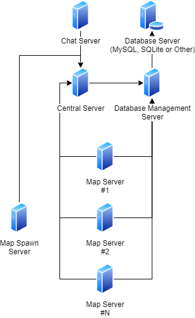

# Server Architecture

For this project, there are 5 kind of servers are:

*   `Central server`, this server will handle user login/register/character create/character delete more than that it is collects list of other servers.
*   `Cluster server`, this server is part of central server, when central server starts this will starts too, it was made for handle app-servers (map-server, map-spawn-server) connections and listing, broadcasting chat messages, player's character updating from any map-server to other map-servers.
*   `Map spawn server`, this server will connect to cluster server and then cluster server will send request to this server to start an map servers.
*   `Map server`, this server will handle gameplay, each Map scene will handle by 1 server, so if you have 3 maps, it will run 3 servers to handle each map, this server will connect to cluster server to send its address and users list.
*   `Database management server`, this server will handle database operation.