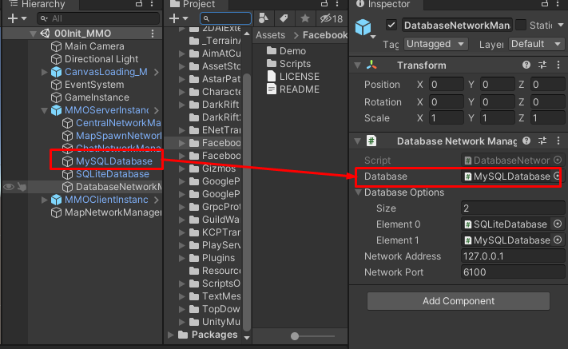

# How to change database system

For this project now there 2 available types of database system there are SQLite and MySql database system

You can change database system at `DatabaseNetworkManager` by drag database system you wish to use into `Database` field, and you can setup options for the config file (`./config/serverConfig.json -> databaseOptionIndex`) by set reference to database components to `Database Options`.

From the image above, in `Database Options`, its first entry is `SQLite` and another one is `MySQL`, so when you are going to setup your server config file (`./config/serverConfig.json -> databaseOptionIndex`), you can set `databaseOptionIndex` to `0` to use `SQLite` and `1` to use `MySQL`

Then setup database server connection config in `./config/sqliteConfig.json` or `./config/mySqlConfig.json`, up to which database you want to use.

* * *

If you use MySQL database you have to import SQL file from {Project Folder}/Assets/UnityMultiplayerARPG/MMO/SQLs

If your project is a fresh project, just import `mysql_main.sql`

If it is the old project which updating to new version import `mysql_update_XX–YY.sql`. the XX is old version, YY is new version.

For example, if you have old project version 1.23 you will have to import following files to update to version 1.30

*   mysql_update_1.23–1.24.sql
*   mysql_update_1.28–1.29.sql
*   mysql_update_1.29–1.30.sql

But for the newer version it has a migration system integrated, so you won't have to import and update sql files, just iport `mysql_main.sql` is enough.

