# How to integrate Google Play Login

To integrate Google Play login you have to create app at publisher console ([https://play.google.com/apps/publish/](https://play.google.com/apps/publish/))

Set all `Store listing` / `Pricing & distribution` / `Content rating` and make it available for internal test (manage at `Release management` -> `App releases`) by upload signed APK file, then Save and Review to make it available for internal test

Then go to **Game Services** from main publisher console page then press on **ADD NEW GAME**

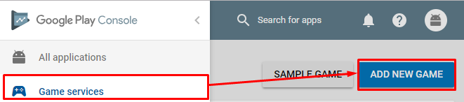

Fill an information

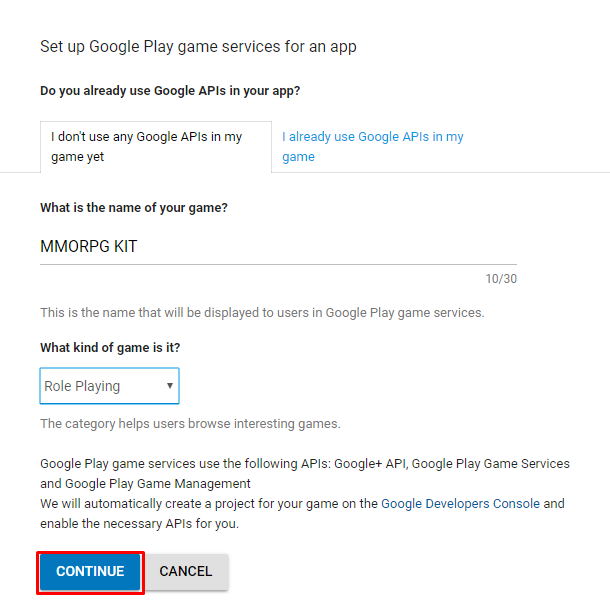

* * *

## Link with Game app

Then link it to your created game

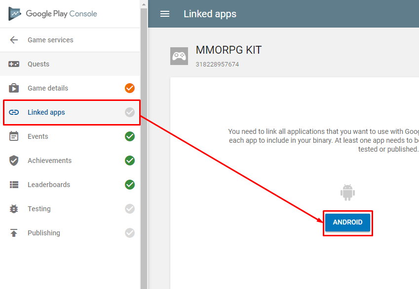

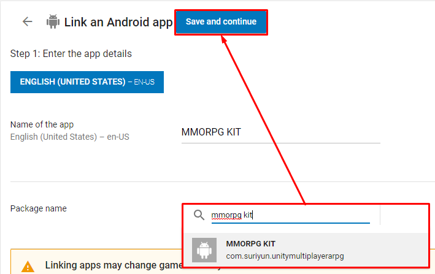

Then do Authorize and Confirm processes

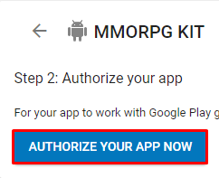

* * *

## Link with Web platform

Then link it to your game web, its URL actually can be any but we'll have to setup oauth2 callback URL later which its domain must be the same with this URL


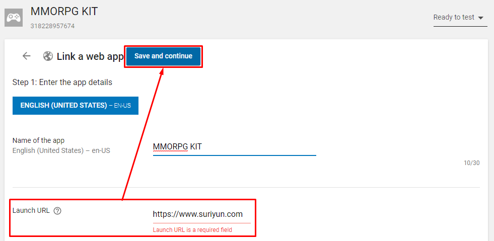

Then do Authorize and Confirm processes


* * *

## Setup OAuth2 Client ID

Then we are going to copy OAuth client ID to setup in the project

Select linked Web platform

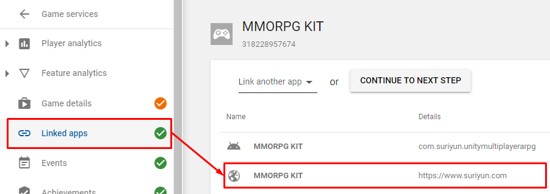

Scroll down to `Authorisation` section then copy `OAuth2 Client ID`

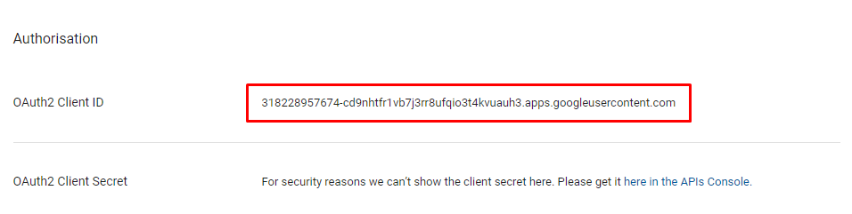

Then paste copied data to **Unity -> Google play games — Android Configuration -> Resources Definition**

Then press **Setup**

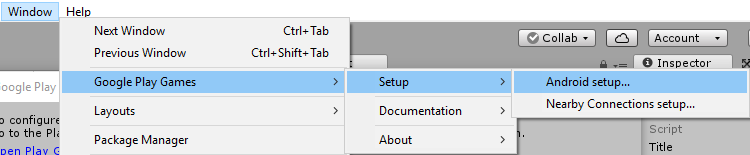

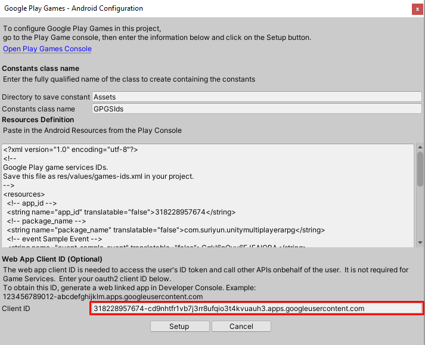

* * *

## Setup Resource Definition

Create **Events** or **Achievements** or **Leaderboards** then press Get resources button to copy export resources data

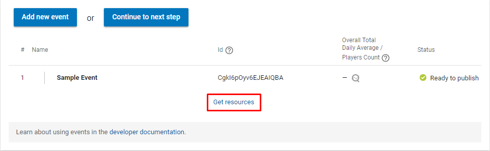

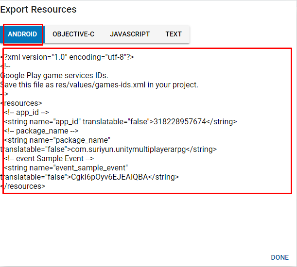

Then paste copied data to **Unity -> Google play games — Android Configuration -> Resources Definition**

Then press **Setup**


* * *

## Setup App fingerprint

Go to your **App Console** page then go to **App Signing**

Copy **SHA-1** data at **Upload certificate**

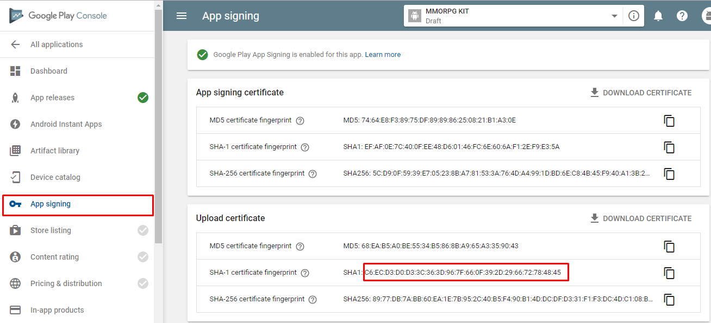

Then go to API Console ([https://console.cloud.google.com/apis/](https://console.cloud.google.com/apis/)) choose your App project then go to **Credentials**

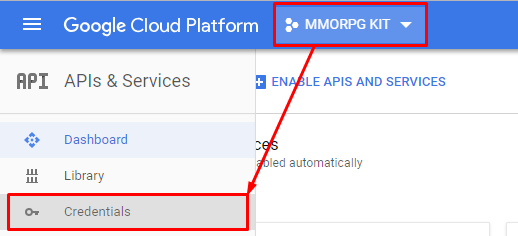

Choose **OAuth Client** then paste copied **SHA-1** and **Save**

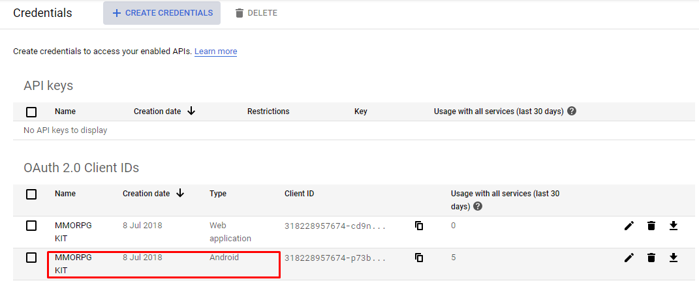

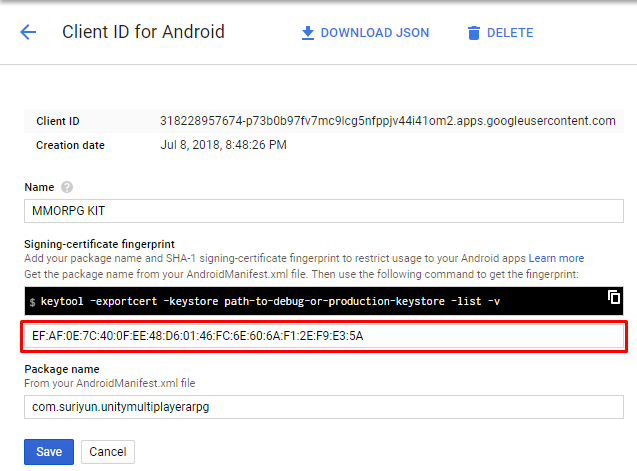

* * *

## Setup Web URI

You will have to setup OAuth2 callback page, if you use PHP to serve your web you can use this [client](https://github.com/googleapis/google-api-php-client). You can find all client libraries from this [link](https://developers.google.com/identity/protocols/OAuth2WebServer)

I also prepare codes which I've used for my game

If you're going to use my codes, you must setup PHP web-server 

Then create a web folder which you're going to use as OAuth callback page, for this example I'm going to create `oauth2callback` folder.

Then setup client library follow installation instruction from this [link](https://github.com/googleapis/google-api-php-client)

After than create `index.php` inside created web folder and paste following codes:

```
<?php
// index.php
require_once __DIR__.'/vendor/autoload.php';

session_start();

$client = new Google_Client();
$client->setAuthConfigFile('client_secrets.json');
$client->setRedirectUri('https://' . $_SERVER['HTTP_HOST'] . '/oauth2callback');
$client->addScope('https://www.googleapis.com/auth/plus.login');
$client->addScope('https://www.googleapis.com/auth/plus.me');
$client->addScope('https://www.googleapis.com/auth/userinfo.email');
$client->addScope('https://www.googleapis.com/auth/userinfo.profile');
$client->setAccessType('online');
$client->setIncludeGrantedScopes(false);

if (!isset($_GET['code'])) {
  $auth_url = $client->createAuthUrl();
  header('Location: ' . filter_var($auth_url, FILTER_SANITIZE_URL));
} else {
  $credentials = $client->authenticate($_GET['code']);
  if (isset($credentials['error']))
  {
    echo 'Error: ' . $credentials['error'] . ' Description: ' . $credentials['error_description'];
  }
  else
  {
    $_SESSION['access_token'] = $client->getAccessToken();
    echo 'Success';
  }
}
?>
```

Then set URI in Console

Go to API Console ([https://console.cloud.google.com/apis/](https://console.cloud.google.com/apis/)) choose your App project then go to **Credentials**


Then set **Authorised redirect URIs** in Web App platform and **Save**

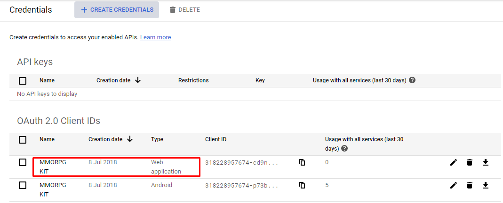

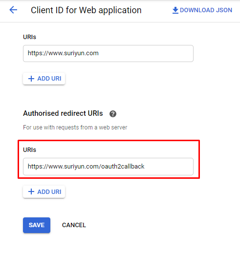

After that go back to the previous page again to download JSON, rename it to `client_secrets.json` (because I use this name in my codes above) and upload to the same place with `index.php`

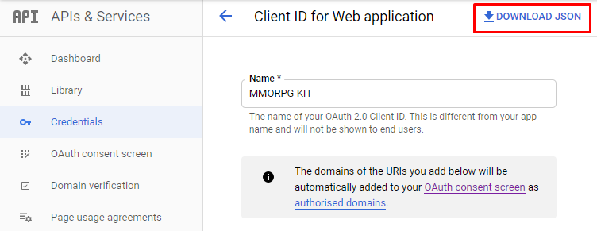

* * *

## Setup UIs

Then open your login scene (for the demo it is Home scene), add **Google Play Login** component to any game object (for the demo, I’ve added it at CanvasHome -> UILogin)

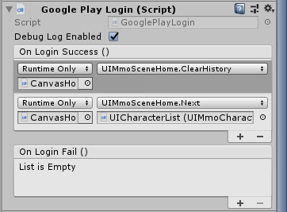

Then set an event when Login success / fail, the Demo I make it show character list after the success

Then in your Login with Google Play button set **Google Play Login** component -> **On Click Google Play Login** at **On Click** event

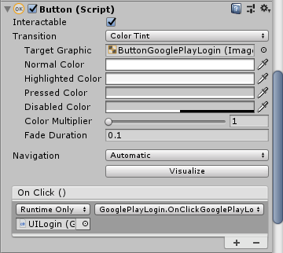