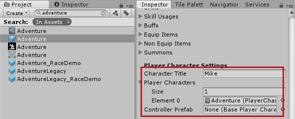
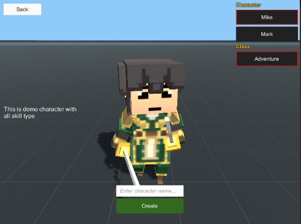
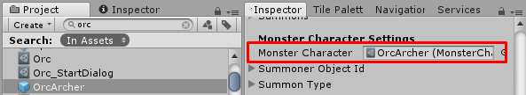

* * *

1.38b — Updates
==============

## Add more functionality for dev extensions

MMO -> Central Network Manager to allow developer to serialize and deserialize extra data when create character, There are following new functions: 

*   SerializeCreateCharacterExtra(PlayerCharacterData characterData, NetDataWriter writer), Use this to add extra data when create character for example, the UMA integration, I've use this to add avatar to send to server
*   DeserializeCreateCharacterExtra(PlayerCharacterData characterData, NetDataReader reader), Use this to read added data when create character for example, the UMA integration, I've use this to read avatar data

PlayerCharacterDataExtension, There are following new functions:
*   static void SerializeCharacterData(IPlayerCharacterData characterData, NetDataWriter writer), Use this to add extra data when send saved character data
*   static void DeserializeCharacterData(IPlayerCharacterData characterData, NetDataReader reader), Use this to read added data when receive saved character data

## Player Character Entity changes

*   Add `Character Title` which is title which will show in character create UIs
*   The `Database` is changed to `Player Characters` and also changed to list, so you can set `Player Character` data here to show as character class selection in character create UIs

If you want it have character class selection in character create UIs, you have to set `Ui Character Class Prefab` and `Ui Character Class Container`. You also can leave some of them empty to not show character class selection, it will set first entry in `Player Character Entity` -> `Player Characters` for creating character

Why I do it like this?, I made it able to change character class (`Player Character` class) and planned to make NPC can change character class. I realised that for some case, developer might want to make their game able to select character class in character create UIs, so now in character create UIs it can have 
  - `Player Character Entity` selection (Use `Player Character Entity` -> `Character Title` as title) and 
  - `Player Character` selection (Use `Player Character` -> `Title` as title)

So developer may make `Player Character Entity` for difference gender then in character create UIs, player can choose character gender then choose character class

I think rename `Player Character` class to `Player Character Class` will be more make sense but I didn't do it yet because I afraid that it will break old project

## Monster Character

*   The `Database` is changed to `Monster Character`

;

I made migration codes, it will migrate data for new version, so you don't worry that updates will break your project