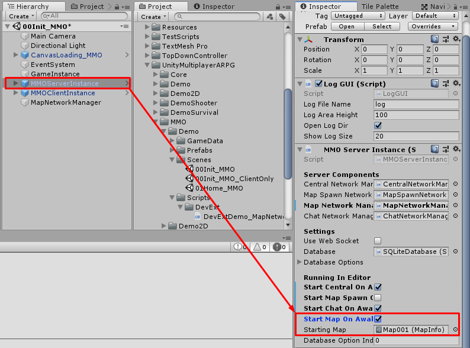
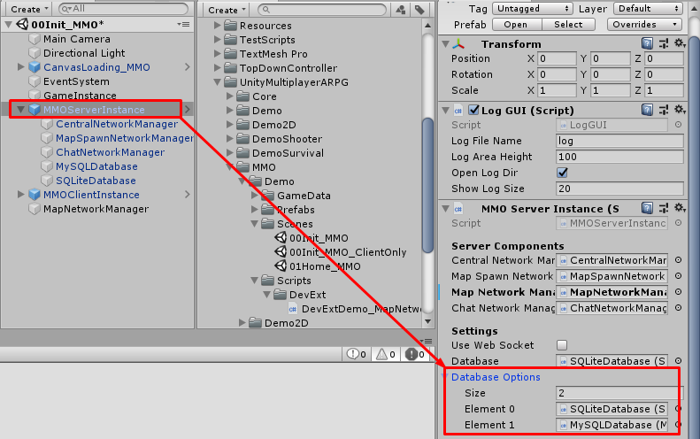
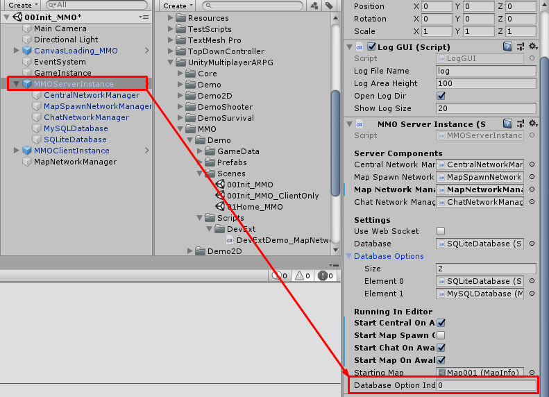

* * *

1.42 — Updates
==============

## Player Storage / Guild Storage / Player Bank / Guild Bank

* Add player storage system, players can deposit/withdraw an item from storage, other characters in the same account also able to access the storage
* Add guild storage system, players can deposit/withdraw an item from storage, other characters in the same guild also able to access the storage
* Add player bank system, players can deposit/withdraw gold from the bank, other characters in the same account also able to access the bank
* Add guild bank system, players can deposit/withdraw gold from the bank, other characters in the same guild also able to access the bank

Visit `NPC` in `Map001` scene to try these features from menu `Player Storage` and `Guild Storage`

## MMO - Can test map-server in Unity Editor

You can test map-server in Unity Editor by just set `MMOServerInstance` -> `Start Map On Awake` to `TRUE` and set map that you want to test to `MMOServerInstance` -> `Starting Map`

## MMO - Can switch database with config files/command line arguments

Now you can switch database with config files/command line arguments but you have to prepare list of database that can be switched at `MMOServerInstance` -> `Database Options`

Then you set swith database in config file with config key "databaseOptionIndex", value is index of database option. Example config: `"databaseOptionIndex" : 1`.

Or may swith database with command line. Example command: `-databaseOptionIndex 1`.

In Unity Editor, you can switch database option via `MMOServerInstance` -> `Database Option Index` config

