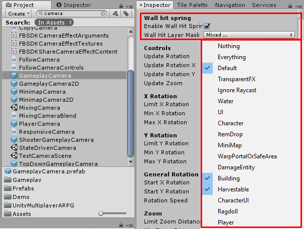
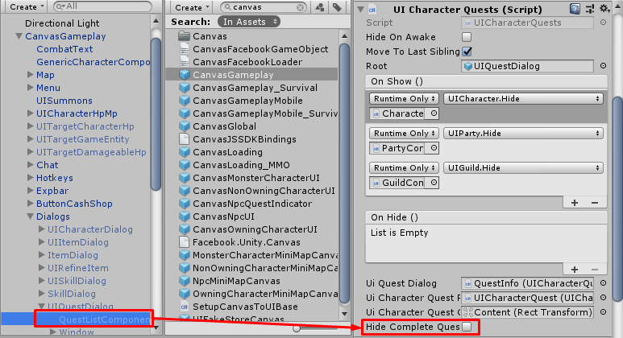
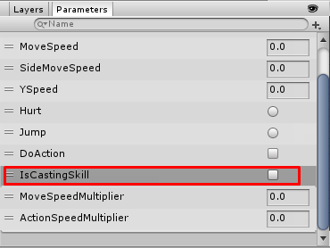
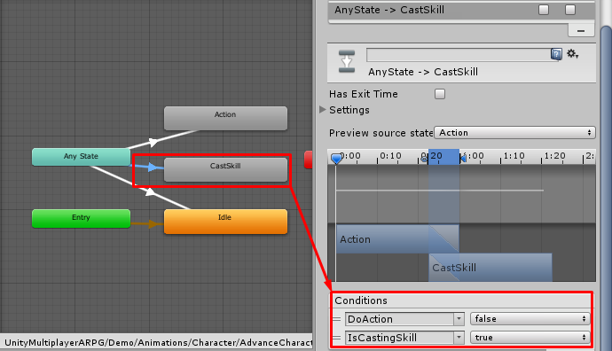
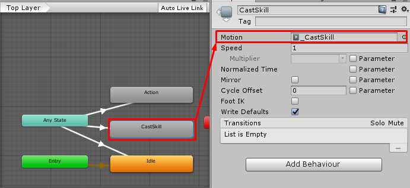
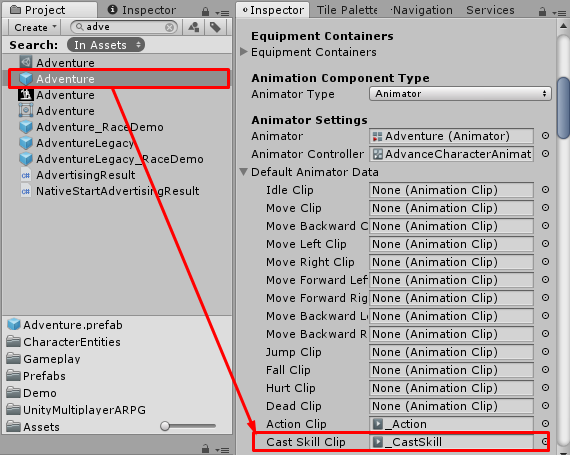

* * *

1.43b — Updates
==============

- Fix invalid character stats calculation in `UI Character`
- Fix cannot press F to pick up items
- Fix invalid character attack/use skill animations settings in `Character Model`
- Fix cannot access player storage bug
- Add camera collision

- Move character attack/skill/buff codes to new partial class files (BaseCharacterEntity_AttackFunctions, BaseCharacterEntity_BuffFunctions, BaseCharacterEntity_SkillFunctions)
- Reduce DevExtMethods calls in BaseGameEntity and classes that extended from this class, it will be called only in Awake and OnDestroy function. For other function, developer has to implement an event delegates (You can see DevExtDemo_PlayerCharacterEntity, DevExtDemo_MonsterCharacterEntity) for example
- Add `hideCompleteQuest` to `UICharacterQuests`, Developers can use it to filter quest list

- Add casting duration/animation/effect for skills, now you can set casting duration/animation/effect before activating the skill

- Add OnCastSkill(), OnApplySkill(), OnAttack() functions to `Skill` class. Developers can extend `Skill` class and change some skill functionality by those functions

* * *

Developer might have to add **IsCastingSkill(Bool)** to character's **Animator Controller**.

Add transition to *Skill Casting state* in **Animator Controller**.

And have to set default cast skill clip to `Character Model` -> `Default Animator Data` -> `Cast Skill Clip`.

