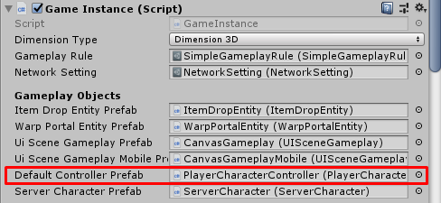
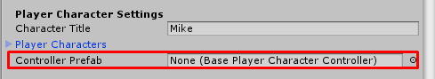

* * *

How to change controller
==============

You can change `Default Controller Prefab` in `Game Instance` component.

So you can switch from Point-Click controller to FPS controller by just drag created controller prefab to your `Game Instance`

It also overridable in `Player Character Entity` -> `Controller Prefab` so each `Player Character Entity` can have difference controller

