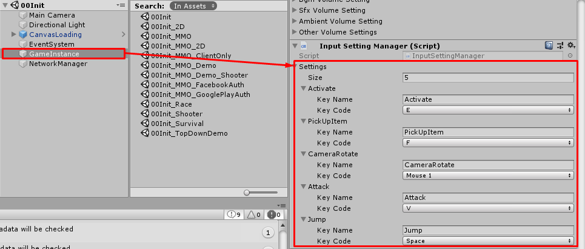

* * *

How to change input
==============

This project was override input system to make it able to set input keys for difference platform (PC/Mac/Mobile) easily

For now, I didn't tested on Console platforms yet but I think it should work, I recommend you to remove settings from GameInstance -> Input Setting Manager (I added it for Demo purpose)

Then set following keys to Project Settings -> Input

*   **Activate** key for talk to NPC / show other character menu
*   **PickUpItem** key for pick up dropped item
*   **Attack** key for attack
*   **Jump** key for jump
*   **FindEnemy** key for find enemy
*   **Reload** key for reload gun