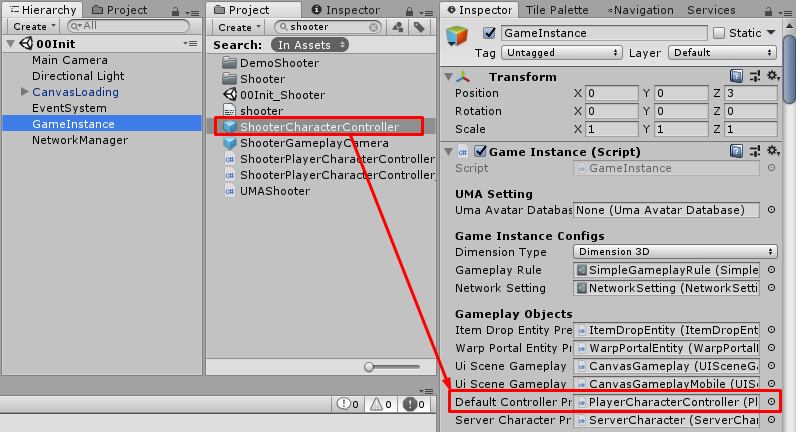

# FPS gameplay

You can change controller to FPS controller by:

Set `ShooterCharacterController` prefab to `GameInstance` -> `Default Controller Prefab`

Done, that's it.

* * *

## Shooter Player Character Controller

The `Shooter Player Character Controller` component contains following configs:

*   `Mode` if this is `Adventure` character will always turn following to move input direction and move forward except when attack or use skill it will turn to camera forward, if this is `Combat` character will always turn following to camera forward and move forward or backward or strafe left or right following input direction.
*   `Can Switch View Mode` if this is `TRUE` it will able to switch view mode to `Fps` or `Tps` when press `SwitchViewMode` key, the default key is `F1`.
*   `View Mode` current view mode `Fps` or `Tps`.
*   `Sprint Active Mode` how to active sprint move state.
*   `Crouch Active Mode` how to active crouch move state.
*   `Crawl Active Mode` how to active crawl move state.
*   `Angular Speed` this is speed to turn to move direction.
*   `Turn To Target Duration` this is duration to turn to camera forward when current character turn to other direction.
*   `Crosshair Rect` the crosshair rect.
*   `Tps Zoom Distance` default zoom distance when switch view mode to `Tps`.
*   `Tps Min Zoom Distance` min zoom distance while view mode is `Tps`.
*   `Tps Max Zoom Distance` max zoom distance while view mode is `Tps`.
*   `Tps Target Offsets` offsets between gameplay camera and character entity -> `Camera Target Transform` while view mode is `Tps`.
*   `Tps Fov` camera's field of view while view mode is `Tps`.
*   `Tps Near Clip Plane` camera's near clip plane while view mode is `Tps`.
*   `Tps Far Clip Plane` camera's far clip plane while view mode is `Tps`.
*   `Fps Zoom Distance` default zoom distance when switch view mode to `Fps`.
*   `Fps Target Offsets` offsets between gameplay camera and character entity -> `Camera Target Transform` while view mode is `Fps`.
*   `Fps Fov` camera's field of view while view mode is `Fps`.
*   `Fps Near Clip Plane` camera's near clip plane while view mode is `Fps`.
*   `Fps Far Clip Plane` camera's far clip plane while view mode is `Fps`.

* * *

There are extra configs in `Item` that made for FPS gameplay are:

*   `Weapon Ability` For now you can set only zoom ability to weapon, players can activate ability by right-click, you can create weapon ability from create menu (Right click in `Project` select `Create` -> `Create Game Data` -> `Weapon Ability`)
*   `Crosshair Setting` 
*   `Fire Type` if this is `Single Fire` player have to release button for next fire, if this is `Automatic` player can hold to fire without button release for next fire
