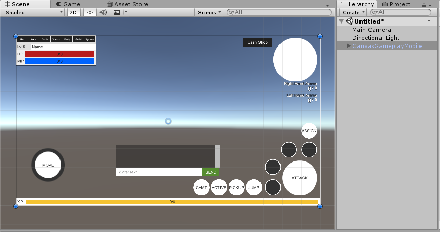
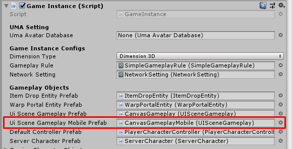
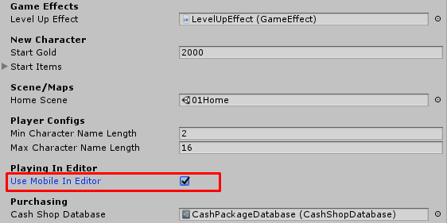

* * *

Mobile Platform
==============

### How to modify mobile UI
You can try modify mobile UI by drag `CanvasGameplayMobile` prefab to empty scene

### Set your mobile UI
You can set UI prefab for mobile platform at `Game Instance` -> `Ui Scene Gameplay Mobile Prefab`

### Test mobile UI in editor
You can test mobile UI in editor by turn on `Game Instance` -> `Use Mobile In Editor`

