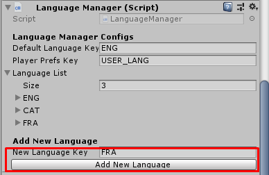
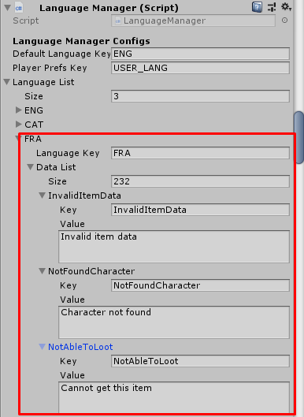
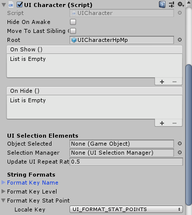
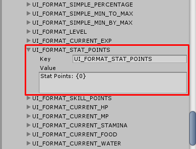
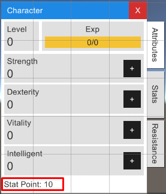
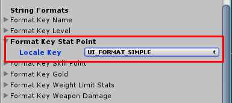
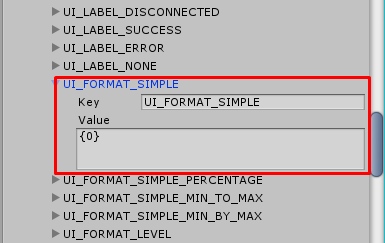
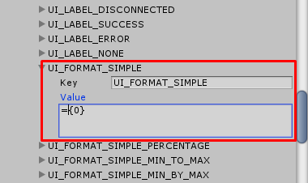

* * *

Localization
==============

You can add new language in the `Language Manager` which usually attached to the same game object with `Game Intance` by 

- Enter language key in `New Language Key` for example `FRA` (which stands for "France")
- Then press on `Add New Language` button

Now new language will be added, Then expand data to change text for each key as you wish

**TODO: Add key table here**

There are some keys that uses for UIs formats for example `UI_FORMAT_STAT_POINTS` which normally uses with `UI Character` -> `Format Key Stat Point` as a format key for character's stat points.

We uses the keys to map with data in `Language Manager`, for the `UI_FORMAT_STAT_POINTS`, its default value is `Stat Point: {0}`, while playing game if character's stat points = 10 it will be shown as `Stat Point: 10`, if format set to `STP: {0}` it will be shown as `STP: 10`

You may change `Format Key Stat Point` to `UI_FORMAT_SIMPLE`, if you want to show just stat point amount as `10` because default format value for `UI_FORMAT_SIMPLE` is `{0}`

But if you set format for `UI_FORMAT_SIMPLE` to `={0}` when you change `Format Key Stat Point` to `UI_FORMAT_SIMPLE` it will shown as `=10`

