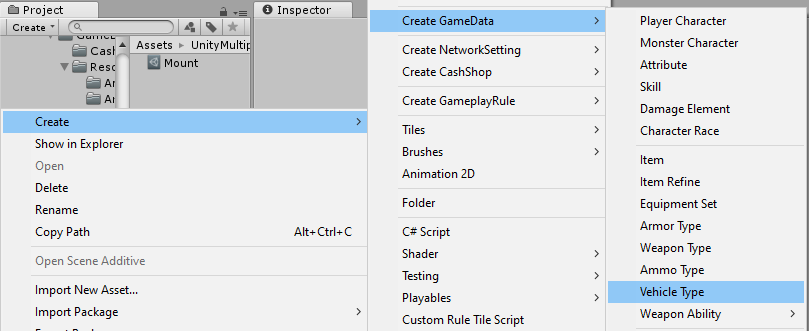
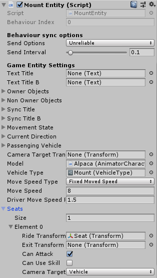
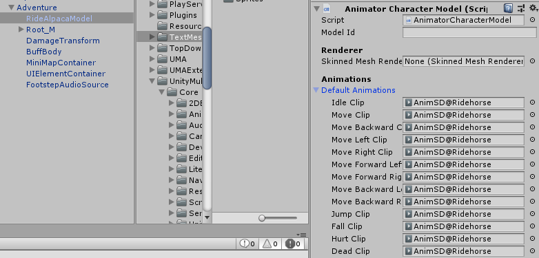
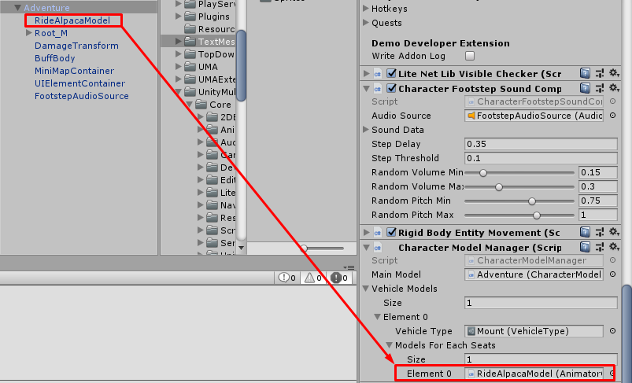

* * *

1.46 — Updates
==============

## Character Entities - Structure Changes

In this version there are changes on **Character Entities**, now its movement functions are moved to other **Movement** components. So it's has not to use/make differences of **Character Entities** for differences of 3D/2D gameplay, you can use **Player Character Entity** and **Monster Character Entity** for your characters in 2D games. 

For old users, you don't worry about deprecating classes such as **Player Character Entity 2D** and **Monster Character Entity 2D**, it's won't force you changes components to **Player Character Entity** / **Monster Character Entity**, I still keep it for backward compatibilities use.

### Movement Components

- **RigidBodyEntityMovement**, this is movement component which handles by `Rigidbody` for movement, character entities which uses this movement component will able to jump, it's also works with point click movement which its paths calculate by [this function](https://docs.unity3d.com/ScriptReference/AI.NavMesh.CalculatePath.html)
- **NavMeshEntityMovement**, this is movement component which handles by `NavMeshAgent` for movement, I usually uses it with monsters because they are not going to jump
- **RigidBodyEntityMovement2D** this is movement component which handles by `Rigidbody2D` for movement, it's just dumb movement which always move forward to target, not avoid an obstacles (because Unity have no official 2D AI solution). If you are looking for smarter AI see [this open-source project](https://github.com/insthync/UnityMultiplayerARPG_2DAI)

## Mount System

In this version, I've implement mount system which can use by items / skills and can unmount with key (use `x` by default).

### How to create new Mount

To create new mount, you have to prepare vehicle type, I make it for character animtion specification while passenging vehicle, you can prepare vehicle type by:

- Right click on `Project` panel
- Choose `Create` -> `Create Game Data` -> `Vehicle Type`

Then prepare mount entity, it's like when you prepare character entity, you have to:

- Prepare model
- Add `Mount Entity` component
- Set created `Vehicle Type` to `Mount Entity` -> `Vehicle Type` field
- Set other options as you wish

In mount entity you have to setup `Seats`, it must have at least 1 seat. Each seat you can set following options:

- **Passenging Transform**
- **Exit Transform**
- **Can Attack**, if this is `TRUE` character will able to attack while passenging this vehicle in this seat
- **Can Use Skill**, if this is `TRUE` character will able to use skill while passenging this vehicle in this seat
- **Camera Target**, this is target for camera while character passenging this vehicle

After created mount entity, make it as prefab, if you use `Game Database` add it to `Mount Entities` field, if not place it in `Resources` folder.

### Character Model - Animation while mount

In this version I have add `Character Model Manager` to manage animation specific by `Vehicle Type` and `Seat`. In the future I may use it for other animations such as swimming and driving.

So if you have old characters and want to make them play animation while mount horse correctly, you have to add new `Character Model` component for handle that animation. I recommend to create new child transform then add that component for ease of managing

 Then back to character entity if it's not attached `Character Model Manager`, you have to do it. Then in `Character Model Manager` there is `Vehicle Models` add new entry for specific `Vehicle Type` and set `Models For Each Seats` by the new `Character Model` that I have mentioned above.

### Mount Item

Now item will have new type it is `Mount` when change its type to `Mount` you will able to set `Mount Entity`

### Mount Skill

Now you can set `Mount Entity` for an active skills in `Mount` section

## Bug Fixes / Improvement

- Issues with shooter controller that cannot activate an NPCs, Drop items are fixed
- Cannot set summoning character entity for Skills for 2D games
- Reduce packet size for all networking objects by remove index of behaviours, move sync fields / net functions instances from behaviours to network identity, so network identity will handle all sync fields / net functions