# Getting Started (Singleplay/LAN)

## Importing

You must install newtonsoft-json, actually should do it before import the package but you can do it later

You can do it by

Go to your project folder then `/Packages` edit `manifest.json`, Add
```
 "com.unity.nuget.newtonsoft-json": "3.0.2"
```
Into dependencies

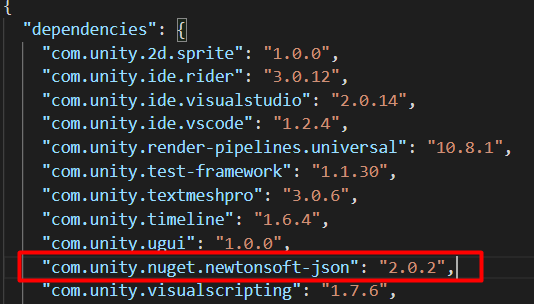

Or use Package manager from menu `Window` -> `Package Manager`

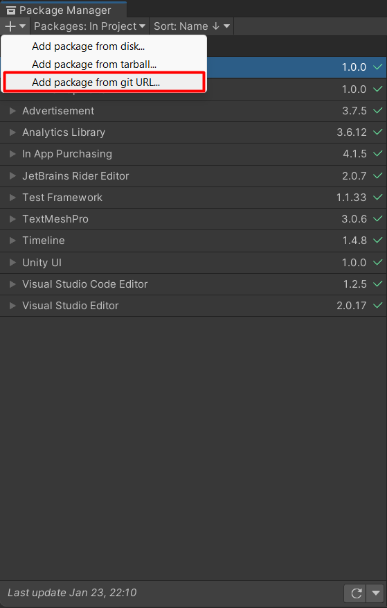

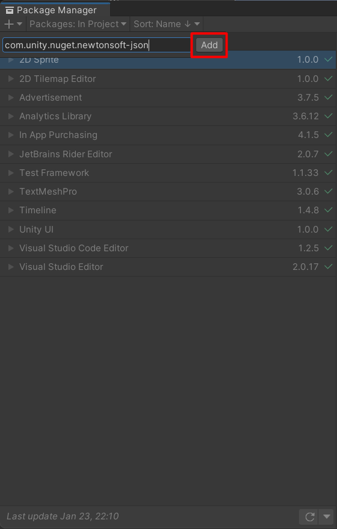

* * *

After download the package from Unity Asset Store, click on `Import` button


* * *

Then, Wait for a few seconds, it will ask you to Install/Upgrade Unity packages. Press `Skip` to skip it


* * *

After that, The Import dialog will be shown, Press `Import` to import the package

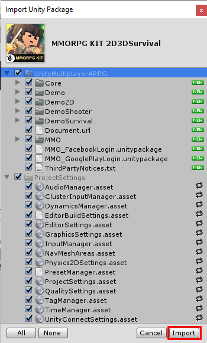

* * *

## Use Unity 2021?

If you are using Unity 2021, you have to do follows [this](pages/151-working-with-2021.md)

* * *

## Want to use Old Input Manager?

If you want to use old input manager, you have to change `Active Input Handling` to `Input Manager (Old)`, you can find the setting from `Project Settings -> Player`


## Want to use New Input System?

If you want to use new input system, you have to install the package from package manager which you can access it via menu `Window -> Package Manager`

Change packages scope to `Unity Registry` 

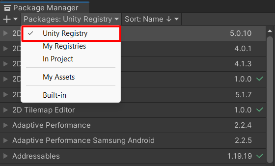

Then find for the input system and install it

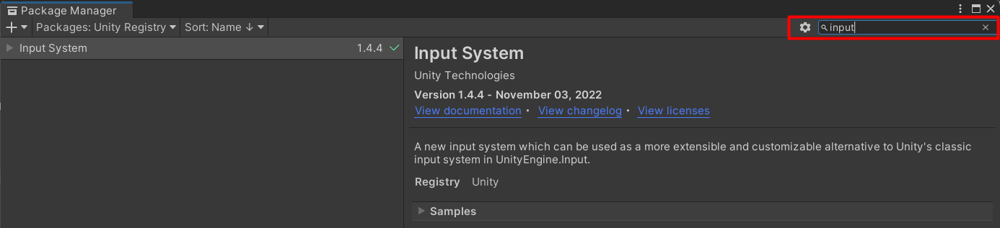

Next, change `Active Input Handling` to `Input System Package (New)`, you can find the setting from `Project Settings -> Player`

Then you can try use demo's input actions by set it in init scene (`00Init`) -> `GameInstance` -> `InputSettingManager`

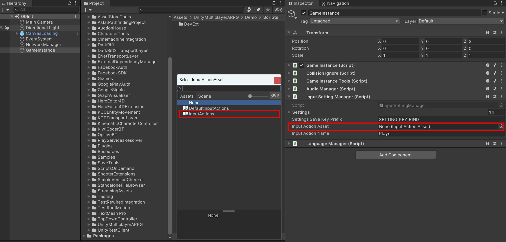

* * *

## Building

Before you build, you should setup scripting define symbols by use menu: `MMORPG KIT -> Setup For Offline-Lan Build` to make sure that the build will work properly.


Next, make sure `Scenes in build` are correct, Open up the `Build Setting...` dialog from menu `File -> Build Settings...` 

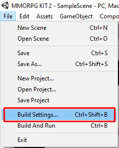

To test the demo, scene named `00Init` must be the first that enabled in the list, it's also have to add and enable `01Home`, `Map01` and `Map02` scenes

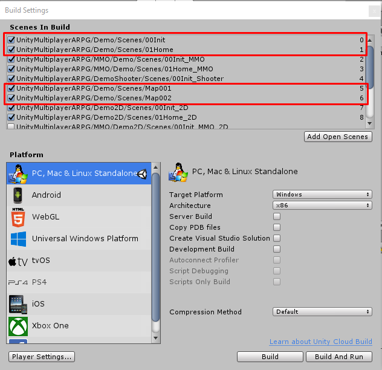

* * *

Then you can build the game to test Multiplayer gameplay, by press on `Build` button to build it

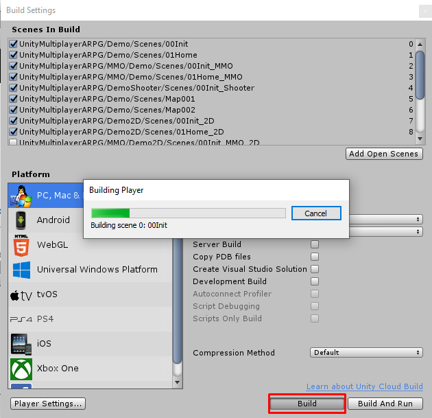


* * *

## Testing

Open up first client and host the game to let other to join later

Select `Multiplayer` and `Host`

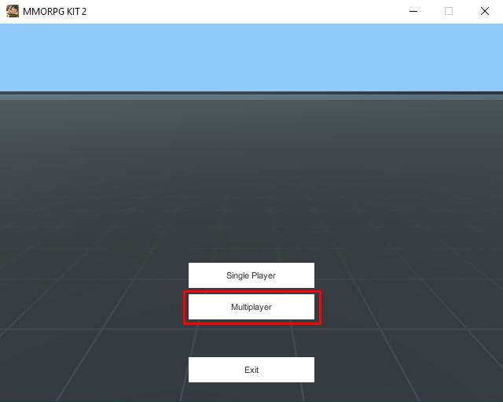

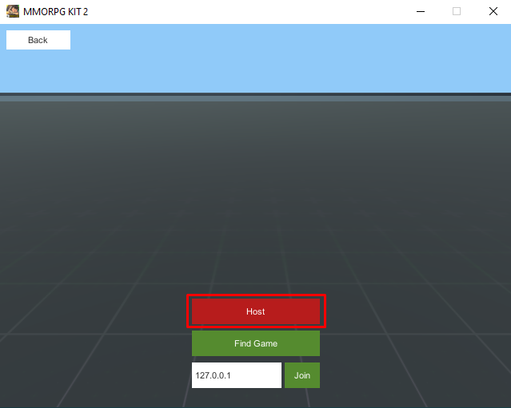

Then create first character and start game

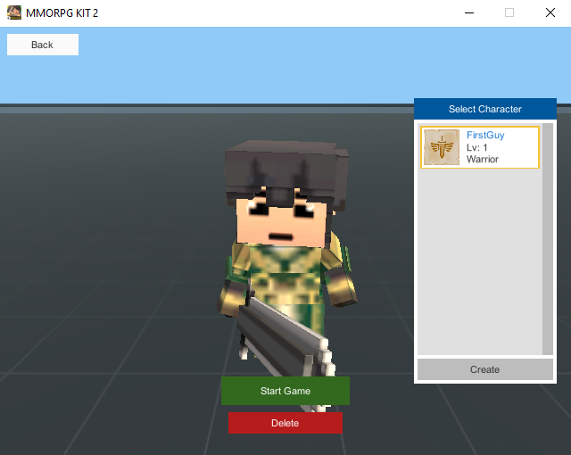

* * *

Then open up another client and join the game that hosted

Select `Multiplayer` then `Find Game` then select the host which you are going to join the game and press on `Join` button

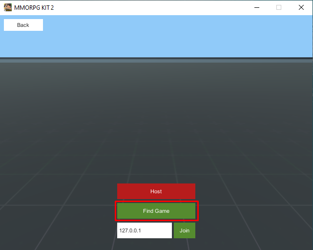

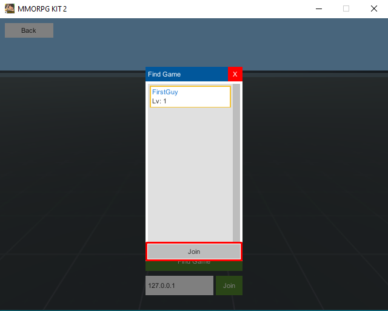

Then create second character and start game

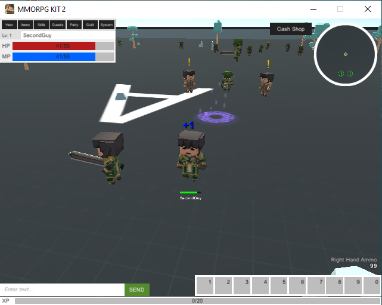

* * *

In the demo you can:

*   Press C to toggle Character dialog
*   Press I to toggle Inventory dialog
*   Press T to toggle Skill tree dialog
*   Press Q to toggle Quest list dialog
*   Press P to toggle Party dialog
*   Press G to toggle Guild dialog
*   Press Esc to toggle System menu (including respawn menu when dead)
*   Press F to pick up item
*   Press E to talks to NPCs / Request other players to join party / guild / trade
*   Press V to attack nearby characters
*   Press Tab to select target character to attack
*   Click on hotkeys to assign hotkeys
*   Press 1-0 keys to use item or skill that assigned to hotkey
*   Press X to exit riding vehicle (Alpaca)

When you kill monster, your character will gain XP, collect XP to level up. When level up, your character will gain stat point and skill point. You can use stat point to increase attributes, in the demo there are:

*   `Strength` increase your character attack damage while equip sword, 2-hand sword and also increase limit inventory weight
*   `Dexterity` increase evasion and accuracy
*   `Vitality` increase max HP
*   `Intelligence` increase max MP

And you Skill point to increase skill level
<!--stackedit_data:
eyJoaXN0b3J5IjpbMTMyNDUxNDk5Nl19
-->