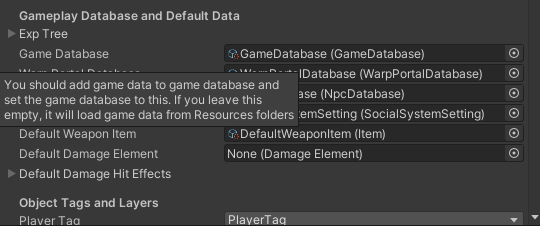

# Game Instance and relates data

## Game Instance

This is component contains configuration for gameplay such as:
*   Gameplay rule
*   Gameplay UIs for PC and Mobile platforms
*   An objects that will be instantiates in gameplay scenes for general purpose such as represent dropped items, position in mini-map, character name and HP/MP stats
*   Exp table, Game database, Warp portal database, Npc database
*   Default weapon data when character not equip any weapon, default damage element when character attack with unset damage element
*   How far to pickup and dropped items, how far to active other characters, how far to build an building
*   How inventory system works
*   Amount of gold, items that new character will own at start of the game
*   Home scene which used to manage your character

You can find `Game Instance` in `00Init` scene.

**I will not write all description here because you can see it by hover the setting by mouse cursor to see the description.**

##### Game Instance - Helpers / Utilities Components

There is some helpers that attached to game instance game object in the demo that some of them does's not required to use in the project, but I uses them to help me to setup gameplay as I wish it to be, there is:
*   `Collision Ignore` (Not required to use in the project), I use it to ignore collision between colliders to make character able to move through other characters and also able to move through dropped items
*   `Game Instance Tools`  (Not required to use in the project), I use it to generate Exp table, just set max character leve, first level exp and last level exp to generate
*   `Audio Manager`, For most games nowsaday there are more than one volume settings so I made this to manage them
*   `Input Setting Manager`  (Not required to use in the project), I made this to move Unity's input settings to this component to make it more convenience to change input settings, if this doesn't used in the project, you will have to setup input settings from menu `Edit -> Project Settings... -> Input`
*   `Language Manager` (Not required to use in the project), I made this to manage localized settings in the game

* * *

## Gameplay Rule

Some gameplay rule settings such as damage calculation, weapon durable calculation, amount of stat point that character will gain when levelup can be set in gameplay rule.

You can create this database by right click in `Project` window, choose `Create -> Create GameplayRule -> Simple Gameplay Rule`

To enable it in your game, you have to set it in `Game Instance -> Gameplay Rule`

* * *

## Game Database

This is database which store an game data such as characters, monsters, quests, maps (and so on) that being used in your game.

More Info: [Click Here](pages/103-game-database)

* * *

## Warp Portal Database

This is database which store warp portals that will be represented in gameplay scene to let players activate and warp to another position, you can set position of portal and position of warp target in this database. Or create warp portal entity in your map scene and set warp target position if you feels it's more convenience.

You can create this database by right click in `Project` window, choose `Create -> GameDatabase -> Warp Portal Database`

To enable it in your game, you have to set it in `Game Instance -> Warp Portal Database`

* * *

## Npc Database

This is database which store Npcs that will be represented in gameplay scene with their dialogs to let players activate and talking with them, you can set position of Npcs, and their dialogs. Or create NPC entity in your map scene and dialogs if you feels it's more convenience.

You can create this database by right click in `Project` window, choose `Create -> GameDatabase -> Npc Database`

To enable it in your game, you have to set it in `Game Instance -> Npc Database`

* * *

## Social System Setting

This is setting for social system such as party and guild, you can set max amount of party memeber, guild exp tree, gold and items that requried to create guild here

You can create this setting by right click in `Project` window, choose `Create -> GameData -> Social System Setting`

To enable it in your game, you have to set it in `Game Instance -> Social System Setting`

* * *

## Home scene

This is scene which used for manage connection and manage player's characters, you can see how I setup home scene in `01Home` scene and `01Home_MMO` scene for MMO games

* * *

## UI Scene Gameplay

This is collection of an UIs which will be shown in gameplay scene, so you can change an UIs here, you can find `CanvasGameplay` (in `Project` window)  to see how I setup it or duplicate it to customize UIs based on the demo UIs to make your own UIs, set it to `Game Instance -> Ui Scene Gameplay Prefab` or `Game Instance -> Ui Scene Gameplay Mobile Prefab` if it's going to be used with mobile platforms
<!--stackedit_data:
eyJoaXN0b3J5IjpbNDk4MTcwNzEzXX0=
-->