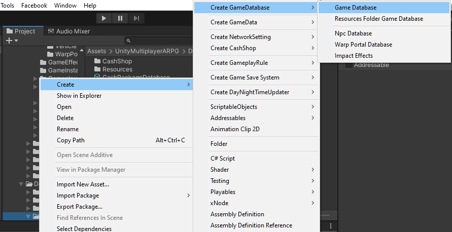
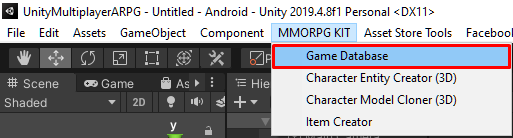

# Game Database

This is database which store an game data, now there are following things that required to add into game database to make them able to work in your game:

## Entity
*   `Player Character Entity`, the character which will be represent in game scene and can controls by players.
*   `Monster Character Entity`, the monster character which will be represent in game scene.
*   `Vehicle Entity`, the mountable animal or vehicle which will be represent in game scene.
*   `Other Network Objects`, other network objects which will be represent in game scene.

## Game Data

*   `Attribute`, an attributes that can be increase by stat point to increase character stats.
*   `Currency`, an custom currencies. If you want to use other currencies other than gold and cash you can create custom currencies.
*   `Damage Element`, an elements of damage, you can make fire, ice, poison damage elements for more variety of gameplay. You can leave it empty if you don't want to have other damage elements than default damage element (which set to `Game Instance`).
*   `Item`, an items.
*   `Item Craft Formula`, formula for item crafting.
*   `Armor Types`, type for an armor items, you can define equipping slots by armor types.
*   `Weapon Types`, type for an weapon items, you can define how weapon working by weapon types.
*   `Ammo Types`, type for an ammo items, you can define which kind of ammo is required for weapon in weapon type game data.
*   `Skill`, an character's skills.
*   `Guild Skill`, skills that can be use when joined the guild.
*   `Status Effects`, status effects which will apply to the character when attacking or being attacked.
*   `Player Character`, aka character's class, it is data for player character.
*   `Monster Character`, it is data for monster character.
*   `Harvestable`, type for harvestable entities, you can define items which will drops when harvestable entities destroyed.
*   `Map Info`, map scenes that allowed player to accesses and settings for each maps.
*   `Quest`, an character's quests.
*   `Faction`, factions that allowed player to select, you can leave it empty if you don't want to have factions in your game.
*   `Gacha`, use it to get random rewards

* * *

## Create Game Database

There are 2 types of built-in game database that can be created:

*   `Game Database`, with this game database you can set an game data to game database by drag created game data into its fields. You can create this kind of game database by right click in `Project` window, choose `Create -> GameDatabase -> Game Database`
*   `Resources Folder Game Database`, with this game database you can set an game data to game database by create an game data in `Resources` folder (the folder with name `Resources` which can be created anywhere in `Assets` folder). You can create this kind of game database by right click in `Project` window, choose `Create -> GameDatabase -> Resources Folder Game Database`

* * *

## Game Database Management Editor

You can manage game data with game database management editor, which is a dialog which help your to find game data easily (and also have buttons for create, duplicate, delete game data)

The game database management editor was made for `Game Database` only, so if you uses `Resources Folder Game Database`, you won't be able to manage with game database management editor.

You can open the editor via menu `MMORPG KIT -> Game Database`

After you select the menu, it will show a dialog to select your game database, then after selected your game database, it will shows list of all game data and its settings.

* * *

## Switch Game Database

You can change game database by drag created game database to `Game Instance -> Game Database` field

## Advance

You may create your own `Game Database` system by create class which inherits from `BaseGameDatabase` 

Then implement `void LoadDataImplement(GameInstance gameInstance)` function

And call following functions to add game data to game instance to use in gameplay later.

*   `GameInstance.AddAttributes` add attributes to game instance.
*   `GameInstance.AddCurrencies` add currencies to game instance.
*   `GameInstance.AddDamageElements` add damage elements to game instance.
*   `GameInstance.AddItems` add items to game instance.
*   `GameInstance.AddItemCraftFormulas` add item craft formulas to game instance.
*   `GameInstance.AddArmorTypes` add armor types to game instance.
*   `GameInstance.AddWeaponTypes` add weapon types to game instance.
*   `GameInstance.AddAmmoTypes` add ammo types to game instance.
*   `GameInstance.AddNpcDialogs` add npc dialogs to game instance.
*   `GameInstance.AddQuests` add quests to game instance.
*   `GameInstance.AddSkills` add skills to game instance.
*   `GameInstance.AddGuildSkills` add guild skills to game instance.
*   `GameInstance.AddStatusEffects` add status effects to game instance.
*   `GameInstance.AddCharacterEntities` add character entities to game instance, you can use this function to add player character entities or monster character entities.
*   `GameInstance.AddVehicleEntities` add vehicle entities to game instance.
*   `GameInstance.AddHarvestables` add harvestable to game instance.
*   `GameInstance.AddMapInfos` add map infos to game instance.
*   `GameInstance.AddFactions` add factions to game instance.

**It might have other functions to add game data, game entity to game instance which I didn't add to this document**
<!--stackedit_data:
eyJoaXN0b3J5IjpbODQyNzc1Mzg3LDM3MjE2NDQ3Nl19
-->