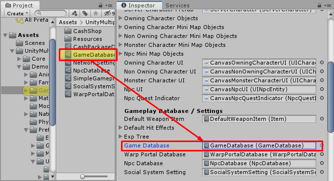

# Game Database

This is database which store an game data, now there are following things that required to add into game database to make them able to work in your game:

*   `Attribute`, an attributes that player character levelup to increase character stats
*   `Damage Element`, an elements of damage, you can make fire, ice, poison damage elements for more variety of gameplay. You can leave it empty if you don't want to have other damage elements than default damage element (which set to `Game Instance`)
*   `Item`, an items
*   `Npc Dialog`, an NPC dialogs which will be shown when character talks to NPCs
*   `Quest`
*   `Guild Skill`, skills that can be use when joined the guild that already level up the skill
*   `Play Character Entity`, the character which will be represent in game scene and can controls by players
*   `Monster Character Entity`, the monster character which will be represent in game scene
*   `Mount Entity`, the mountable animal or vehicle which will be represent in game scene
*   `Map Info`, map scenes that allowed player to accesses and settings for each maps
*   `Faction`, factions that allowed player to select, you can leave it empty if you don't want to have factions in your game

* * *

## Create Game Database

There are 2 types of game database that can be created:

*   `Game Database`, with this game database you can set an game data to game database by drag created game data into its fields. You can create this kind of game database by right click in `Project` tab, choose `Create -> GameDatabase -> Game Database`
*   `Resources Folder Game Database`, with this game database you can set an game data to game database by create an game data in `Resources` folder (the folder with name `Resources` which can be created anywhere in Assets). You can create this kind of game database by right click in `Project` tab, choose `Create -> GameDatabase -> Resources Folder Game Database`

* * *

## Switch Game Database

You can change game database by drag created game database to `Game Instance -> Game Database` field

## Advance

You may create your own `Game Database` system by create class which inherit from `BaseGameDatabase` 

Then implement `void LoadData(GameInstance gameInstance)` function

And call following functions to add game data to game instance to use in gameplay later.

*   `GameInstance.AddAttributes(attributes)` add attributes to game instance
*   `GameInstance.AddItems(items)` add items to game instance
*   `GameInstance.AddNpcDialogs(npcDialogs)` add npc dialogs to game instance
*   `GameInstance.AddQuests(quests)` add quests to game instance
*   `GameInstance.AddGuildSkills(guildSkills)` add guild skills to game instance
*   `GameInstance.AddCharacterEntities(characterEntities)` add character entities to game instance, you can use it to add player character entities and monster character entities
*   `GameInstance.AddMountEntities(mountEntities)` add mount entities to game instance
*   `GameInstance.AddMapInfos(mapInfos)` add map infos to game instance
*   `GameInstance.AddFactions(factions)` add factions to game instance

After added all game data, call this function to notify the game instance the everything are loaded then it will load home scene to start the game

*   `gameInstance.LoadedGameData()`