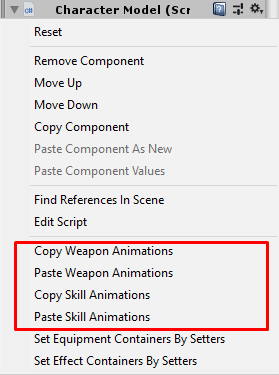

# Animator Character Model

This component working by create [Animator Override Controller](https://docs.unity3d.com/Manual/AnimatorOverrideController.html) at runtime based on `Animator Controller` which set to `Animator Controller` field. Then when character change weapon it can change animation set (idle, move, dead and other animations) based on clip's names which set to `Animator Controller's states`.

To setup this component, you should learn about [Mechanim Animation System](https://docs.unity3d.com/Manual/AnimationOverview.html) and [Animation Clip](https://docs.unity3d.com/Manual/AnimationClips.html).

* * *

You can prepare it after prepared `Character Entity` then add `Animation Character Model` component, then setup following settings:

### Hidding Objects

This is a list of game objects which will be deactivated when hidden, character model can be hidden in shooter game mode when zooming with guns.

You can set just root of bone here because when root deactivated, all equipment models that are its children will be hidden too.

* * *

### Effect Containers

Effect container was made to instantiates effects (particles, sfx and so on) to difference positions, some buff effects may instantiates at character hands, some effects may instantiates at character body.

To set a container, you have to create empty game object then set its position to where you wish the effects to instantiates.

For example, `Body` container's position will be located at center of character like this

Then drag it to `Effect Containers` and set `Effect Socket`

That is it, but there is another way to setup effect container by using `Effect Container Setter`

You have to create empty game object, set its position, then you have to set its name as `Effect Socket` and attach `Effect Container Setter` to the game object

Then go back to character model and press on `Set Effect Containers by Setters` button

Finally, the effect container has been set

* * *

### Equipment Containers

Equipment container was made to instantiates equipments (helment, armor, sword and so on) to difference positions, some equipments may instantiates at character hands, some equipments may instantiates at character body.

To set a container, you have to create empty game object then set its position to where you wish the equipments to instantiates.

For example, `Head` container's position will be located at character head bone like this

Then drag it to `Equipment Containers`, set `Equip Socket` and set `Default Model` it is the model which will be deactivated when equip the equipment and activated when unequip the equipment, for example `Hair` is default model it will be deactivated to hide it when equip `Helmet`

That is it, but there is another way to setup equipment container by using `Equipment Container Setter`

You have to create empty game object, set its position, then you have to set its name as `Equipment Socket` and attach `Equipment Container Setter` to the game object

Then go back to character model and press on `Set Equipment Containers by Setters` button

Finally, the equipment container has been set

* * *

## Animation Clip Settings

Before looking into animation clip settings list, I want you to know about `Action Animation` settings

### Action Animation

*   `Clip` set `Animation Clip` as you wish to play specific action animation.
*   `Trigger Duration Rate` this value will multiplies with animation clip's length to trigger an action events to do actions such as hit an enemies or spawn magical projectiles. For example, if attack animation length is 2 seconds, and this value is 0.5, then 1 second after start play this animation clip, an enemies will receives damages.
*   `Duration Type` there are 2 types: `By Clip Length` and `By Fix Value`. for the first one, next action will be able to play after animation clip length duration. for the second one, next action will be able to play after `Fix Duration Value` duration.
*   `Extra Duration` some duration which will sum with animation clip length or `Fix Duration Value`, may use it to play idle animation before next attack animation.
*   `Audio Clips` an audio clips which will play randomly when trigger an action events.
* * *

All animation clip settings contains:

*   `Default Animations` this is contains default animation clips and action animations
*   `Weapon Animations` each of this is contains animation clips and action animations for specific `Weapon Type`.
*   `Skill Animations` each of this is contains skill cast clip and activate skill action animation for specific `Skill`.
*   `Controller Type` there are 3 choices: `Simple` it will use pre-made `Animator Controller` which has 1 layer and made for **non shooter-games**, `Advance` it will use pre-made `Animator Controller` which have 2 layers and made for **shooter-games** which can attack while moving and `Custom` which use custom `Animator Controller`, developer should see `Custom Controller Type` section.
*   `Animator` set `Animator` which will be used to handle `Animation Controller` here.
*   `Animator Controller` set `Animator Controller` which will be overrided to change animation set
*   `Action State Layer` this is animator controller layer for action state (state for attack and activate skill animations), set layer to layer which has the action state, if you have only 1 layer set it to 0, for **shooter-games** it may have 2 layers for generic movement and actions because most **shooter-games** can attack while moving, you may set it to 1.
*   `Cast Skill State Layer` this is animator controller layer for cast skill state (play "cast skill" animation then play "activate skill" animation later), set layer to layer which has the cast skill state.

* * *

## Custom Controller Type

You can create your own `Animation Controller` to use with this character model instead of using an pre-made animation controllers, but you have to set clip names for each states to:

*   `__Idle` for clip which will set to **idle** state.
*   `__MoveForward` for clip which will set to **move forward** state.
*   `__MoveBackward` for clip which will set to **move backward** state.
*   `__MoveLeft` for clip which will set to **move left** state.
*   `__MoveRight` for clip which will set to **move right** state.
*   `__MoveForwardLeft` for clip which will set to **move forward left** state.
*   `__MoveForwardRight` for clip which will set to **move forward right** state.
*   `__MoveBackwardLeft` for clip which will set to **move backward left** state.
*   `__MoveBackwardRight` for clip which will set to **move backward right** state.
*   `__Jump` for clip which will set to **jump** state.
*   `__Fall` for clip which will set to **fall** state.
*   `__Hurt` for clip which will set to **hurt** state.
*   `__Dead` for clip which will set to **dead** state.
*   `__Action` for clip which will set to **action** state.
*   `__CastSkill` for clip which will set to **cast skill** state.

And also add parameters:

*   `IsDead`(boolean) this will be `TRUE` while character is dead.
*   `IsGrounded`(boolean) this will be `TRUE` while character is stand on the ground.
*   `MoveSpeed`(float) this will be > 0 while character move forward and < 0 while character move backward.
*   `SideMoveSpeed`(float) this will be > 0 while character move right and < 0 while character move left
*   `DoAction`(boolean) this will be `TRUE` while character is attacking or activate skill
*   `IsCastingSkill`(boolean) this will be `TRUE` while character is casting skill
*   `Hurt`(trigger) this will trigger when character receive damage
*   `Jump`(trigger) this will trigger when character jump
*   `MoveSpeedMultiplier`(float) this should set to action state -> multiplier parameter
*   `ActionSpeedMultiplier`(float) this should set to move states -> multiplier parameter

* * *

## Helper Context Menu

Context menu is menu which will appear when click on gear icon on top-left of component  in `Inspector`, sometime you might want to copy animations from character model to other character models you can use context menu to do it easily.

* * *

After done you can save it as prefab (drag to any folder in `Project` tab).