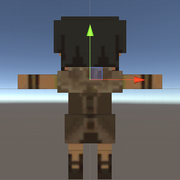
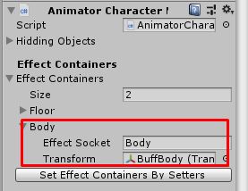
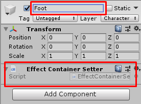
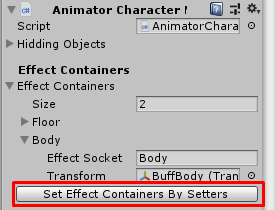
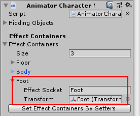
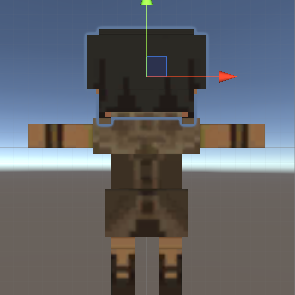
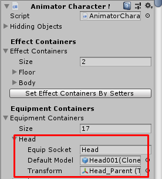
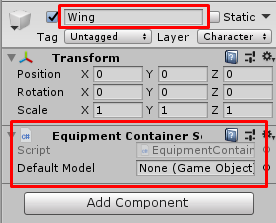
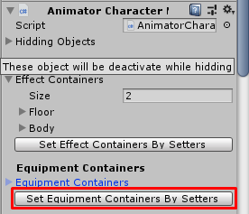
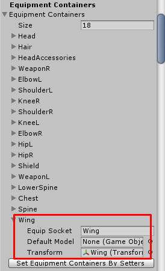

# Character Model 2D

You can prepare it after prepared `Character Entity` then add `Sprite Renderer` and `Character Model 2D` components, then setup following settings:

### Hidding Objects

This is a list of game objects which will be deactivated when hidden, character model can be hidden in shooter game mode when zooming with guns.

You can set just root of bone here because when root deactivated, all equipment models that are its children will be hidden too.

* * *

### Effect Containers

Effect container was made to instantiates effects (particles, sfx and so on) to difference positions, some buff effects may instantiates at character hands, some effects may instantiates at character body.

To set a container, you have to create empty game object then set its position to where you wish the effects to instantiates.

For example, `Body` container's position will be located at center of character like this

Then drag it to `Effect Containers` and set `Effect Socket`

That is it, but there is another way to setup effect container by using `Effect Container Setter`

You have to create empty game object, set its position, then you have to set its name as `Effect Socket` and attach `Effect Container Setter` to the game object

Then go back to character model and press on `Set Effect Containers by Setters` button

Finally, the effect container has been set

* * *

### Equipment Containers

Equipment container was made to instantiates equipments (helment, armor, sword and so on) to difference positions, some equipments may instantiates at character hands, some equipments may instantiates at character body.

To set a container, you have to create empty game object then set its position to where you wish the equipments to instantiates.

For example, `Head` container's position will be located at character head bone like this

Then drag it to `Equipment Containers`, set `Equip Socket` and set `Default Model` it is the model which will be deactivated when equip the equipment and activated when unequip the equipment, for example `Hair` is default model it will be deactivated to hide it when equip `Helmet`

That is it, but there is another way to setup equipment container by using `Equipment Container Setter`

You have to create empty game object, set its position, then you have to set its name as `Equipment Socket` and attach `Equipment Container Setter` to the game object

Then go back to character model and press on `Set Equipment Containers by Setters` button

Finally, the equipment container has been set

*   `Sprite Renderer` is renderer to play animating sprites, set attached `Sprite Renderer` to this field.

* * *

## Animation Clip Settings

Before looking into animation clip settings list, I want you to know about `Animation Clip 2D`, `Character Animation 2D` and `Action Animation 2D` settings:

### Animation Clip 2D

This is contains following settings:
*   `Frames` this is list of sprites which will be used to make animation.
*   `Frame Per Sec` this is frame per seconds.
*   `Loop` if this is `TRUE` it will loop, set this to `TRUE` for idle, move animations.
*   `Flip X` if this is `TRUE` it will flip sprites on X-axis.
*   `Flip Y` if this is `TRUE` it will flip sprites on Y-axis.

You can create `Animation Clip 2D` by right click in any folder in `Project` tab, then select `Create` -> `Animation 2D`

### Character Animation 2D

You can set `Animation Clip 2D` for each directions there are: `Down`, `Up`, `Left`, `Right`, `Down Left`, `Down Right`, `Up Left` and `Up Right`. If your character have only 4 directions, you leave `Right`, `Down Left`, `Down Right`, `Up Left` and `Up Right` empty.

### Action Animation 2D

This is extended from `Character Animation 2D` so it will contains settings from `Character Animation 2D`.

*   `Trigger Duration Rate` is rate from total animation clip length to trigger an action events to do actions such as hit enemy or spawn magical projectile. For example, if attack animation length is 2 seconds, and this value is 0.5, then 1 second after start play this animation clip, an enemies will receives damages.
*   `Extra Duration` some duration which will sum with animation clip length or `Fix Duration Value`, may use it to play idle animation before next attack animation.
*   `Audio Clips` an audio clips which will play randomly when trigger an action events.

* * *

All animation clip settings contains:

*   `Idle Animation 2D`
*   `Move Animation 2D`
*   `Dead Animation 2D`
*   `Default Attack Animation 2D`
*   `Default Skill Cast Animation 2D`
*   `Default Skill Activate Animation 2D`
*   `Default Reload Animation 2D`
*   `Weapon Animations 2D` each of this is contains animation clip 2Ds and action animation 2Ds for specific `Weapon Type`.
*   `Skill Animations 2D` each of this is contains skill cast clip 2D and activate skill action animation 2D for specific `Skill`.

* * *

After done you can save it as prefab (drag to any folder in `Project` tab).