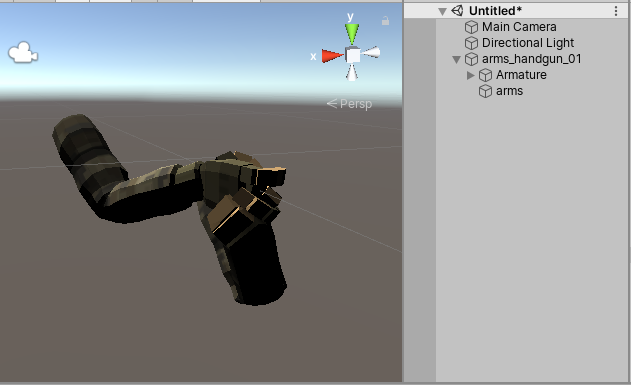
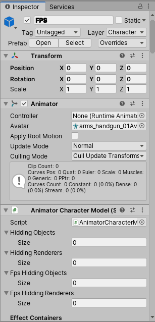
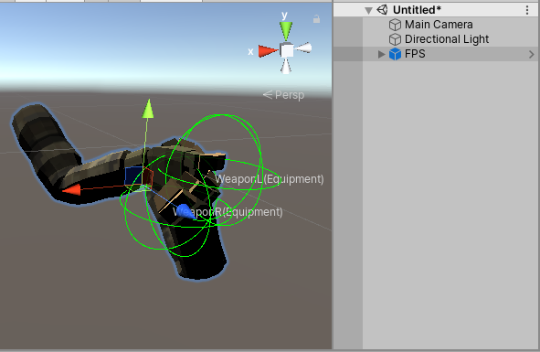
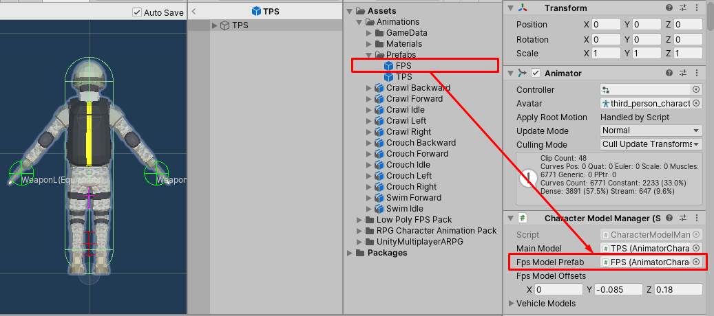

# FPS Hands Model

This is model which will instantiates as gameplay camera's child, How to prepare it is similar to how to prepare character model, you just drag the FPS hands mesh to empty scene.

Then add character model component ([Animator Character Model](pages/108-animator-character-model ':target=__blank') or [Animation Character Model](pages/107-animation-character-model ':target=__blank') or [Character Model](pages/106-character-model ':target=__blank')) to the FPS hands mesh.

Then set character model component's configs and drag it to any folder in `Project` tab to create a prefab.

* * *

Then you have to set FPS hands model prefab to character entity, The character entity (Which you will learn how to create from [this page](pages/135-player-character-entity ':target=__blank')) will have `Character Model Manager` component attached, drag the FPS hands model prefab to `Fps Model Prefab` field.

Then set the `FPS Model Offsets` (in `Character Model Manager` component) it's offsets between instantiating Fps hands model and gameplay camera.