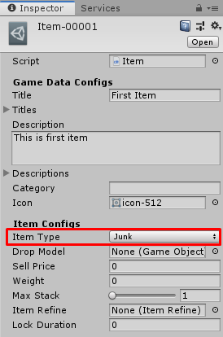

# How to create Junk Item

[filename](game-data/_item-create-scriptable-object.md ':include')

There are following configs

[filename](game-data/_game-data-generic-config.md ':include')

Then we're going to create `Junk Item` so set `Item Type` to `Junk`

There are following configs for `Junk Item`

[filename](game-data/_item-generic-config.md ':include')

* * *

That's an configs for `Junk Item`

[filename](game-data/_game-data-put-to-database.md ':include')