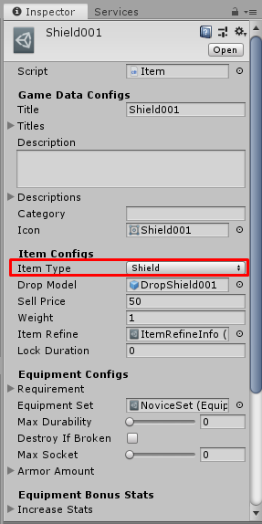
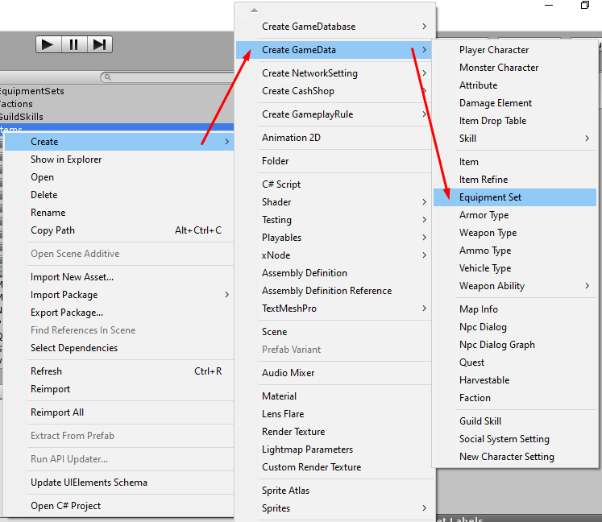

# How to create Shield Item

You can create item by right click in `Project` tab then select `Create` -> `Create GameData` -> `Item`

After the item created. Set its name, its name must be unique unlike other data because we're going to use it as data id (*You can change filename later after you have done the setup*)

There are following configs

- `Title` is default title. if you want to set title for specific language you can set it to `Titles`
- `Titles` is language specific titles. You can set title for specific language key, language key must be the key which existed in `Language Manager` -> `Language List`
- `Description` is default description. if you want to set description for specific language you can set it to `Descriptions`
- `Descriptions` is language specific descriptions. You can set description for specific language key, language key must be the key which existed in `Language Manager` -> `Language List`
- `Icon` is icon which represent item appearance
Then we're going to create `Shield Item` so set `Item Type` to `Shield`

There are following configs for `Shield Item`

- `Drop Model` set mesh or skinned mesh prefab which you want it to be instantiated in gameplay scene to represend dropped item, you also able to attach drop sfx audio source to the prefab which will play on awake when instantiates.
- `Sell Price` is item sell price when sell item to NPC. Not price to buy from NPC.
- `Weight` item weight. About this package, character stats has weight limit, if character carry too many items and sum weight is over weight limit. Character will not able to carry more item.
- `Max Stack` this is max item amount for each slot in inventory.
- `Item Refine` item refine contains settings for refine settings for each level, repair price for each durability rates which available for an equipment items only and title color which available for all item types, you may assume that an item refine is an item rarity settings.

You can create item refine by right click in `Project` tab then select `Create` -> `Create GameData` -> `Item Refine`

## Equipment Configs

- `Requirement` is requirement for equip this item, if character hasn't pass this requirement. it will not able to equip this item. You can `Character` which is `Player Character` data (which assumable as character class). `Level` is character level. `Attribute Amounts` an attributes with each amount that required to equip this item.
- `Equipment Set` this package has equipment set system which when character equipped same item set, character can receives bonus. The `Equipment Set` has `Effects` which is an bonus for each amount of same item set that equipped. You can create equipment set by right click in `Project` tab then select `Create` -> `Create GameData` -> `Equipment Set`

- `Max Durability` is equipment max durability. If this is set to 0 it will not broken.
- `Destroy If Broken` if this is `TRUE` item will be destroy (remove from inventory) when broken.
- `Max Socket` is max amount of sockets that can be enhance by `Socket Enhancer` items.
- `Armor Amount` this is main stats for this item, it will increase character armors when equip this item, Its `Base Amount` is amount of armor when item level is 1. Its `Amount Increase Each Level` is amount of armors that will be increased when item level > 0.

## Equipment Bonus Stats

- `Increase Stats` increasing character stats when equip this item, Its `Base Stats` is amount of stats that will be increased when item level is 1. Its `Stats Increase Each Level` is amount of stats that will be increased when item level > 0.
- `Increase Stats Rate` increasing character stats rate when equip this item, Its `Base Stats` is amount of stats rate that will be increased when item level is 1. Its `Stats Increase Each Level` is amount of stats rate that will be increased when item level > 0.
- `Increase Attributes` increasing character attributes when equip this item, You have to set [attribute](pages/104-character-stats-and-relates-data?id=attribute ':target=__blank') which you want to increase then its `Base Amount` is amount of attributes that will be increased when item level is 1. Its `Amount Increase Each Level` is amount of attributes that will be increased when item level > 0.
- `Increase Attributes Rate` increasing character attributes rate when equip this item, You have to set [attribute](pages/104-character-stats-and-relates-data?id=attribute ':target=__blank') which you want to increase then its `Base Amount` is amount of attributes rate that will be increased when item level is 1. Its `Amount Increase Each Level` is amount of attributes rate that will be increased when item level > 0.
- `Increase Resistances` increasing character resistances when equip this item, You have to set [damage element](pages/104-character-stats-and-relates-data?id=damage-element ':target=__blank') which you want to increase then its `Base Amount` is amount of resistances that will be increased when item level is 1. Its `Amount Increase Each Level` is amount of resistances that will be increased when item level > 0.
- `Increase Armors` increasing character armors when equip this item, You have to set [damage element](pages/104-character-stats-and-relates-data?id=damage-element ':target=__blank') which you want to increase then its `Base Amount` is amount of armors that will be increased when item level is 1. Its `Amount Increase Each Level` is amount of armors that will be increased when item level > 0.
- `Increase Damages` increasing character damages when equip this item, You have to set [damage element](pages/104-character-stats-and-relates-data?id=damage-element ':target=__blank') which you want to increase then its `Base Amount` is amount of damages that will be increased when item level is 1. Its `Amount Increase Each Level` is amount of damages that will be increased when item level > 0.
- `Increase Skill Levels` increasing character skill levels when equip this item.
## Equipment Model

- `Equipment Models` set mesh or skinned mesh prefab which you want it to be instantiated in gameplay scene to represend equipped item, you also able to `EquipmentEntity` to the prefab to changes mesh's materials based on item level (more item level may have brighter glow materials).
* * *

That's an configs for `Shield Item`

After finish the setup, add it to your [game database](pages/103-game-database.md). If you're using `Resources Folder Game Database` as your [game database](pages/103-game-database.md), you must put it in `Resources` folder.