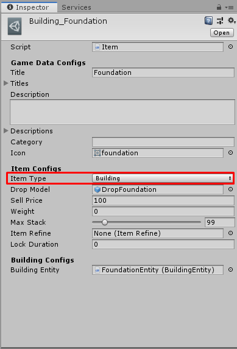

# How to create Building Item

[filename](game-data/_item-create-scriptable-object.md ':include')

There are following configs

[filename](game-data/_game-data-generic-config.md ':include')

Then we're going to create `Building Item` so set `Item Type` to `Building`

There are following configs for `Building Item`

[filename](game-data/_item-generic-config.md ':include')

## Building Configs

- `Building Entity` the building entity which character will construct when use this item.

* * *

That's an configs for `Building Item`

[filename](game-data/_game-data-put-to-database.md ':include')