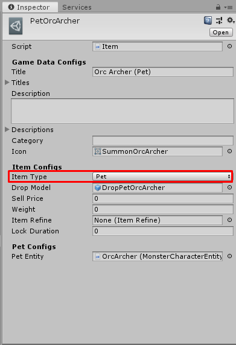

# How to create Pet Item

[filename](game-data/_item-create-scriptable-object.md ':include')

There are following configs

[filename](game-data/_game-data-generic-config.md ':include')

Then we're going to create `Pet Item` so set `Item Type` to `Pet`

There are following configs for `Pet Item`

[filename](game-data/_item-generic-config.md ':include')

## Pet Configs

- `Pet Entity` the monster character entity which will be spawned when use this item.

* * *

That's an configs for `Pet Item`

[filename](game-data/_game-data-put-to-database.md ':include')