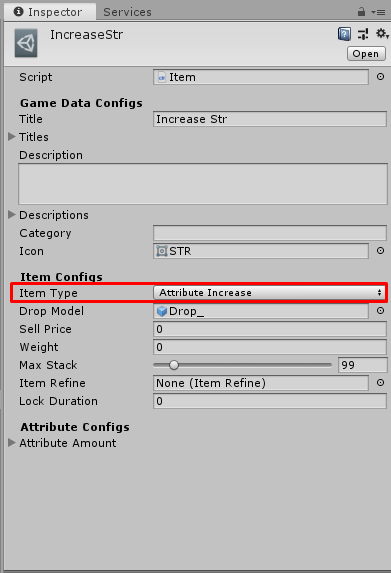

# How to create Attribute Increase Item

[filename](game-data/_item-create-scriptable-object.md ':include')

There are following configs

[filename](game-data/_game-data-generic-config.md ':include')

Then we're going to create `Attribute Increase Item` so set `Item Type` to `Attribute Increase`

There are following configs for `Attribute Increase Item`

[filename](game-data/_item-generic-config.md ':include')

## Attribute Configs

- `Attribute Amount` the attribute with amount which will be increased to character when use this item.

* * *

That's an configs for `Attribute Increase Item`

[filename](game-data/_game-data-put-to-database.md ':include')