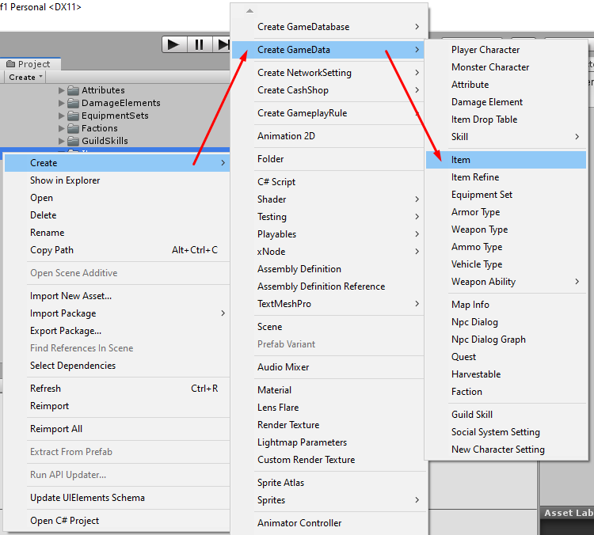
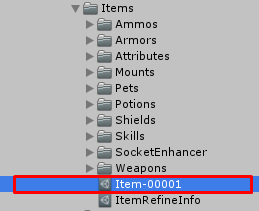
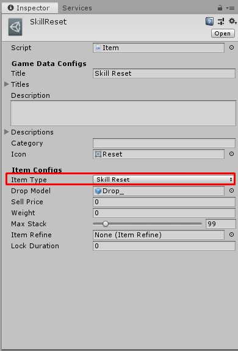
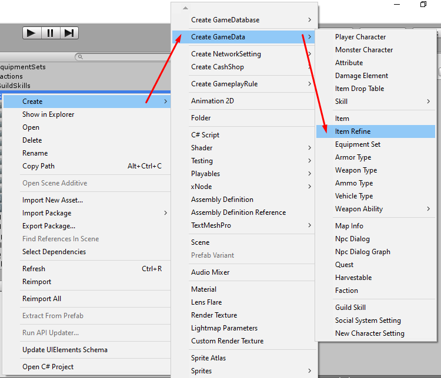

# How to create Skill Reset Item

You can create item by right click in `Project` tab then select `Create` -> `Create GameData` -> `Item`

After the item created. Set its name, its name must be unique unlike other data because we're going to use it as data id (*You can change filename later after you have done the setup*)

There are following configs

- `Title` is default title. if you want to set title for specific language you can set it to `Titles`
- `Titles` is language specific titles. You can set title for specific language key, language key must be the key which existed in `Language Manager` -> `Language List`
- `Description` is default description. if you want to set description for specific language you can set it to `Descriptions`
- `Descriptions` is language specific descriptions. You can set description for specific language key, language key must be the key which existed in `Language Manager` -> `Language List`
- `Icon` is icon which represent item appearance
Then we're going to create `Skill Reset Item` so set `Item Type` to `Skill Reset`

There are following configs for `Skill Reset Item`

- `Drop Model` set mesh or skinned mesh prefab which you want it to be instantiated in gameplay scene to represend dropped item, you also able to attach drop sfx audio source to the prefab which will play on awake when instantiates.
- `Sell Price` is item sell price when sell item to NPC. Not price to buy from NPC.
- `Weight` item weight. About this package, character stats has weight limit, if character carry too many items and sum weight is over weight limit. Character will not able to carry more item.
- `Max Stack` this is max item amount for each slot in inventory.
- `Item Refine` item refine contains settings for refine settings for each level, repair price for each durability rates which available for an equipment items only and title color which available for all item types, you may assume that an item refine is an item rarity settings.

You can create item refine by right click in `Project` tab then select `Create` -> `Create GameData` -> `Item Refine`

* * *

That's an configs for `Skill Reset Item`

After finish the setup, add it to your [game database](pages/103-game-database.md). If you're using `Resources Folder Game Database` as your [game database](pages/103-game-database.md), you must put it in `Resources` folder.