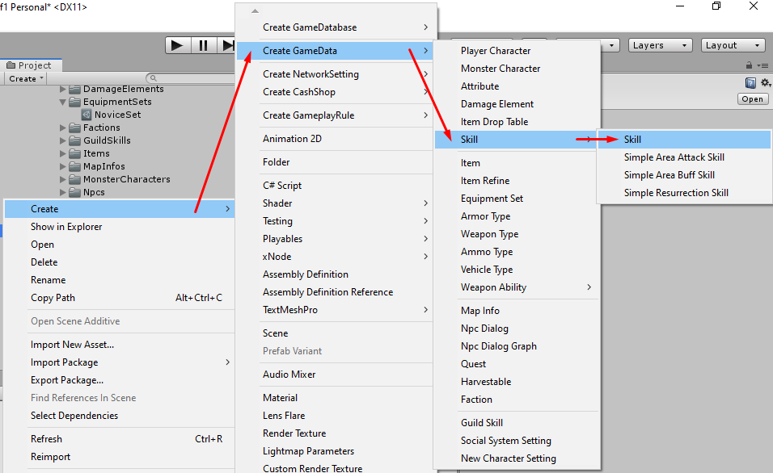
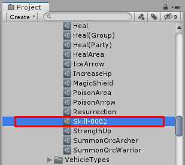
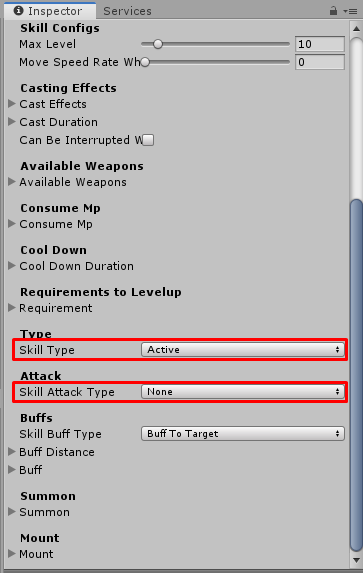

# How to create Summon Skill

You can create skill by right click in `Project` tab then select `Create` -> `Create GameData` -> `Skill` -> `Skill`

After the skill created. Set its name, its name must be unique unlike other data because we're going to use it as data id (*You can change filename later after you have done the setup*)

There are following configs

- `Title` is default title. if you want to set title for specific language you can set it to `Titles`
- `Titles` is language specific titles. You can set title for specific language key, language key must be the key which existed in `Language Manager` -> `Language List`
- `Description` is default description. if you want to set description for specific language you can set it to `Descriptions`
- `Descriptions` is language specific descriptions. You can set description for specific language key, language key must be the key which existed in `Language Manager` -> `Language List`
- `Icon` is icon which represent item appearance
Then we're going to create `Summon Skill` so set `Skill Type` to `Active` and also set `Skill Attack Type` to `None` because it will not attack other characters when use this skill.

There are following configs for `Summon Skill`

- `Max Level` max level that character can learn this skill
- `Move Speed Rate While Using Skill` this value will multiplies with character move speed stats while character is using this skill, set this to 0 if you want to make character don't move while using this skill. This will be in-use with active skills and craft s only.
- `Skill Cast Effects` collection of effects while casting skill (before activate).
- `Cast Duration` casting skill duration (before activate). This will be in-use with active skills and craft skills.
- `Can Be Interrupted While Casting` if this is `TRUE` character will not able to move while casting this skill. This will be in-use with active skills and craft skills.
- `Available Weapons` if character equipped weapons that set in this list, character will be able to use this skill. Set this list to be empty, to make character able to use this skill while equip or not equip any weapons. This will be in-use with active skills and craft skills.
- `Consume Mp` amount of Mp which required to use this skill. its `Base Amount` is amount of required Mp when skill level is 1. Its `Amount Increase Each Level` is increasing amount of required Mp when skill level > 0. This will be in-use with active skills and craft skills.
- `Cooldown Duration` cooldown before allow to use skill next time. its `Base Amount` is duration when skill level is 1. Its `Amount Increase Each Level` is increasing duration when skill level > 0. This will be in-use with active skills and craft skills.
- `Requirement` is requirement for level up this skill. if character hasn't pass this requirement. it will not able to level up this skill.
## Summon Configs

- `Monster Entity` the monster character entity which will be spawned when use this skill.
- `Duration` this is life duration for spawned monster.
- `Amount Each Time` if this is `2` it will spawn `2` monsters when using the skill.
- `Max Stack` if this is `4` it will able to spawn `4` monsters. For example: if `Amount Each Time` is `2`, and `Max Stack` is `4`. Then when using skill first time `2` monsters will be spawned, then the second time it will spawn `2` more monsters so there are `4` spawned monsters and then the third time it will kill `2` monsters to spawn `2` new monsters so it will have `4` spawned monsters.
- `Level` this is level of spawning monsters.

* * *

That's an configs for `Summon Skill`

After finish the setup, add it to your [game database](pages/103-game-database.md). If you're using `Resources Folder Game Database` as your [game database](pages/103-game-database.md), you must put it in `Resources` folder.