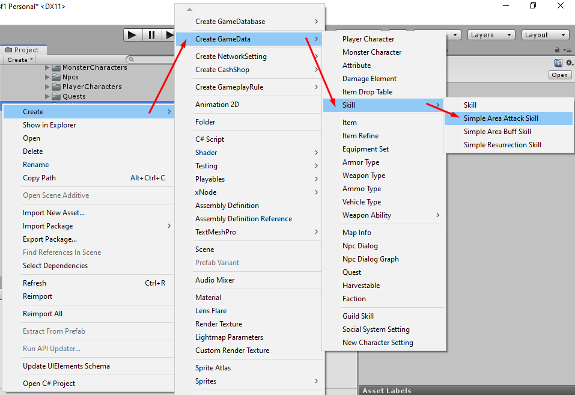

# How to create Area Attack Skill

You can create area buff skill by right click in `Project` tab then select `Create` -> `Create GameData` -> `Skill` -> `Simple Area Attack Skill`

After the skill created. Set its name, its name must be unique unlike other data because we're going to use it as data id (*You can change filename later after you have done the setup*)

There are following configs

- `Title` is default title. if you want to set title for specific language you can set it to `Titles`
- `Titles` is language specific titles. You can set title for specific language key, language key must be the key which existed in `Language Manager` -> `Language List`
- `Description` is default description. if you want to set description for specific language you can set it to `Descriptions`
- `Descriptions` is language specific descriptions. You can set description for specific language key, language key must be the key which existed in `Language Manager` -> `Language List`
- `Icon` is icon which represent item appearance
- `Max Level` max level that character can learn this skill
- `Move Speed Rate While Using Skill` this value will multiplies with character move speed stats while character is using this skill, set this to 0 if you want to make character don't move while using this skill. This will be in-use with active skills and craft s only.
- `Skill Cast Effects` collection of effects while casting skill (before activate).
- `Cast Duration` casting skill duration (before activate). This will be in-use with active skills and craft skills.
- `Can Be Interrupted While Casting` if this is `TRUE` character will not able to move while casting this skill. This will be in-use with active skills and craft skills.
- `Available Weapons` if character equipped weapons that set in this list, character will be able to use this skill. Set this list to be empty, to make character able to use this skill while equip or not equip any weapons. This will be in-use with active skills and craft skills.
- `Consume Mp` amount of Mp which required to use this skill. its `Base Amount` is amount of required Mp when skill level is 1. Its `Amount Increase Each Level` is increasing amount of required Mp when skill level > 0. This will be in-use with active skills and craft skills.
- `Cooldown Duration` cooldown before allow to use skill next time. its `Base Amount` is duration when skill level is 1. Its `Amount Increase Each Level` is increasing duration when skill level > 0. This will be in-use with active skills and craft skills.
- `Requirement` is requirement for level up this skill. if character hasn't pass this requirement. it will not able to level up this skill.
- `Cast Distance` is distance from skill caster to aim position.
- `Area Duration` is duration that the area will be appears.
- `Apply Duration` is duration that the area will apply damage to characters.
- `Target Object Prefab` is the prefab which will be instantiated at aim position while aiming before cast the skill.
- `Area Damage Entity` is the prefab which will be instantiated at aim position after skill casted.
- `Skill Attack Type` how skill applies damages to enemies.
- `Damage Info` contains info about how skill applies damage to other characters ([See more](pages/018-damage-info ':target=__blank')). This will be in-use with `Normal` skill attack type only. If skill attack type is `Based On Weapon` it will use weapon's damage info.
- `Damage Amount` base damage amounts for this skill. This will be in-use with `Normal` skill attack type only. If skill attack type is `Based On Weapon` it will use weapon's damage amounts as base damage amounts.
- `Effectiveness Attributes` skill can increase more damage based on these attributes ([See more](pages/104-character-stats-and-relates-data?id=attribute ':target=__blank'))
- `Weapon Damage Inflictions` damage inflictions based on weapon damage amount.
- `Additional Damage Amounts` damage amounts that will be increasing while attacking target.
- `Increase Damage Amounts With Buffs` if this is `TRUE` applied buff damages will be included to skill attack damages.
- `Is Debuff` if this is `TRUE` an enemies will receive debuff.
- `Debuff` debuff which will applies to an enemies.

* * *

That's an configs for `Area Attack Skill`

After finish the setup, add it to your [game database](pages/103-game-database.md). If you're using `Resources Folder Game Database` as your [game database](pages/103-game-database.md), you must put it in `Resources` folder.