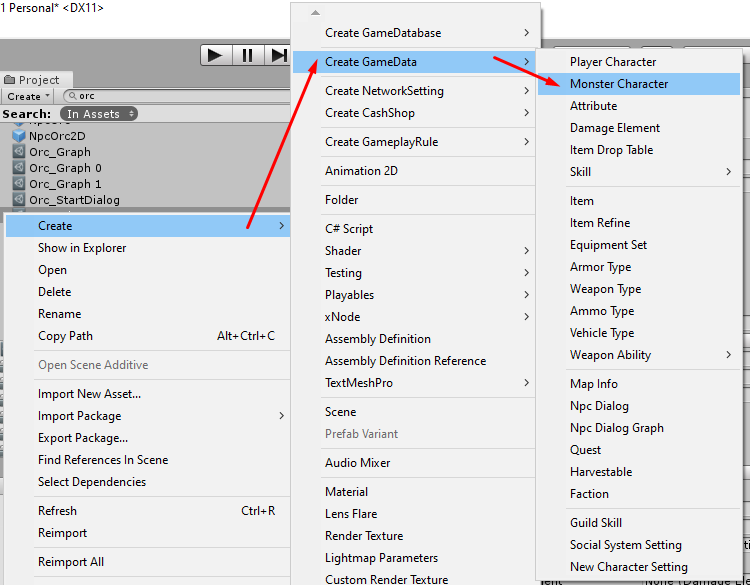
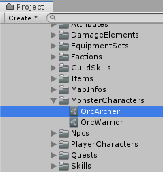

# How to create Monster Character Entity

Before create new monster character entity, you should know about `Player Character` game data first.

### Monster Character

You can create monster character by right click in `Project` tab then select `Create` -> `Create GameData` -> `Item`

After the monster character created. Set its name, its name must be unique unlike other data because we're going to use it as data id (*You can change filename later after you have done the setup*)

There are following configs

- `Title` is default title. if you want to set title for specific language you can set it to `Titles`
- `Titles` is language specific titles. You can set title for specific language key, language key must be the key which existed in `Language Manager` -> `Language List`
- `Description` is default description. if you want to set description for specific language you can set it to `Descriptions`
- `Descriptions` is language specific descriptions. You can set description for specific language key, language key must be the key which existed in `Language Manager` -> `Language List`
- `Icon` is icon which represent item appearance
*   `Stats` this is character stats. Its `Base Stats` is amount of stats when character level is 1. Its `Stats Increase Each Level` is amount of stats that will be increased when character level > 0.
*   `Attributes` this is character attributes. You have to set [attribute](pages/104-character-stats-and-relates-data?id=attribute ':target=__blank') which you want to increase then its `Base Amount` is amount of attributes when character level is 1. Its `Amount Increase Each Level` is amount of attributes that will be increased when character level > 0.
*   `Resistances` this is character resistances. You have to set [damage element](pages/104-character-stats-and-relates-data?id=damage-element ':target=__blank') which you want to increase then its `Base Amount` is amount of resistances when character level is 1. Its `Amount Increase Each Level` is amount of resistances that will be increased when character level > 0.
*   `Armors` this is character armors. You have to set [damage element](pages/104-character-stats-and-relates-data?id=damage-element ':target=__blank') which you want to increase then its `Base Amount` is amount of armors when character level is 1. Its `Amount Increase Each Level` is amount of armors that will be increased when character level > 0.
*   `Default Level` this will be used to adjust base stats, base attributes, base resistances, base armors and base damage amounts based on entity level. For example: if monster has `Base HP` = `100`, `HP Increase Each Level` = `5` and `Default Level` = `15`. It will adjust `Base HP` to `{Base Hp} - ({HP Increase Each Level} * ({Default Level} - 1))` = `100 - (5 * (15 - 1))` = `30` so monster level 1 will has `30` HP, level 2 will has `35` HP = `30 + (5 * (2 - 1))` = `{Adjusted Base Hp} + ({HP Increase Each Level} * ({Level} - 1))`.
*   `Characteristics` set it to `Normal` then monster will not attack when player nearby, `Aggressive` monster will attack when player nearby and `Assist` monster will attack when other monsters which have the same `Ally Id` has been attacked by the player.
*   `Wander Move Speed` move speed while wandering (Not chasing enemies).
*   `Ally Id` this will work with `Assist` characteristic only, to detect ally.
*   `Visual Range` range to see other characters.
*   `Damage Info` contains info about how skill applies damage to other characters ([See more](pages/018-damage-info ':target=__blank')).
*   `Damage Amount` monster's attack damage amounts.
*   `Random Exp Min` exp that character will gain when kill the monster.
*   `Random Exp Max` exp that character will gain when kill the monster.
*   `Random Gold Min` gold that character will gain when kill the monster.
*   `Random Gold Max` gold that character will gain when kill the monster.
*   `Max Drop Items` max difference of items that monster can drops after killed.
*   `Random Items` items that character will gain when kill the monster.
*   `Item Drop Table` this is like `Random Items` can create by right click in `Project` tab -> `Create` -> `Create GameData` -> `Item Drop Table`.

* * *

If your project is 3D game, you have to drag skinned mesh to empty scene then add `Monster Character Entity` component. If your project is 2D, you can create empty game object then add `Monster Character Entity` component.

Then set an transforms / containers

*   `Camera Target Transform` this is transform for position which camera will look at and follow while playing in TPS view mode. You may use added child transform and adjust its position to center of the character. If this is empty (None) it will use entity's transform.
*   `Fps Camera Target Transform` this is transform for position which camera will look at and follow while playing in FPS view mode. You may use added child transform and adjust its position to center of the character. If this is empty (None) it will use entity's transform.
*   `Combat Text Transform` this is transform where it will instantiates an damage texts, HP recovery texts and so on, You may use added child transform and adjust its position to center of the character. If this is empty (None) it will use entity's transform.
*   `Opponent Aim Transform` this is transform where other characters will aim to while attacking, You may use added child transform and adjust its positionto  center of the character. If this is empty (None) it will use `Combat Text Transform`.
*   `Melee Damage Transform` this is transform where it will applying melee damage and find hitting character to apply damages later, You may use added child transform and adjust its position to center of the character. If this is empty (None) it will use entity's transform.
*   `Missile Damage Transform` this is transform where it will applying missile damage and find hitting character to apply damages later, You may use added child transform and adjust its position to center of the character. If this is empty (None) it will use `Melee Damage Transform`. This can be overrided by `Equipment Entity` -> `Missile Damage Transform`.
*   `Character UI Transform` this is transform where it will instantiates an UIs which relates to character such as character name, guild name, HP gage, MP gage and so on, You may use added child transform and adjust its position to center of the character. If this is empty (None) it will use entity's transform.
*   `Mini Map UI Transform` this is transform where it will instantiates mini-map UIs and also set its layer to MiniMap, You may use added child transform and adjust its positionto  center of the character. If this is empty (None) it will use entity's transform.
*   `Monster Character` this is game data which contains monster stats, skills, drop info.
*   `Destroy Delay` this is delay before the entity will be destroyed after dead, can use it as to play dead animation before destroy the entity.
*   `Destroy Respawn Delay` this is delay before the entity will be respawned after dead.

* * *

Then setup character model component based on dimension (2D or 3D) and animation type.

## 3D Character Model

*   **[Animator Character Model](pages/108-animator-character-model ':target=__blank')**, This character model will support **[Mechanim Animation System](https://docs.unity3d.com/Manual/AnimationOverview.html ':target=__blank')** only, it's using pre-made animator controller then override it at runtime to change animation but it's allow to make custom animator controller too with some conditions.
*   **[Animation Character Model](pages/107-animation-character-model ':target=__blank')**, This character model will support **[Legacy Animation System](https://docs.unity3d.com/Manual/Animations.html ':target=__blank')** only.
*   **[Character Model](pages/106-character-model ':target=__blank')**, This is the old one which supports both **[Legacy Animation System](https://docs.unity3d.com/Manual/Animations.html ':target=__blank')** and **[Mechanim Animation System](https://docs.unity3d.com/Manual/AnimationOverview.html ':target=__blank')** but it's harder to use.

## 2D Character Model

*   **[Character Model 2D](pages/109-character-model-2d ':target=__blank')**, This is character model for 2D game, it's use `Animation Clip 2D` to manage animation's frames
* * *

Then setup entity movement component based on dimension (2D or 3D) and animation type.

## 3D Entity Movement

*   **Rigid Body Entity Movement** If you planned to make your character to move by rigidbody system, which your character will be able to jump, use this entity movement.
*   **Nav Mesh Entity Movement** If you planned to make your character to move by nav mesh system, use this entity movement.

## 2D Entity Movement

*   **Rigid Body Entity Movement 2D** For 2D games, there is only one built-in entity movement, if you want to use another entity movement which integrate [A* Pathfinding Project](https://arongranberg.com/astar). You can get it from: [UnityMultiplayerARPG_2DAI](https://github.com/insthync/UnityMultiplayerARPG_2DAI).

After setup entity movement, then adjust colliders fit to character

* * *

After finish the setup, drag it to `Project` tab to make prefab then add it to [game database](pages/103-game-database.md). If you're using `Resources Folder Game Database` as your [game database](pages/103-game-database.md), you must put it in `Resources` folder.