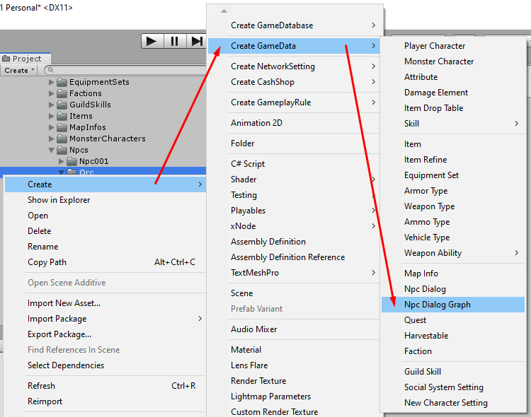
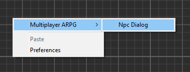
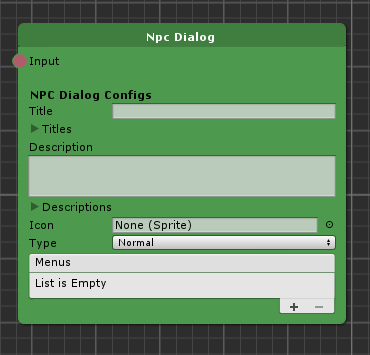
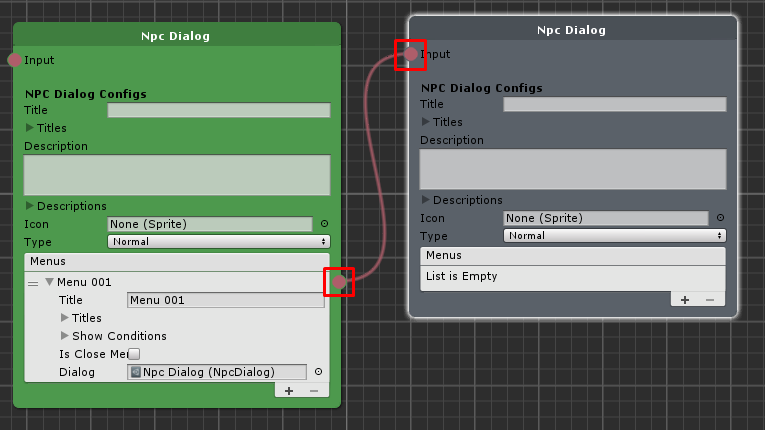
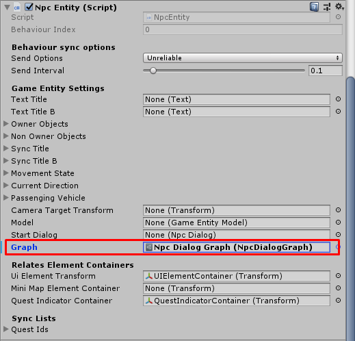
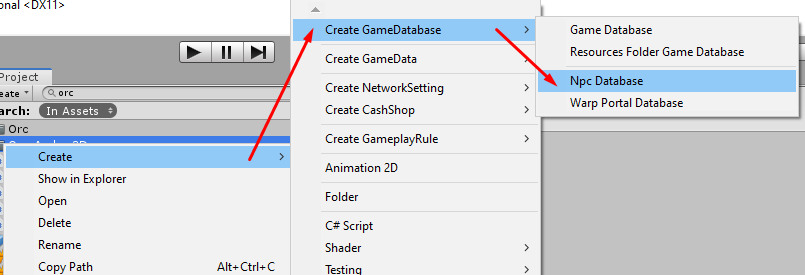
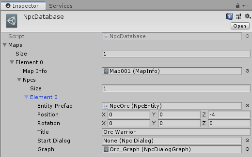

# How to create Npc Entity

Before create new npc entity, you should know about `Npc Dialog Graph`, you can create new `Npc Dialog Graph` by right click in `Project` tab then select `Create GameData` and select `Npc Dialog Graph` then new graph will be created, double-click on it to see the graph and edit it any time.

You can create new dialog by right click in graph then select `Multiplayer ARPG` -> `Npc Dialog`.

`Npc Dialog` have following configs:

- `Title` is default title. if you want to set title for specific language you can set it to `Titles`
- `Titles` is language specific titles. You can set title for specific language key, language key must be the key which existed in `Language Manager` -> `Language List`
- `Description` is default description. if you want to set description for specific language you can set it to `Descriptions`
- `Descriptions` is language specific descriptions. You can set description for specific language key, language key must be the key which existed in `Language Manager` -> `Language List`
- `Icon` is icon which represent item appearance
*   `Type` type of this dialog.
*   `Menus` choices to next dialog, you also can set conditions to show the menu.

You can set next dialog by drag from menu to another dialog .

Okay, you known about `Npc Dialog Graph` and `Npc Dialog` then next section is about `Npc Entity`.

* * *

If your project is 3D game, you have to drag skinned mesh to empty scene then add `Npc Entity` component. If your project is 2D, you can create empty game object then add `Npc Entity` component.

* * *

After finish the setup, drag it to `Project` tab to make prefab then add it to [game database](pages/103-game-database.md). If you're using `Resources Folder Game Database` as your [game database](pages/103-game-database.md), you must put it in `Resources` folder.
* * *

### How to add Npcs directly to the scene

You can add Npcs directly in game scene to make it appear in map scene, to do it you have to prepare `Npc Entity` then drag prepared `Npc Entity` to the map scene.

Then set created npc dialog graph to `Graph`.

* * *

### How to add Npcs to Npc Database to spawn to the scene later

To add Npcs via Npc Database you have to prepare `Npc Entity` prefab and `Npc Dialog Graph`.

About `Npc Database`, you can create new `Npc Database` by right click in `Project` tab select `Create -> Create GameDatabase -> Npc Database`.

Then in `Npc Database` you can set map which you wish to spawn an Npcs then each map you can set Npc's position, rotation, `Npc Entity` and `Graph`.

Then set `Npc Database` to `Game Instance -> Npc Database` in init scene.