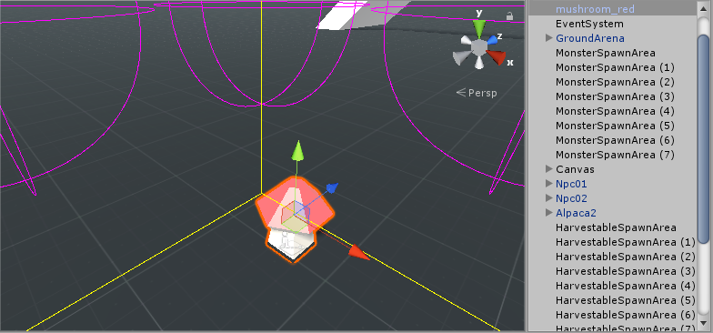
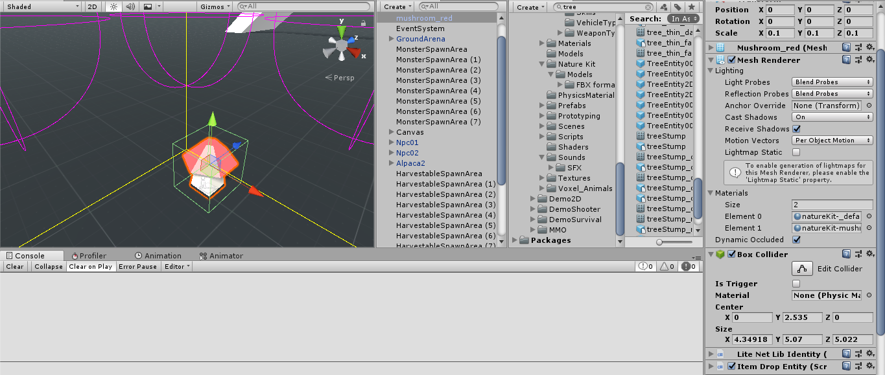
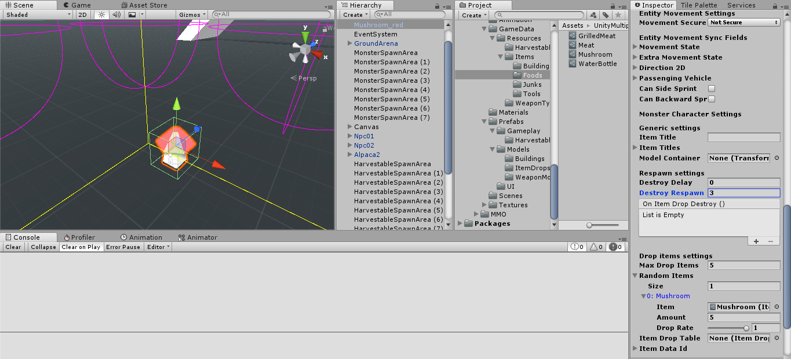
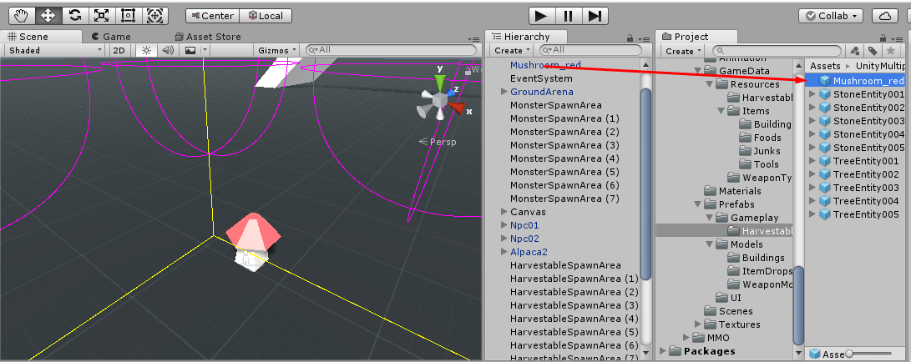
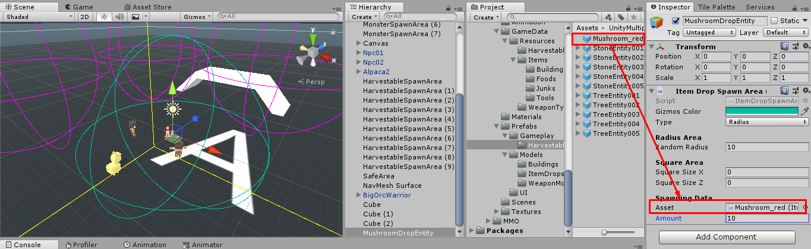

# Item Drop Entity

`Item Drop Entity` is a game entity which represent item which drop on the ground, the one which set to `Game Instance` -> `Item Drop Entity Prefab` is a place holder for `Item` -> `Drop Model`.

For the `Item Drop Entity` which placed on the scene is work differently, another thing which is different is character can earn more than one item when pickup in-scene `Item Drop Entity`, it is not a place holder for the drop model.

You can create in-scene `Item Drop Entity` by drag mesh or skinned mesh to the scene

Then setup its collider, and then attach `Item Drop Entity` component.

Then set items which characters can earn to `Item Drop Entity` as you wish.

## Make it can be spawned by `Item Drop Spawn Area`

To make it can be spawned by `Item Drop Spawn Area` you have to make the `Item Drop Entity` to prefab, by drag it to anywhere inside `Project` tab.

Then you can create a empty game object, attach `Item Drop Spawn Area` component, then set `Item Drop Entity` prefab which you want to spawn when server start as you wish.

