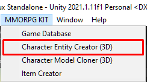
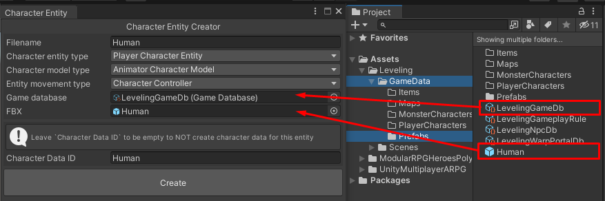
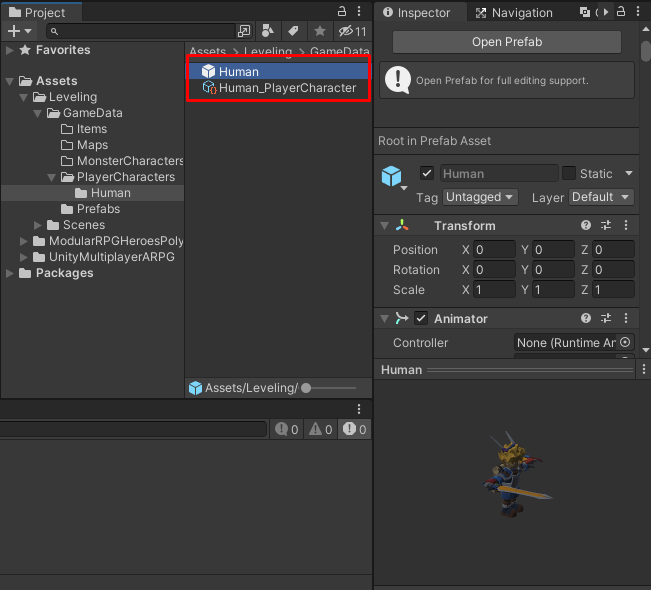
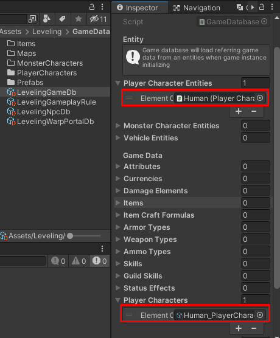

# How to create character entity with `Character Entity Creator`

Before you use this tool, you have to prepare character model prefab.

If prepared, then open the dialog from menu `MMORPG KIT -> Character Entity Creator (3D)`

Then set game database which you want to put creating entity to and prepared prefab.

After set data in the dialog, press `Create` button, then it will shows folder choosing dialog, select folder which you want to save.

Then data will be created in selected folder.

And also added to the game database.

