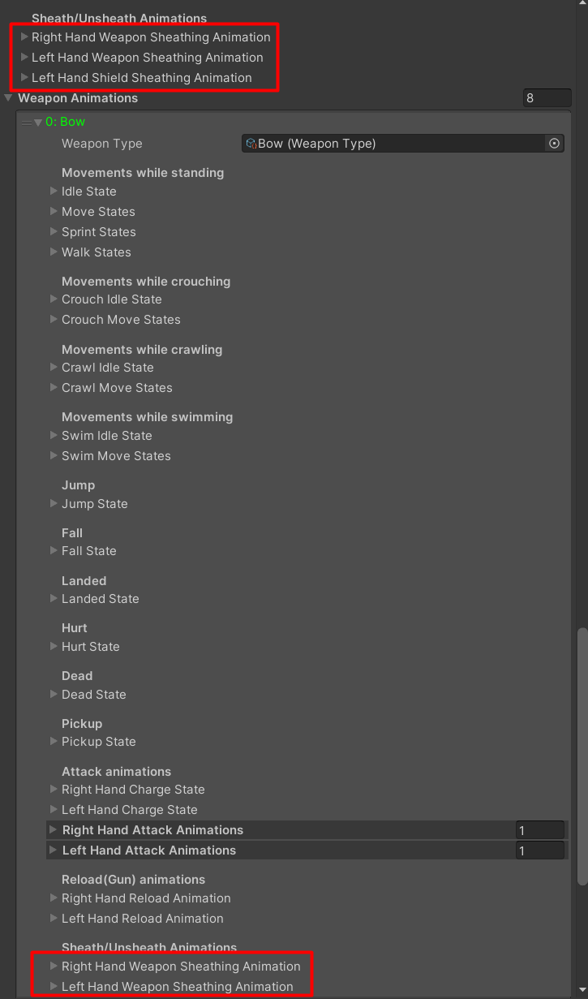
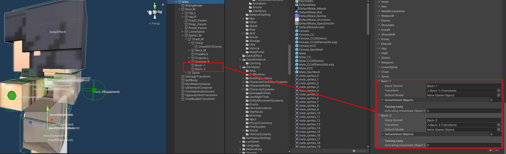
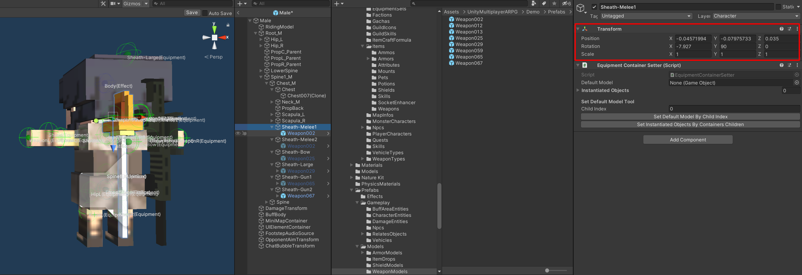
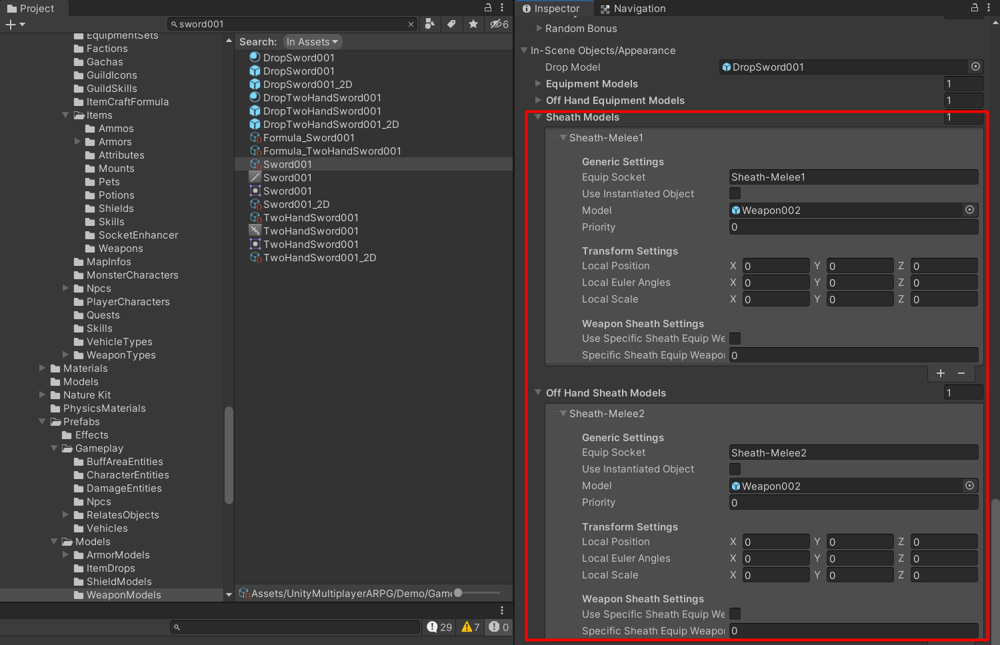

# Sheathing Animations

Sheathing animations is available for `Playable Character Model` only.

Its default settings in `Default Animations` are `Right Hand Weapon Sheathing Animation`, `Left Hand Weapon Sheathing Animation`, and `Left Hand Shield Sheathing Animation`.

Each having these settings:
- `Sheath State` settings for sheath animation state you can set animation clip, animation mask, speed rate and so on here. You should set set animation which move your character hand to your character back and hide item model here.
- `Sheathed Duration Rate` this is rate of animation clip's length to hide item model, for example: if animation clip's length is `2` seconds, and if this value is `0.5`, then it will hide item model after animation clip played `1` seconds.
- `Unsheath State` settings for unsheath animation state you can set animation clip, animation mask, speed rate and so on here. You should set set animation which move your character hand to your character back to change item model and move your character hand back to idle animation here.
- `Unsheathed Duration Rate` this is rate of animation clip's length to hide item model, for example: if animation clip's length is `2` seconds, and if this value is `0.5`, then it will change item model to the new one after animation clip played `1` seconds.

### Weapon Type specific settings

You can set Sheath/Unsheath animations for difference weapon type in each `Weapon Animations` entries.

* * *

## Sheath models

You can setup model and which transform to instantiates sheath item models like as equipping weapon/shield model by setup character model's equipment containers for sheath item models by create empty game object place it to where you want to instantiates sheath item models, and set it to character model's equipment containers.

You can places equipment item model into those transforms to see how it will be instantiated while playing the game to adjust containers transform's position, rotation and so on.

Then setup character model in item data

And test it

* * *

## Want to sheath weapons, not unequip items?

You can do it by set `Player Character Entity` -> `Is Weapons Sheathed` to `TRUE`. That is it, so if you want it to sheath equipments automatically you may create a new component which will sheath equipments after some duration and attach it to your character entity.