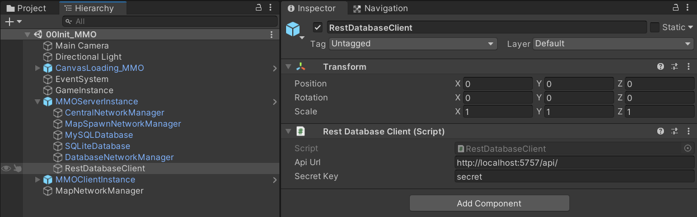
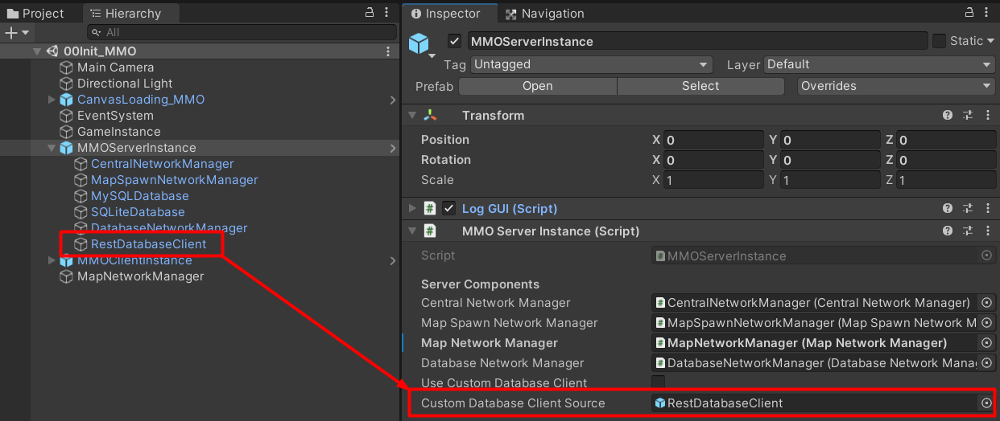

# Custom Database Client

You can create client to connect to custom database management server which is run outside in Unity project by create a component which implements `IDatabaseClient`.

Then attach that component to any game object and set the game object which has that component attached to `MMOServerInstance` -> `customDatabaseClientSource`, then turn `useCustomDatabaseClient` option on to use it. You also can set `useCustomDatabaseClient` option in `serverConfig.json` too.

This assets has a built-in REST database client and also a REST database service which developed by using .NET7, you can find it [here](https://github.com/insthync/UnityMultiplayerARPG_DatabaseManager)

If you use [this](https://github.com/insthync/UnityMultiplayerARPG_DatabaseManager), you will have to export data from your Unity game project when you make an update, by select your game instance, you can find a export button in `Inspector`.

Click it and choose the server build folder -> `Config`

* * *

If you use custom database management server then when you start your servers, you won't have to use `-startDatabaseServer` command line argument to start database management server because you are going to use custom database management server!