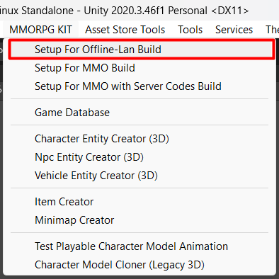

# Something Not Functional With My Built Game

If you test your game in editor and everything works fine but when you build it to test, there are something not functional then you may forget to setup the build.

You can do it by click on following menu, 
To setup scripting define symbols for difference build: 

- `MMORPG KIT -> Setup For Offline-Lan Build` - For offline-LAN games.
- `MMORPG KIT -> Setup For MMO Build` - For MMO client, it will exclude all server codes, so your customers won't be able to use it to run their private servers.
- `MMORPG KIT -> Setup For MMO with Server Codes Build` - For testing MMO server. If your target build (in Unity's `Build Settings`) is server, you don't have to do this.

