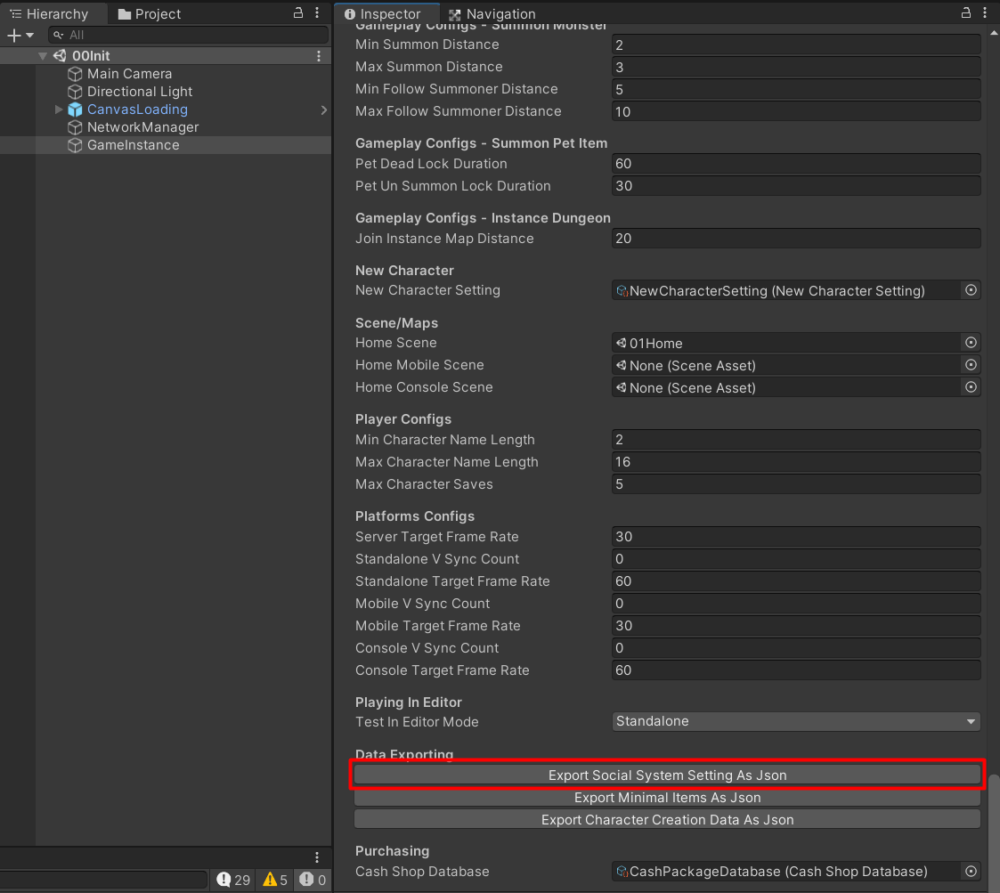
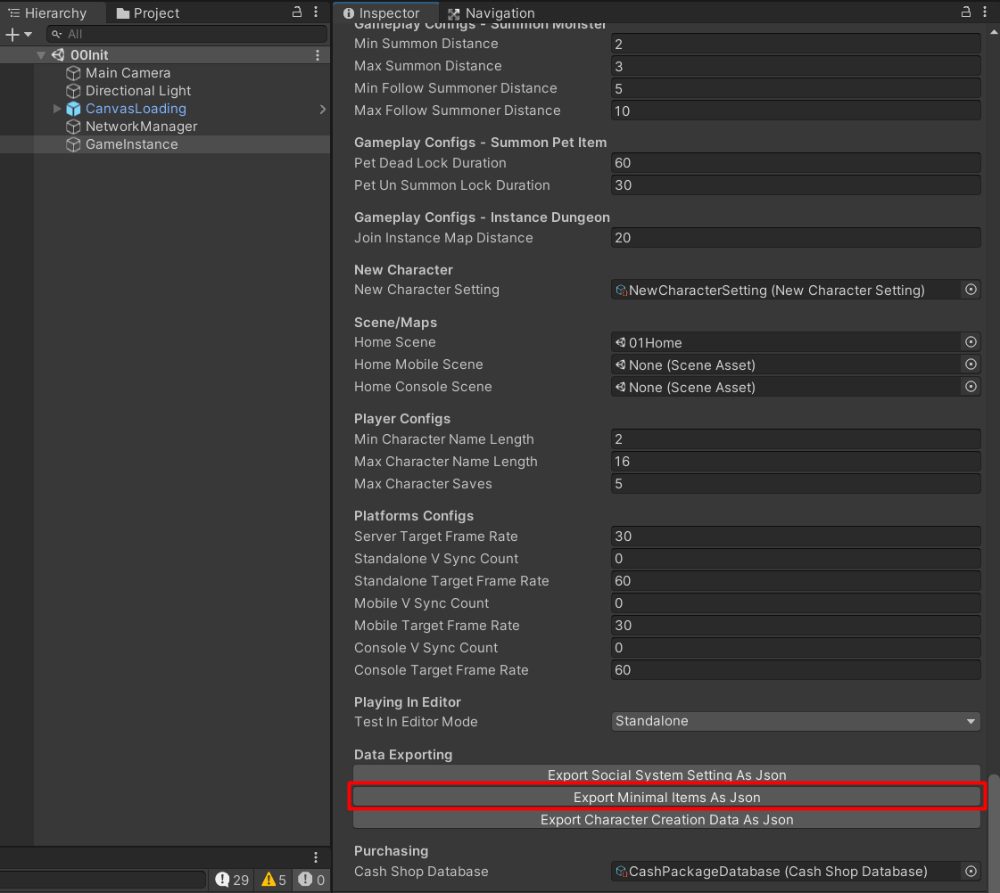

# .NET MMO Project

You can see the project [here](https://github.com/insthync/UnityMultiplayerARPG_MMO.NET.git), this project have implemented Central Server(for Login/Character Management), Map-Spawn Server and Database Management Server (No Map Server, still have to build from Unity). It have all the same configs and arguments to start server as in the Unity project.

- [Server Configs](../pages/027-server-configs.md)
- [Server Config Files](../pages/031-server-config-files.md)
- [Server Command Line Arguments](../pages/030-server-command-line-argument.md)

You will have to export data from your Unity game project when you make an update, by select your game instance, you can find a export button in `Inspector`.

Click it and choose the server build folder -> `Config`