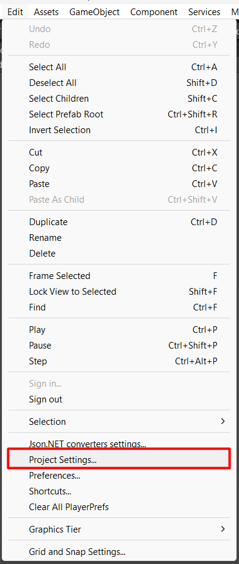
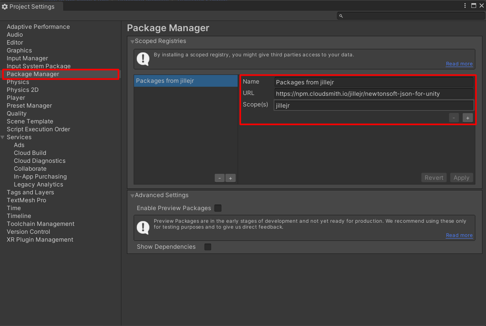

# How to fix: `Unable to add package [jillejr.newtonsoft.json-for-unity] Project has invalid dependencies: jillejr.newtonsoft.json-for-unity.converters: Package [jillejr.newtonsoft.json-for-unity.converters@1.5.1] cannot be found`





```
- Name: Packages from jillejr
- URL: https://npm.cloudsmith.io/jillejr/newtonsoft-json-for-unity
- Scope(s): jillejr
```