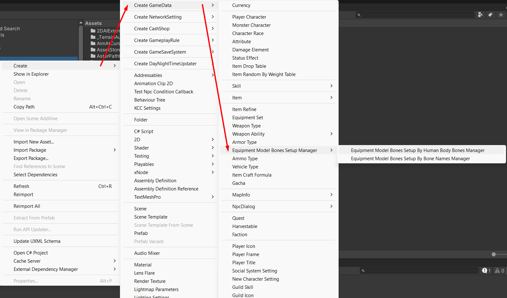
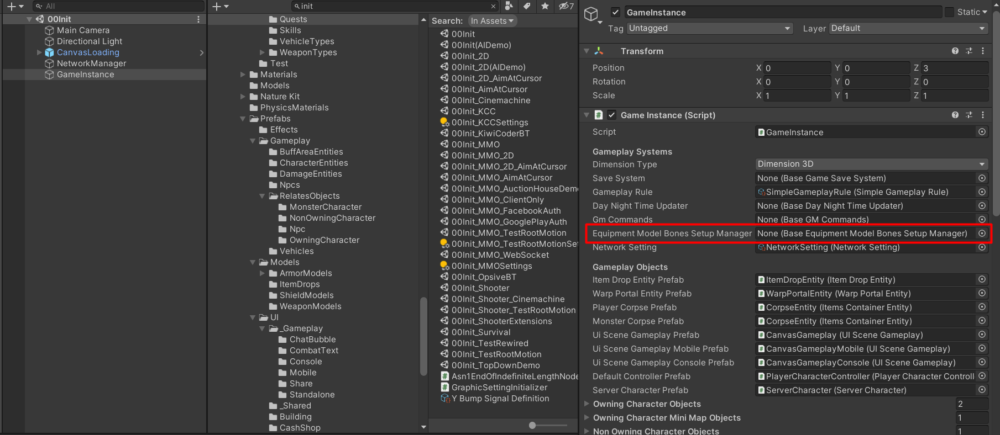
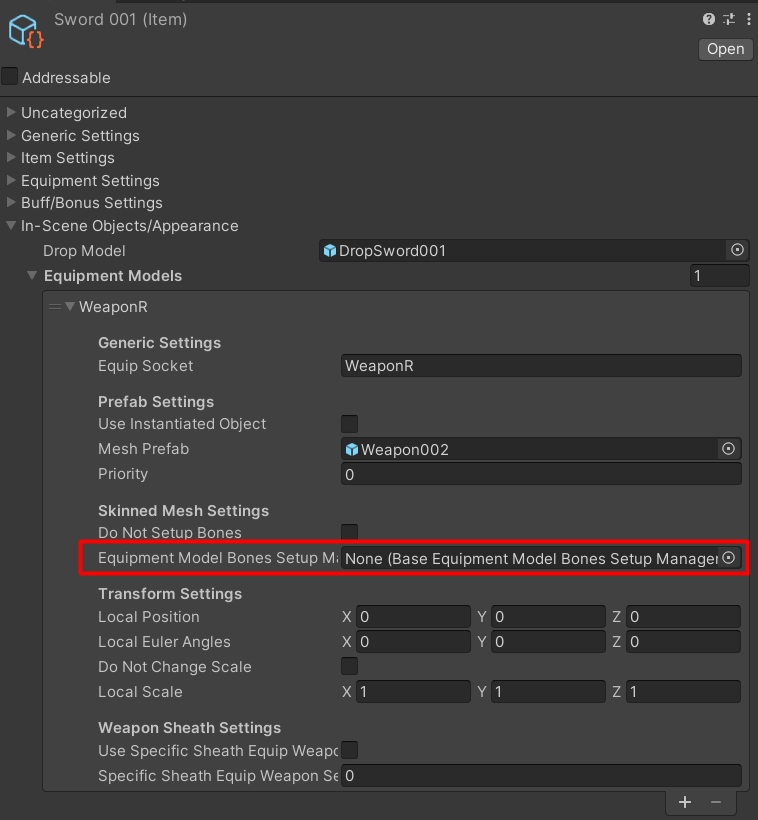

# Equipment Bones Setup Manager

An Equipment bones setup for clothes will be proceeded by `Equipment Bones Setup Manager`

By default it will use `Equipment Model Bones Setup By Human Body Bones Manager` to do it, this manager will add a component to a equipment model, that component is a component which will move bones follow base bones (from Character Model or Default Equipment Model), it will map bones by [Human Body Bones](https://docs.unity3d.com/ScriptReference/HumanBodyBones.html), so character model must be a model which use [Animator](https://docs.unity3d.com/ScriptReference/Animator.html) for animating and must use a humanoid avatar and the equipment model must be a model which use Animator and use humanoid avatar too.

It has another manager named `Equipment Model Bones Setup By Bone Names Manager`, this one will map bones by name and setup skinned mesh renderer bones by the bones that were mapped, it is based on Callepo [codes](https://github.com/suriyun-production/mmorpg-kit-docs/issues/2101).

You also can create a new manager class by create a class which extended from `BaseEquipmentModelBonesSetupManager`.

* * *

You can create a manager scripting object from create menu and change the manager in `GameInstance`

* * *

In case that you want to set manager for specific equipment model, you can do it too, by set the manager scripting object to `Equipment Model` -> `Equipment Model Bones Setup Manager`

