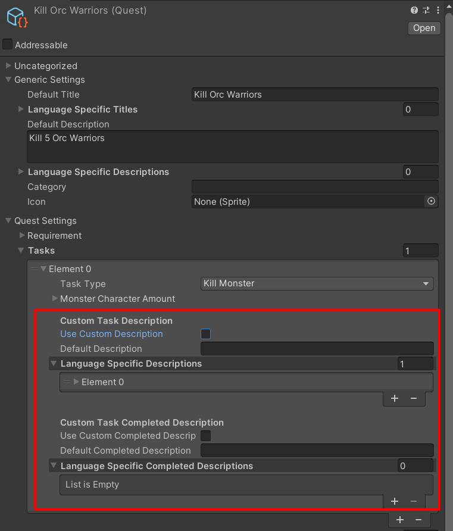

# Custom Quest Task Description

You can set custom quest task description as you wish in `Quest` data -> each `Tasks` entry

It has following settings:

- `Use Custom Description`, turn this on to use custom description (while the task is not complete yet).
- `Default Description` default custom description for default language, if your default language is `ENGLISH`, and you chose it, then this one will be used as description (while the task is not complete yet).
- `Language Specific Descriptions` custom description for specific languages.
- `Use Custom Completed Description`, turn this on to use custom description (while the task is complete).
- `Default Completed Description` default custom description for default language, if your default language is `ENGLISH`, and you chose it, then this one will be used as description (while the task is complete).
- `Language Specific Completed Descriptions` custom description for specific languages.

