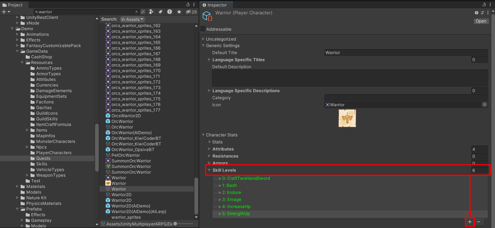
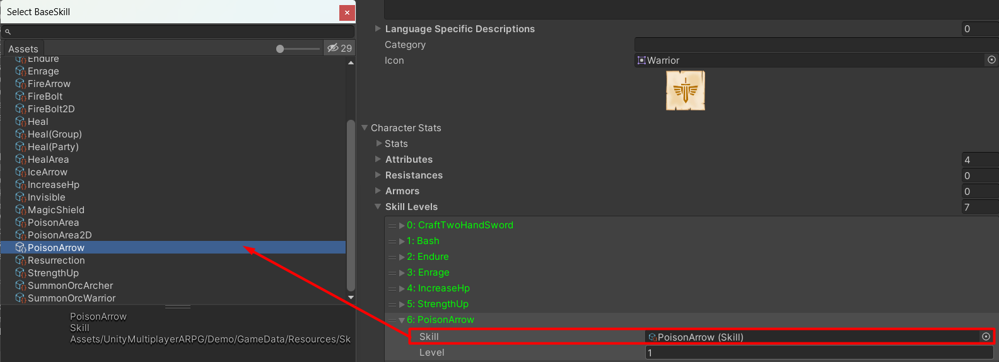

# How to add skill to character

You can add skill to character data ([Player Character](pages/135-player-character-entity.md) or [Monster Character](pages/136-monster-character-entity.md)) by select a character data which you want to add skill, then select `skillLevels` list to add it

Then set select skill and set skill's level

That is it.