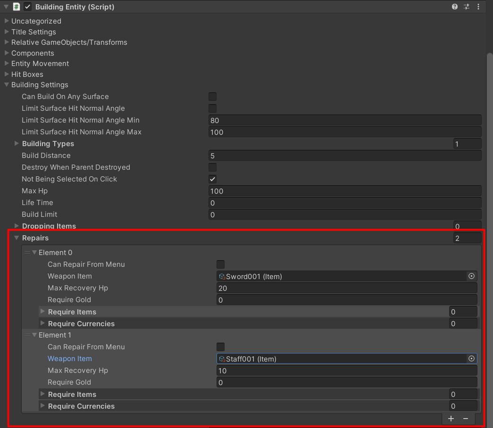

# Building repairing

You can setup repairing in `BuildingEntity`, it has a `Repairs` list, it is a list of `BuildingRepairData`, you can setup which weapon item which can be used to repair the building, and an requirements for repairing.

Each `BuildingRepairData` will contains these settings:

- `canRepairFromMenu` - If this is `TRUE`, it will allow to repair building entity from menu (can setup UI events in `UICurrentBuilding` component), so it doesn't have to equip specific weapon and attack the building.
- `weaponItem` - This will being used if `canRepairFromMenu` is `FALSE`, set the weapon which can be used to repair the building, by attacking.
- `maxRecoveryHp` - Max recovery HP for one time, for example: if building's HP is `80/100`, and this value is `10` then it will recover `10` HP, not `20`, and if building's HP is `80/100`, and this value is `30` then it will recover `20` HP.
- `requireGold` - Require gold to recovery `1` building HP.
- `requireItems` - Require items to recovery `1` building HP.
- `requireCurrencies` - Require currencies to recovery `1` building HP.

You can set any weapon items so you can setup like this:

- `HammerA` - with `maxRecoveryHp` = `10`, can recover up to `10` building's HP each attack hit.
- `HammerB` - with `maxRecoveryHp` = `20`, can recover up to `20` building's HP each attack hit.
- 
So if use use `HammerB`, it will repair the building faster.

