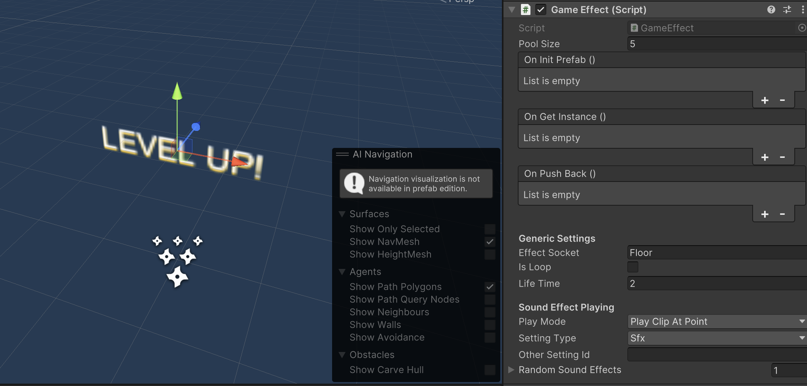
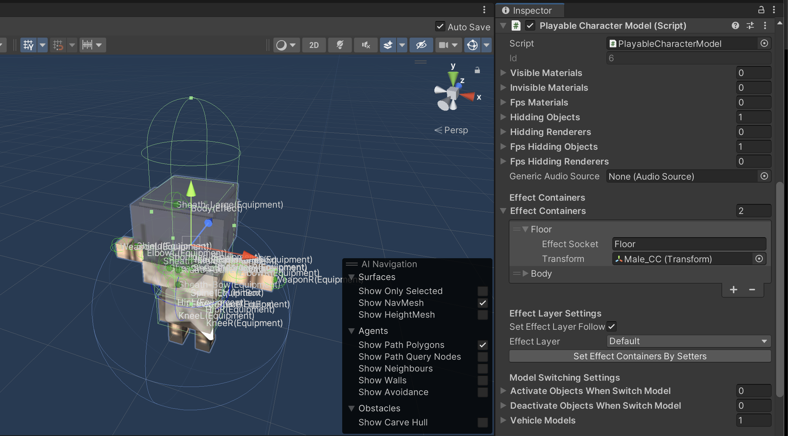
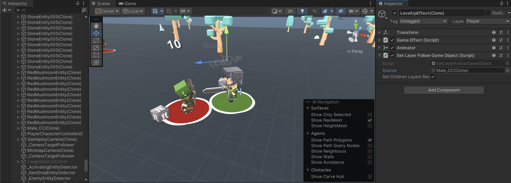

# Game Effect

`Game Effect` is a component which made for special effect playing, it will play particles, audio sources that attached to the game object and its children 
when play function is called (it will be called and play automatically when get instance from pooling system).

When it is going to play on game entity (character/monster and so on)
it will be instantiated and move following to game entity model's effect container which has a same `effectSocket`, 
for example, the demo's level up effect which its `effectSocket` is "Floor" and game entity model's `effectContainers` has one with "Floor" too.

So if your game effect don't play as you wish, you have to check game effect's `effectSocket` and game entity model's `effectContainers` entries.

* * *

You can changes follow settings:

### Generic Settings
- `effectSocket` where in game entity model's `effectContainers` which effect will follow after instantiated.
- `isLoop` the effects will be played looply or not, if not it will play just one time and destroy (or store back to pooling system's container).
- `lifeTime` duration before the game effect will be destroyed (or store back to pooling system's container).

### Settings for audio clip playing
- `playMode` how audio clip will be played.
- `settingType` which type of volume setting.
- `otherSettingId` if `settingType` is `Other`, it will uses this value as setting type.
- `randomSoundEffects` random sound effects.