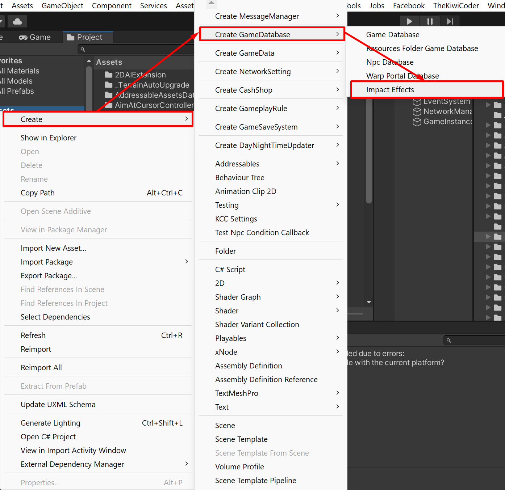

# Impact Effect

You can create a collection of impact effects by `Create` -> `Create GameDatabase` -> `Impact Effects`

After menu selected, the impact effects scriptable object will be created, you can set `Default Impact Effect` and `Impact Effects`, 
`Impact Effects` is a collection of effects which will be played when its source (melee damage, projectile effect) hit any objects in the scene,
it will be played by object's tag, if tag isn't in the `Impact Effects` collection, it will play `Default Impact Effect`.

You can set the created impact effects collection to weapon item -> damage info, monster character -> damage info (and so on)

Then when your character's attacks hit objects (may hit ground or wall, up to tag you've set) it will play effect,
the effect transform will be set by where it is hitting.

So you can use impact effect to play effect when bullet hit something, and also can use it to play bullet hole effect.
