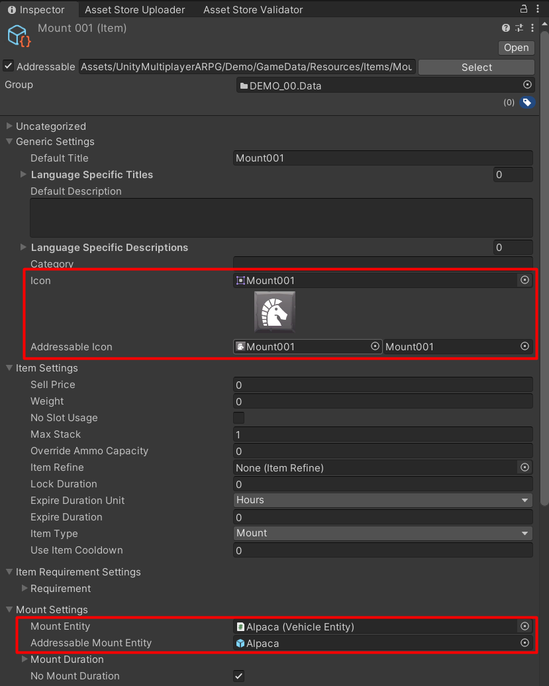
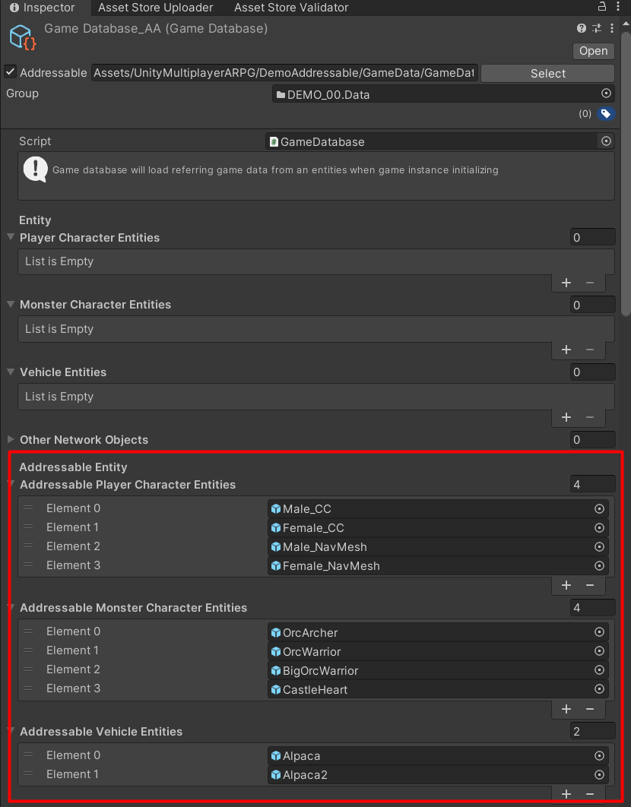
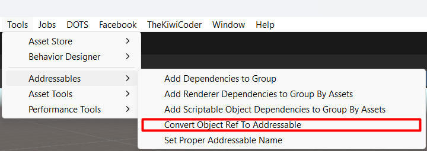
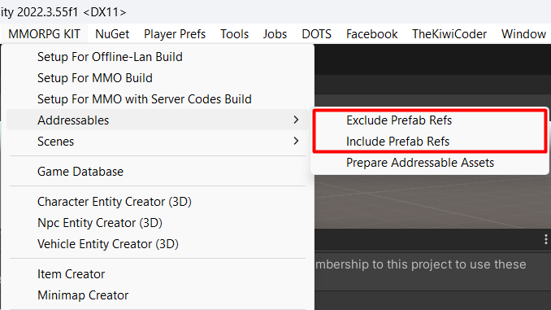
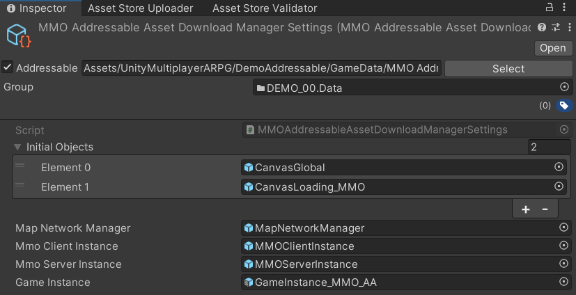
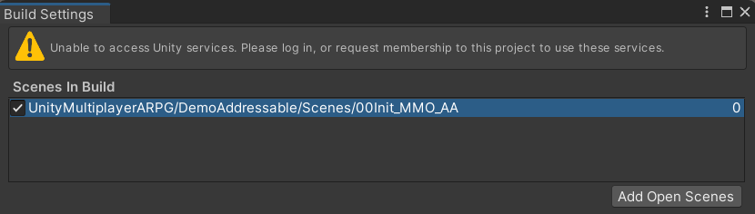

# Addressable Asset

This kit is already implement Unity's addressable asset system, you can learn about the system from: [Package Manual](https://docs.unity3d.com/Packages/com.unity.addressables@1.23/manual/index.html), [Sample](https://github.com/Unity-Technologies/Addressables-Sample)

This kit is just implement reference to load asset from addressable asset system, so you should learn about catalog, group, how to add assets to group, asset reference, asset labels, and how to download addressable to use it properly. Then what you have to do it convert prefab references to addressable references.

It's also have some tools you can use from `Tools` -> `Addressables`

After you convert all prefab references to addressable references, then if you want to exclude prefab references codes, you can add `EXCLUDE_PREFAB_REFS` to project settings / scripting define symbols. Or you can use `MMORPG KIT` -> `Addressables` menus to do it.

* * *

## Asset Downloading

You will have to implement asset downloading by yourself, but if you really can't do it, I've implement a simple component which will download all asset files when enter the scene, it is `UIAddressableAssetDownloadManager`, this component will download all assets from all groups, and also have download status UI implemented, after downloading, it will instantiate objects from addressable asset download manager settings which can be created from `Addressables/MMO Addressable Asset Download Manager Settings` menu.

In `MMO Addressable Asset Download Manager Settings`, it have `Map Network Manager`, `Mmo Client Instance`, `Mmo Server Instance`, and `Game Instance` addressable asset references to setup, so you have make them to be prefabs and then add to addressable group and then set them here to make it instantiates objects follows proper order and initialize data properly.

So you can set scenes in build to have only addressable downloading scene to exclude other assets from build (it will be downloaded later by `UIAddressableAssetDownloadManager` component)

*You can see addressable demo in `UnityMultiplayerARPG/DemoAddressable` folder, if it have many errors because of addresable assets, import `AddressableAssetsData.unitypackage` in `UnityMultiplayerARPG/DemoAddressable` folder (without it still work because it will load from prefab ref instead)*

## Disable Addressable Assets

You can disable addressable assets features by `MMORPG KIT` -> `Addressables` -> `Disable Addressables` menu
You can enable addressable assets features by `MMORPG KIT` -> `Addressables` -> `Enable Addressables` menu
