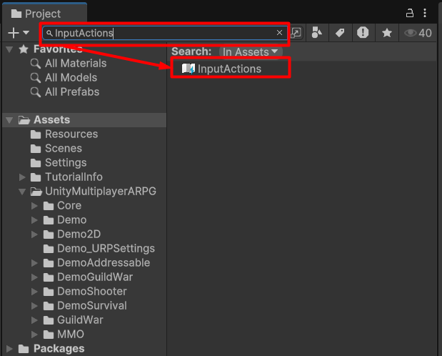

# Zoom scrolling is too slow

If your zoom scrolling on Unity 6 is too slow (Maybe because it have some changes by Unity)

You can change scale factor in input actions config by find a "InputActions" in "Project" tab

Then make change to "Mouse Scroll View" -> "Scroll/Y" scale

