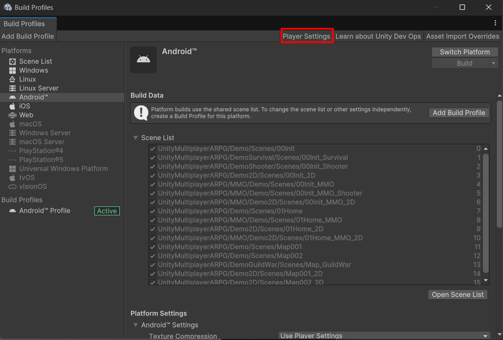
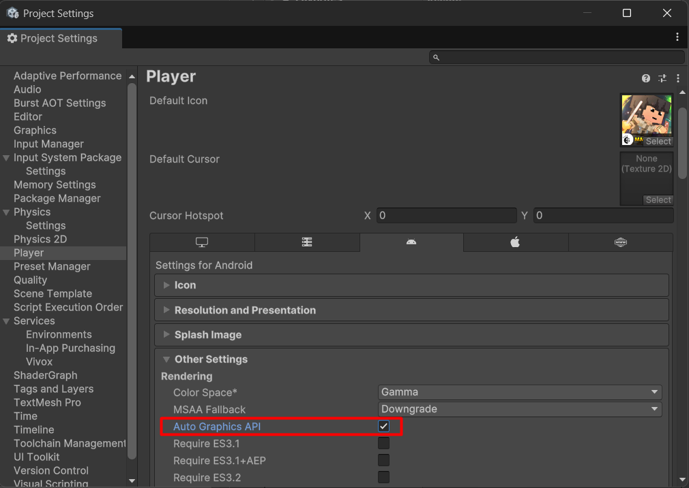

# Pink screen on Android (Unity 6)

To fix it, just turn `Auto Graphics API` on, that is it.

Open `Build Profiles` then `Player Settings` window by menu `File` -> `Build Profiles`, then click on `Player Settings`

Then find `Auto Graphics API` and turn it on.

