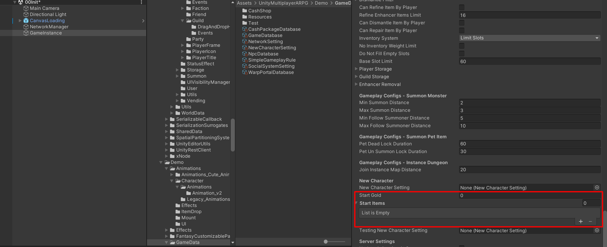
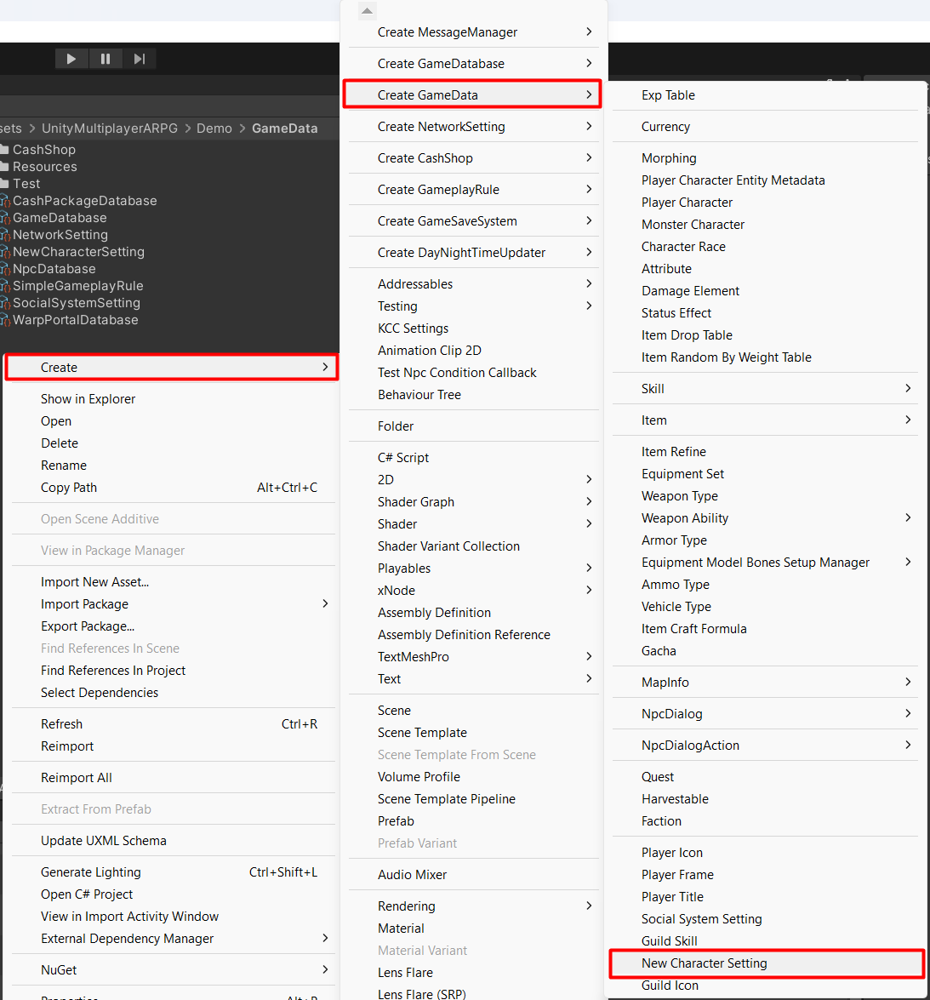
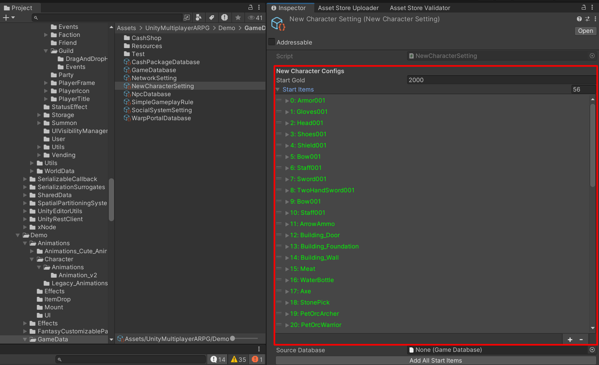
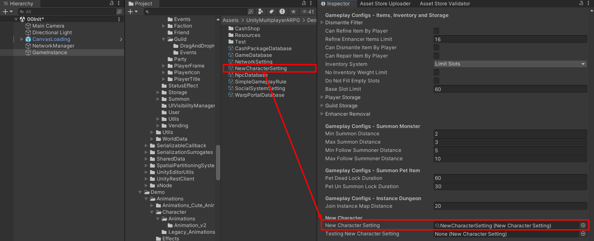
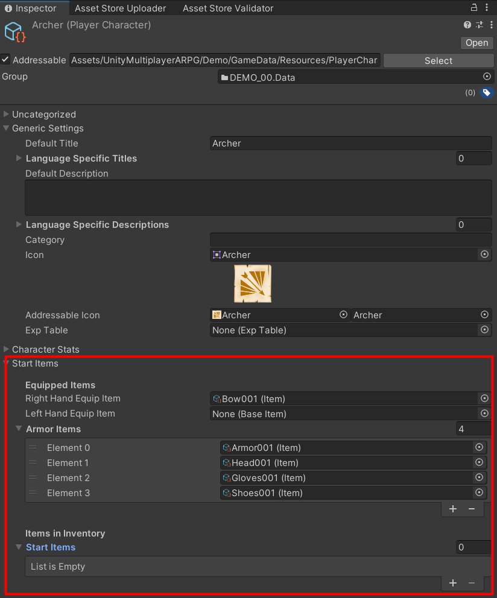

# Start Gold And Items

You can set start gold and items which will be given to player's character when it was created, by changing `Start Gold` and `Start Items` in `Game Instance` component

You also can create a scriptable object which have `Start Gold` and `Start Items` from create menu: `Create` -> `Game Data` -> `New Character Setting`

Then set the created `New Character Setting` to `Game Instance`

## How to set start items for specific character's class

You can set start items for specific character's class in `Player Character` data, `Start Items` section

You can set start equipped items, and start inventory items

